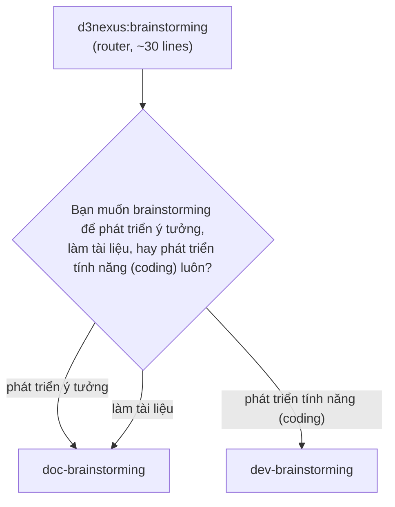

# Brainstorming Split — Design Specification

> **Topic**: Splitting the shared `brainstorming` skill into a development variant and a
> documentation variant, and making brainstorming mandatory in the document path
> **Date**: 2026-09-17 **Status**: Approved Design Spec **Scope**: Two new skills, one skill
> rewritten to a router, one orchestrator restructured, one orchestrator retargeted

---

## 0. What this spec supersedes

The `document_lifecycle_suite` spec, §3.4, decided:

> **`brainstorming` is optional for document work.**

This spec reverses that decision and states why in §3.3.
The earlier spec is not edited — it records what was decided at the time.

---

## 1. Problem

### 1.1 One skill is serving two audiences that have stopped overlapping

`skills/brainstorming/SKILL.md` is 228 lines.
A grep for branch-carrying terms — `dev-designer`, `doc-designer`, `writing-plans`,
`lean-product-lifecycle`, `code`, `document` — hits 31 of them.
The remaining ~197 lines are domain-neutral process discipline: ask one question at a time,
propose two or three approaches, present the design in sections, get approval after each,
self-review the written spec, never skip the gate because the work looks simple.

That ratio is why the skill was shared in the first place, and it is still mostly true today.
The reason to split is not the current ratio.
It is that the 31 lines are the *growing* part.
Release 1.2.0 added a fourth exit and a document branch; commit `8dd7beb` then had to make five
separate passages branch-aware, because guidance written for code work was being read by an agent
heading for a document.
Each future addition on either side lands in a file the other side also loads.

### 1.2 The document path can skip its own inception stage

`doc-lifecycle` Stage 0 is optional, and its skip condition is:

> Skip this stage whenever the content is known and only its shape is open.

An agent evaluating "is the content known?" answers yes essentially always,
because it has just read the request and believes it understands it.
The condition is not testable, so in practice the stage does not exist.

### 1.3 There is no way to ask which kind of work this is

A bare "brainstorm this" — or the hook line at `hooks/session-start:47`, which tells every session
to use `d3nexus:brainstorming` for design exploration — carries no signal about the deliverable.
Today the skill guesses from the request text.
§3.2 replaces the guess with a question.

---

## 2. Goals and non-goals

**Goals**

- Two variants whose process discipline can diverge without either dragging the other.
- A mandatory inception stage in the document path, gated on something testable.
- One place, and only one, where the deliverable question gets asked.
- No breakage for anything that currently names `d3nexus:brainstorming`.

**Non-goals**

- Any change to the development sequence. `dev-lifecycle` keeps its five gates and its stage
  order; its edits in this epic are reference retargeting only.
- Any mechanism that keeps the two variants in sync. See §3.5 — divergence is the point.
- A third variant for `lean-product-lifecycle`. See §4.4.

---

## 3. Design

### 3.1 `brainstorming` survives as a router

An earlier draft of this design had `brainstorming` disappear, replaced by two variants,
breaking every reference.
Requiring the skill to *ask* which kind of work this is makes that impossible:
something has to exist at the name people and hooks already use, in order to do the asking.

So `brainstorming` stays, holding one question and two destinations, and nothing else.



Three labels, two destinations.
"Phát triển ý tưởng" and "làm tài liệu" both reach `doc-brainstorming`,
because developing an idea in this kit produces a document.
The user confirmed this reading explicitly.

The router is skipped entirely when the caller already knows the branch:
`dev-lifecycle` Stage 1 invokes `dev-brainstorming` directly,
`doc-lifecycle` Stage 0 invokes `doc-brainstorming` directly,
and a user may name either variant themselves.
The router exists for the ambiguous entry, which is the only case that needs it.

**Why the router cannot drift.**
§3.5 accepts drift between the two variants as the intended outcome.
The router is exempt from that concern by construction: it holds no process discipline,
so it has nothing to drift *from*.
It holds a question.

**What it costs.**
One more `description` field resident in context permanently — three instead of two.
`description` fields are the standing cost of a skill; bodies load per invocation.
Roughly three lines, in exchange for keeping a documented entry point alive.

### 3.2 Discriminate by deliverable, and ask rather than infer

The router's question is about **what will exist when you are finished**, not about how
specific the request was.

An earlier proposal was to infer: a request naming source-code features routes to code,
a generic request routes to documents.
This is rejected.
A vague request is more often unclear *code* work than it is document work,
so the heuristic fails in the direction that costs most — it sends a feature into the document
path, where the three-tier test suite never runs.

There is no default branch.
When the answer is unclear, the router asks; it does not pick.

### 3.3 Stage 0 becomes mandatory, and the gate count goes 3 → 4

Making the stage mandatory gives it a gate, which renumbers the rest:

| Gate | Before | After |
|------|--------|-------|
| 1 | Brief & Outline (`doc-designer`) | **Spec Approved (`doc-brainstorming`)** |
| 2 | Draft Verified (`doc_quality_check`) | Brief & Outline (`doc-designer`) |
| 3 | Sign-Off (user) | Draft Verified (`doc_quality_check`) |
| 4 | — | Sign-Off (user) |

This mirrors `dev-lifecycle`, where Stage 1 is `brainstorming` and owns Gate 1.
The two orchestrators are meant to read as siblings; a readable diff between them is what makes
drift visible, and an optional Stage 0 broke that symmetry.

**The objection, and the answer.**
Stage 0 was optional so that "write a runbook for X" would not pass two approval gates before
a word gets drafted. That cost is real.

The resolution is that the stage is mandatory in its **existence** and elastic in its **depth** —
which is not a new invention, but the idiom `brainstorming` already states about itself:

> The design can be short (a few sentences for truly simple projects),
> but you MUST present it and get approval.

The runbook still passes through Stage 0. Its spec is three sentences.

What this buys is a gate question that can actually be answered:

| | Gate question | Testable |
|---|---|---|
| Before | "Is the content already known?" | No — the agent always answers yes |
| After | "Was a spec presented and approved?" | Yes — it happened or it did not |

### 3.4 The upstream escape splits asymmetrically

`brainstorming` step 2 currently routes *up* to `lean-product-lifecycle` when the problem space
was never validated. Copying that condition unchanged into both variants would push
"write a runbook" toward market discovery, which is exactly the kind of friction that teaches
people to route around a gate.

- **`dev-brainstorming`** keeps the existing trigger: nobody can name the target customer as a
  specific segment, or the underserved need is asserted rather than evidenced.
- **`doc-brainstorming`** fires only when the document **is itself a product argument** —
  a strategy document, a proposal, a business case — and the idea it argues for has no evidence
  behind it. The condition examines what the document claims, not who reads it.
  A runbook, a handbook, or a set of reference pages never triggers it.

### 3.5 No anti-drift mechanism

Divergence is the intent, so nothing is built to prevent it.
No shared include, no generated file, no check that the two variants still agree.

This is a deliberate acceptance of the risk measured during release 1.2.0,
where Gate 2 caught four instances of prose updated and the corresponding diagram not.
That risk applies to two files that are *supposed* to say the same thing.
These two are supposed to say different things, increasingly so.

### 3.6 `doc-brainstorming` is a rewrite, not a copy

Written around document thinking — audience, reader task, what the reader must be able to do
afterwards — rather than architecture, components, and data flow.

Because a rewrite can silently drop discipline that a copy would have retained, four mechanisms
are carried over **deliberately and by name**, translated into document vocabulary rather than
inherited as code vocabulary:

1. The `<HARD-GATE>` block — no implementation action before an approved design.
2. The user review gate on the written spec.
3. One question per message.
4. The spec self-review pass.

The "this is too simple to need a design" anti-pattern section comes with them, since §3.3 now
depends on it.

### 3.7 Each variant can correct a misroute, but only upward

The router handles the case where the branch is *unknown*.
It does not handle the case where the branch was chosen and chosen wrongly —
a user invoking `dev-brainstorming` directly, then discovering partway through that the
deliverable is a document.

Without a correction path, a variant that discovers it is the wrong variant has nowhere to go,
and the pressure is to carry on rather than to stop. That is the same pressure that produces
mislabelled work in the first place.

So each variant keeps exactly one correction exit to its sibling, with the existing rule as the
test:

> The deliverable decides, not the amount of writing involved.
> **If the work changes a file that ships in the build, it is code.**

- `dev-brainstorming` → `doc-brainstorming` when nothing the work produces ships in the build.
- `doc-brainstorming` → `dev-brainstorming` when something it produces does.

This is a correction, not a routine exit: it fires on a discovery, it restarts inception in the
sibling rather than handing over a finished spec, and it is not drawn as a normal edge in either
variant's process flow. The asymmetry matters — a misroute *into* the document path is the
expensive direction, because it is the direction where the three-tier test suite never runs.

---

## 4. Components

### 4.1 `brainstorming` (rewritten to a router)

Frontmatter `name` + `description` only, per house rule.
Body holds: the three-option question in the user's wording, the routing table, and the rule that
an unclear answer is asked about rather than guessed.
No checklist, no process flow beyond the one branch, no visual companion.

### 4.2 `dev-brainstorming` (new, from the current file)

`git mv skills/brainstorming skills/dev-brainstorming`, then strip the document branch.

Keeps `visual-companion.md` (263 lines) and `scripts/` (863 lines) — 1126 of the directory's
1354 lines. The companion shows mockups, wireframes and layout comparisons; it stays on the code
side only.

Routine exits reduce from four to three: `dev-designer` (epic-scale), `writing-plans` (single
plan), `lean-product-lifecycle` (upstream escape per §3.4).
The `doc-designer` exit is removed as a *routine* exit — that routing now happens at the router —
but the §3.7 correction exit to `doc-brainstorming` remains.

### 4.3 `doc-brainstorming` (new, written fresh)

Per §3.6. Exits: `doc-designer`, the narrowed `lean-product-lifecycle` escape,
and the §3.7 correction exit to `dev-brainstorming`.
No visual companion.

Single-ADR work continues to route directly to `decision-records`,
below even this threshold.

### 4.4 `lean-product-lifecycle` (2 edits)

- Line 37, the small-work route: `d3nexus:brainstorming` → `d3nexus:dev-brainstorming`.
  Its examples are "a single bug, a refactor, a change to an existing feature" — all code work,
  so the route is unambiguous and needs no third variant.
- Line 79, the mermaid entry node: "from brainstorming's step-2 escape" →
  "from either brainstorming variant's step-2 escape".

### 4.5 `dev-lifecycle` (8 references retargeted, no structural change)

`description`, the small-work bullet, the Stage 1 mermaid node, the Gate 1 row, the Stage 1
heading, the invoke line, the decomposition note, and the Stage Skills row.
Five gates and stage order unchanged.

### 4.6 `doc-lifecycle` (restructured per §3.3)

Gate renumber; `description` frontmatter; heading `## The Three Gates` → `## The Four Gates`;
the sentence "Three, not five" → "Four, not five"; the Stage 0 heading loses *(optional)*;
the Stage Skills row `| 0 | brainstorming | — (optional) |` becomes
`| 0 | doc-brainstorming | 1 |`; Stage 0 entry condition becomes "a document request";
and the untestable skip sentence from §1.2 is deleted.

### 4.7 Remaining live references

| File | Change |
|---|---|
| `skills/dev-designer/SKILL.md` | 6 → `dev-brainstorming` |
| `skills/doc-designer/SKILL.md` | 2 → `doc-brainstorming` |
| `skills/dev-implementation/SKILL.md` | 1 → `dev-brainstorming` |
| `skills/writing-plans/SKILL.md` | 1 → `dev-brainstorming` |
| `skills/impact-analysis/SKILL.md` | 3 → `dev-brainstorming` |
| `skills/impact-analysis/references/impact-mechanisms.md` | 1 → `dev-brainstorming` |
| `skills/using-superpowers/SKILL.md` | 2 — stays `brainstorming` (router is correct here) |
| `hooks/session-start` | 1 — stays `brainstorming` (router is correct here) |
| `templates/AGENTS.md` | 1 → `dev-brainstorming` (row reads "new feature, component, behaviour change") |
| `rules/CRITICAL_RULES.md` | 2 — path link + the orchestration chain |
| `skills/doc_quality_check/references/document-reviewer-prompt.md` | **no change** — records a historical path on purpose |
| `docs/lifecycles.{en,vi}.md` | 6 each |
| `docs/choosing-a-lifecycle.{en,vi}.md` | 6 each |
| `.devtool/epic/**`, `CHANGELOG.md` | **no change** — historical records |

---

## 5. Failure modes

### 5.1 An orchestrator routes to the router instead of a variant

The most likely regression, and the one with precedent: `epic-lifecycle` never contained the word
"invoke", so agents read a stage description and did the stage's work themselves.
A stage that names the router re-creates the ambiguity the split exists to remove.
Mechanically checked — §6.

### 5.2 The rename check from release 1.2.0 cannot be reused

`verify.sh` step 9 greps `epic-lifecycle|epic-designer|epic-implementation`, which works because
those are unambiguous identifiers.

**`brainstorming` is an ordinary English word.**
It appears legitimately in `writing-plans` ("during brainstorming"), in `dev-designer`
("not a full brainstorming dialogue"), and at `document-reviewer-prompt.md:11`, which records the
pre-1.2.0 path on purpose. A bare grep would false-positive on all three.
§6 uses a narrow check instead of a rename sweep.

### 5.3 The document path gains a gate people route around

If Stage 0 becomes ceremony for small documents, users will stop entering the document lifecycle
at all. §3.3 mitigates by scaling depth, not by restoring optionality — an optional stage with an
untestable condition is how this failed the first time.

### 5.4 `doc-brainstorming` loses discipline in the rewrite

Mitigated by naming the four carried-over mechanisms explicitly in §3.6 rather than trusting the
rewrite to retain them.

---

## 6. Verification

1. `scripts/verify.sh` passes on the merged result, run from a normal checkout — not only from
   the worktree. A worktree lacks the gitignored `.superpowers/` directory, which is how a
   filesystem-walk bug passed in a worktree and failed on `main` during release 1.2.0.
2. New check, replacing a rename sweep: the orchestrators must name a variant, never the router.

   ```bash
   git ls-files 'skills/dev-lifecycle/*' 'skills/doc-lifecycle/*' \
     | xargs grep -n 'd3nexus:brainstorming\|`brainstorming`'
   # must be empty
   ```

3. `verify.sh` step 9's existing `epic-*` check stays exactly as it is.
4. `find skills -maxdepth 1 -type d` count equals `find skills -name SKILL.md` count.
   Today both are 52. A mismatch is how a stale directory surviving `git mv` was caught last
   release, when it held gitignored `__pycache__` and so was never empty.
5. Both orchestrators' mermaid diagrams match their prose. Four prose/diagram mismatches were
   caught by Gate 2 during 1.2.0; this is the check that caught them.
6. `@doc_quality_check` for the four `docs/` files; `@quality_check` for everything else.

---

## 7. Assumptions, dependencies and risks

- **Assumption**: "phát triển ý tưởng" and "làm tài liệu" reaching the same destination is
  acceptable to users reading the question. Confirmed by the user, but it does mean two of three
  labels behave identically — worth revisiting if it causes confusion in use.
- **Dependency**: commits `0b8a030` and `8dd7beb` are unpushed. They ship with this epic.
- **Risk**: the router adds one hop to the most common entry point in the kit. If the question
  becomes an irritation, the fallback is to let the router infer when the request names
  source-code features and ask only otherwise — explicitly rejected in §3.2, recorded here as the
  retreat path rather than as a plan.

---

## 8. Out of scope

- Any change to `dev-lifecycle`'s sequence or gate count.
- A `lean-brainstorming` variant.
- Fixing the known defects recorded but not addressed this session: archival unreachable through
  the documented flow, `sync_epic` reporting success without verifying, `executing-plans`
  contradicting its own frontmatter, and the duplicate step numbering at
  `quality_check/SKILL.md:422` and `:428`.
- The `assumption-mapping` spec, written and source-corrected but never routed to `writing-plans`.

---

## 9. Release

Epic name: `brainstorming_split`.
Target: **1.3.0** — minor, not major, because the router keeps `d3nexus:brainstorming` working.

Not to be released without explicit instruction.
