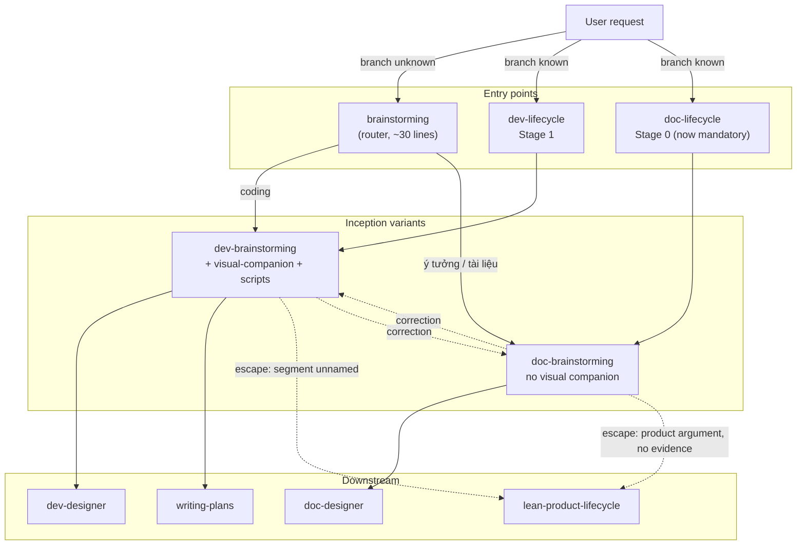
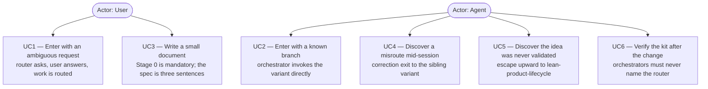
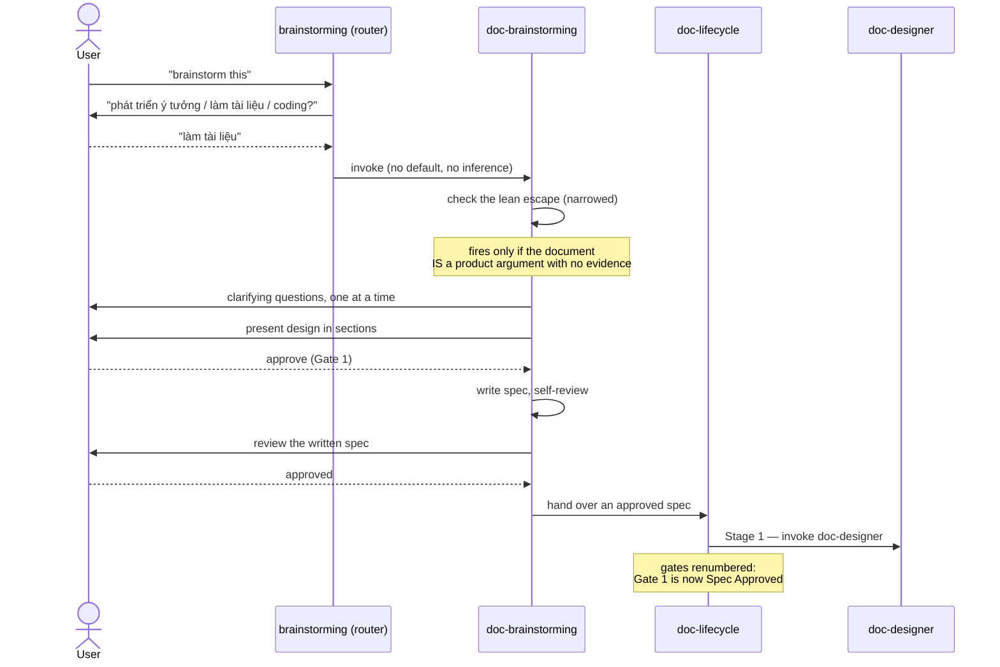

# Epic: Brainstorming Split

## 1. Meta Data

- **Epic name**: `brainstorming_split`
- **Status**: In Progress
- **Target Release**: 1.3.0 (minor — the router keeps `d3nexus:brainstorming` working)
- **Platform**: **Agent Kit (Markdown + Bash/Python)** — see the platform note below
- **Source Spec**: [2026-09-17-brainstorming-split-design.md](2026-09-17-brainstorming-split-design.md)
- **Predecessor epic**: [document_lifecycle_suite](../document_lifecycle_suite/document_lifecycle_suite.en.md) — released as 1.2.0; this epic revises its §3.4 decision

### Platform note

Step 0 platform detection found **no** `pubspec.yaml`, `melos.yaml`, `settings.gradle*`,
`build.gradle.kts`, `Project.swift`, `Tuist.swift` or `Package.swift`. The target is this repository
itself: an agent kit made of Markdown skills plus Bash and Python tooling.

The 3-Tier standard maps onto this repository's own gates. Substituting `melos test`, `./gradlew`
or `swift test` here would be a red flag, not compliance:

| Tier | Meaning here | Command |
|---|---|---|
| **Tier A** — unit | Per-skill structure: frontmatter is exactly `name` + `description`, `name` matches its directory, relative links resolve, ToC anchors match headings | `scripts/verify.sh` steps 1–4 |
| **Tier B** — governance | Cross-namespace references, rule frontmatter, session hook JSON for both runtimes, source fidelity, orphan and rename checks, plus the new orchestrator-routing check this epic adds | `scripts/verify.sh` steps 5–10 |
| **Tier C** — acceptance | Both orchestrators driven end-to-end, the router exercised from an ambiguous request, and `@doc_quality_check` on the four files under `docs/` | `scripts/verify.sh` in full + the six items in spec §7 |

---

## 2. Background

`skills/brainstorming/SKILL.md` is 228 lines. A grep for branch-carrying terms — `dev-designer`,
`doc-designer`, `writing-plans`, `lean-product-lifecycle`, `code`, `document` — hits 31 of them.
The remaining ~197 lines are domain-neutral process discipline.

That ratio is why the skill was shared, and it is still mostly true. The reason to split is not the
current ratio but that the 31 lines are the **growing** part. Release 1.2.0 added a fourth exit and
a document branch; commit `8dd7beb` then had to make five separate passages branch-aware, because
guidance written for code work was being read by an agent heading for a document.

Two further problems come with it:

- **The document path can skip its own inception stage.** `doc-lifecycle` Stage 0 is optional, and
  its skip condition — *"Skip this stage whenever the content is known and only its shape is open"*
  — is not testable. An agent evaluating "is the content known?" answers yes essentially always.
- **Nothing can ask which kind of work this is.** A bare "brainstorm this", or the hook line at
  `hooks/session-start:47`, carries no signal about the deliverable. Today the skill guesses.

---

## 3. Goals & Non-Goals

### Goals

- Two variants whose process discipline can diverge without either dragging the other.
- A mandatory inception stage in the document path, gated on something testable.
- One place, and only one, where the deliverable question gets asked.
- No breakage for anything that currently names `d3nexus:brainstorming`.

### Non-Goals

- Any change to `dev-lifecycle`'s sequence or gate count. Its edits here are reference retargeting.
- Any mechanism keeping the two variants in sync — divergence is the intended outcome.
- A `lean-brainstorming` third variant.
- Fixing the known defects carried over from the previous epic (spec §8).

---

## 4. Architecture & Technical Design

### 4.1 High-Level Architecture



Solid edges are routine routing. Dashed edges are the two escape hatches: the asymmetric upward
escape to `lean-product-lifecycle` (spec §3.4) and the sibling correction exit (spec §3.7).

### 4.2 Use Cases



### 4.3 Sequence Diagram — the primary flow



### 4.4 Check 1 — Shift-Left Impact Analysis

Run against `main` on the planned touchpoints:

```bash
python3 skills/impact-analysis/resources/scripts/check_code_impact.py \
  --files skills/brainstorming/SKILL.md skills/dev-lifecycle/SKILL.md \
          skills/doc-lifecycle/SKILL.md skills/lean-product-lifecycle/SKILL.md \
          skills/dev-designer/SKILL.md skills/doc-designer/SKILL.md \
          hooks/session-start rules/CRITICAL_RULES.md scripts/verify.sh \
  --symbols brainstorming dev-brainstorming doc-brainstorming \
  --base-ref main
```

**Result: 🟢 clean against `main`, zero unmerged commits.** Three findings govern the task split:

**Finding 1 — the rename breaks an executable instruction.**
`skills/brainstorming/SKILL.md:228` hard-codes its own path:

> If they agree to the companion, read the detailed guide before proceeding:
> `skills/brainstorming/visual-companion.md`

After `git mv skills/brainstorming skills/dev-brainstorming` that path is dead, and the agent is
told to read a nonexistent file at precisely the moment the user accepted the companion offer.
Task 1 owns this.

**Finding 2 — the server script's path comment goes stale, but its logic does not.**
`skills/brainstorming/scripts/start-server.sh:80` computes
`AGENT_DIR="$(cd "$SCRIPT_DIR/../../.." && pwd)"`, which is depth-based.
`skills/dev-brainstorming/scripts` sits at the same depth as `skills/brainstorming/scripts`, so the
walk-up still lands in the right place. Only the comment above it becomes wrong. Fix it for
accuracy; it is not a break.

**Finding 3 — the router decision prevents a broken link.**
`rules/CRITICAL_RULES.md:61` links `[Brainstorming Skill](../skills/brainstorming/SKILL.md)`.
Because spec §3.1 keeps a router at that exact path, the link still resolves and `verify.sh`
steps 1–4 stay green. Under the earlier "brainstorming disappears" plan this would have been a
broken relative link in the kit's own critical rules.

**Verified blast radius — 20 live files**, measured rather than estimated:

| Area | Files |
|---|---|
| Renamed / created | `skills/brainstorming/` (router), `skills/dev-brainstorming/` (7 files), `skills/doc-brainstorming/` (new) |
| Orchestrators | `skills/dev-lifecycle/SKILL.md`, `skills/doc-lifecycle/SKILL.md`, `skills/lean-product-lifecycle/SKILL.md` |
| Consumers | `skills/dev-designer/`, `skills/doc-designer/`, `skills/dev-implementation/`, `skills/writing-plans/`, `skills/impact-analysis/` (2 files) |
| Other | `rules/CRITICAL_RULES.md`, `templates/AGENTS.md`, `scripts/verify.sh` |
| Docs | `docs/lifecycles.{en,vi}.md`, `docs/choosing-a-lifecycle.{en,vi}.md` |

**Deliberately excluded**: `.devtool/**` and `CHANGELOG.md` history record work done under the old
arrangement; editing them to match the present falsifies the record.
`skills/doc_quality_check/references/document-reviewer-prompt.md:11` records a pre-1.2.0 path on
purpose and is likewise left alone.
`skills/using-superpowers/SKILL.md` and `hooks/session-start` keep naming `brainstorming`, because
the router is the correct destination for an unclassified request.

**Tool calibration note.** The script reported 🔴 0.0% coverage and "exception handling with zero
test coverage" for every Markdown file. These are false positives — it pattern-matches source code,
and prose about failure modes is not error handling. Its coverage thresholds do not apply to this
epic; the Tier A–C table above is the real gate.

### 4.5 BDD scenarios

Summarised here, exhaustive in [bdd_scenarios.md](bdd_scenarios.md), covering all five dimensions:

- **Happy paths** — ambiguous entry routed by answer; known branch bypassing the router.
- **Edge cases & boundaries** — a one-paragraph document still passing Stage 0; a request naming
  both a feature and a document; an empty or non-committal answer to the router's question.
- **State transitions** — `doc-lifecycle` gate numbering before and after; a variant entered, then
  corrected to its sibling mid-session.
- **Async / race** — not applicable to skill markdown in the concurrency sense; covered instead as
  *ordering hazards*: Task 2 recreating `skills/brainstorming/` after Task 1 moved it away.
- **Failures & resilience** — the dead `visual-companion.md` path from Finding 1; an orchestrator
  naming the router instead of a variant; `verify.sh` false-positives on the English word
  "brainstorming".

---

## 5. Rollout Strategy & Mitigation

**Phasing.** One branch, tasks in dependency order, merged as a unit. The kit is consumed as a
versioned plugin, so a half-applied split would leave orchestrators pointing at skills that do not
exist yet. There is no feature flag available in this medium.

**Ordering hazard.** Task 1 runs `git mv skills/brainstorming skills/dev-brainstorming`; Task 2
then creates a **new** `skills/brainstorming/` holding only the router. Running these out of order,
or running Task 2's file creation before the move, produces a directory that the move then swallows.
Task 2 is explicitly blocked by Task 1.

**Rollback.** Every task is file-level and reversible by `git revert`. The riskiest single
operation is the rename; it is a pure `git mv` and its revert is another `git mv`.

**Mitigation for the gate-renumber.** `doc-lifecycle` going from three gates to four touches the
mermaid diagram, the prose, the gate table and the Stage Skills table. Four prose/diagram
mismatches were caught at Gate 2 during 1.2.0, all of this exact shape. Task 4's Definition of Done
requires the four representations to be checked against each other explicitly, not incidentally.

**Release.** Target 1.3.0. **The user has not authorized a release.** Task 9 writes the CHANGELOG
entry as *Unreleased*; publishing is a separate decision outside this epic.

---

## 6. Kanban Tasks Breakdown

| # | Task | Blocked by |
|---|---|---|
| 1 | [Rename brainstorming to dev-brainstorming and strip the document branch](task_1_dev_brainstorming_rename.md) | — |
| 2 | [Rewrite brainstorming as the routing skill](task_2_brainstorming_router.md) | 1 |
| 3 | [Write doc-brainstorming from scratch](task_3_doc_brainstorming_skill.md) | — |
| 4 | [Make doc-lifecycle Stage 0 mandatory and renumber the gates](task_4_doc_lifecycle_mandatory_stage_0.md) | 3 |
| 5 | [Retarget dev-lifecycle to dev-brainstorming](task_5_dev_lifecycle_retarget.md) | 1 |
| 6 | [Retarget the remaining live consumers](task_6_consumer_retarget.md) | 1, 3 |
| 7 | [Add the orchestrator-routing check to verify.sh](task_7_verify_orchestrator_routing_check.md) | 4, 5 |
| 8 | [Update the four bilingual lifecycle documents](task_8_docs_bilingual_update.md) | 1, 3, 4, 5 |
| 9 | [Tier C acceptance and CHANGELOG](task_9_tier_c_acceptance.md) | 1–8 |
