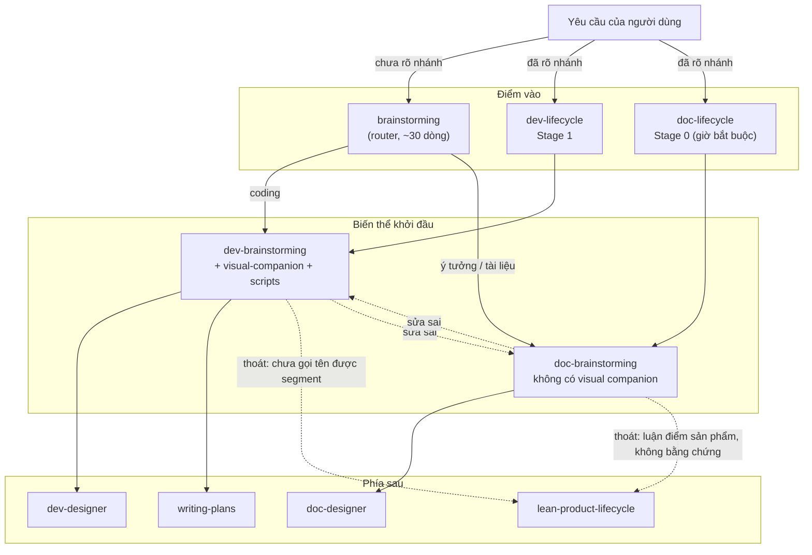
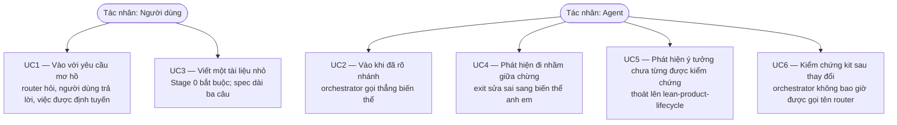
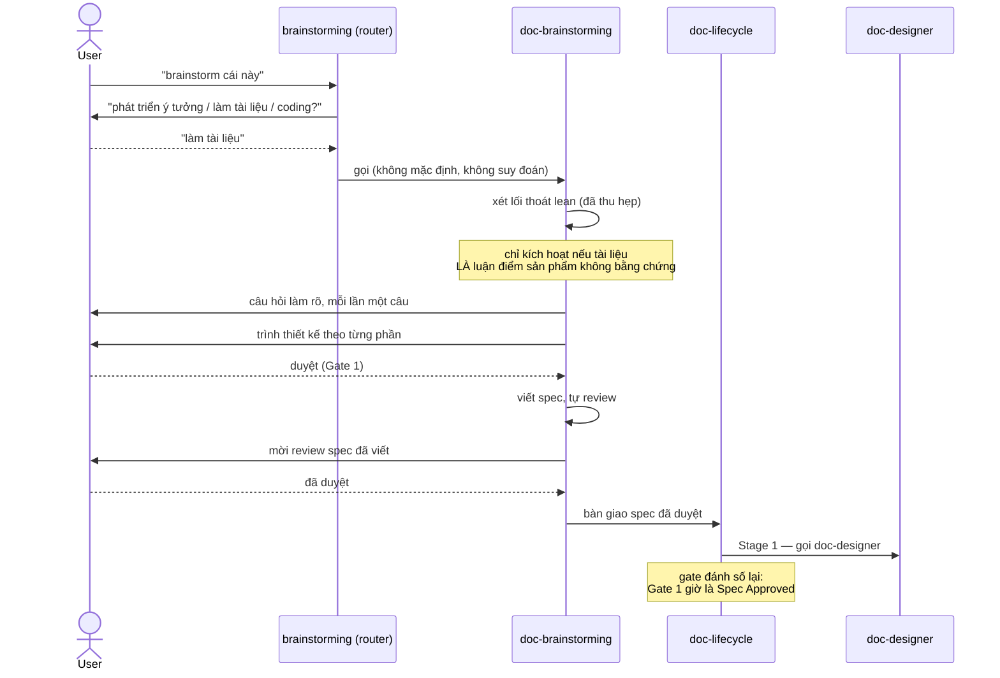

# Epic: Tách Brainstorming

## 1. Meta Data

- **Epic name**: `brainstorming_split`
- **Status**: In Progress
- **Target Release**: 1.3.0 (minor — router giữ `d3nexus:brainstorming` hoạt động)
- **Platform**: **Agent Kit (Markdown + Bash/Python)** — xem ghi chú platform bên dưới
- **Source Spec**: [2026-09-17-brainstorming-split-design.md](2026-09-17-brainstorming-split-design.md)
- **Epic tiền nhiệm**: [document_lifecycle_suite](../document_lifecycle_suite/document_lifecycle_suite.vi.md) — đã phát hành 1.2.0; epic này sửa lại quyết định §3.4 của nó

### Ghi chú platform

Bước 0 dò platform **không** thấy `pubspec.yaml`, `melos.yaml`, `settings.gradle*`,
`build.gradle.kts`, `Project.swift`, `Tuist.swift` hay `Package.swift`. Đối tượng chính là
repository này: một agent kit gồm skill Markdown cộng công cụ Bash và Python.

Chuẩn 3 tầng ánh xạ vào chính các cổng của repository này. Thay bằng `melos test`, `./gradlew`
hay `swift test` ở đây là red flag chứ không phải tuân thủ:

| Tầng | Ý nghĩa ở đây | Lệnh |
|---|---|---|
| **Tier A** — unit | Cấu trúc từng skill: frontmatter đúng `name` + `description`, `name` khớp thư mục, link tương đối resolve, anchor ToC khớp heading | `scripts/verify.sh` bước 1–4 |
| **Tier B** — governance | Tham chiếu chéo namespace, frontmatter của rules, JSON session hook cho cả hai runtime, source fidelity, check orphan và rename, cộng check định tuyến orchestrator mà epic này thêm vào | `scripts/verify.sh` bước 5–10 |
| **Tier C** — acceptance | Chạy cả hai orchestrator đầu-cuối, kích hoạt router từ một yêu cầu mơ hồ, và `@doc_quality_check` trên bốn file trong `docs/` | `scripts/verify.sh` đầy đủ + sáu mục ở §7 của spec |

---

## 2. Bối cảnh

`skills/brainstorming/SKILL.md` dài 228 dòng. Grep các từ mang điều kiện nhánh — `dev-designer`,
`doc-designer`, `writing-plans`, `lean-product-lifecycle`, `code`, `document` — trúng 31 dòng.
Khoảng 197 dòng còn lại là kỷ luật quy trình trung tính về lĩnh vực.

Tỷ lệ đó chính là lý do skill được dùng chung, và hiện vẫn còn đúng phần lớn. Lý do phải tách không
nằm ở tỷ lệ hiện tại, mà ở chỗ 31 dòng kia là phần **đang lớn lên**. Bản 1.2.0 thêm exit thứ tư và
một nhánh tài liệu; sau đó commit `8dd7beb` phải sửa năm đoạn cho nhận biết nhánh, vì hướng dẫn viết
cho việc code lại đang bị một agent đi làm tài liệu đọc.

Kèm theo là hai vấn đề nữa:

- **Nhánh tài liệu có thể bỏ qua chính giai đoạn khởi đầu của nó.** `doc-lifecycle` Stage 0 là tùy
  chọn, và điều kiện bỏ qua của nó — *"Skip this stage whenever the content is known and only its
  shape is open"* — không kiểm chứng được. Agent đánh giá "nội dung đã biết chưa?" hầu như luôn trả
  lời là rồi.
- **Không có gì hỏi được đây là loại việc nào.** Một câu "brainstorm cái này", hay dòng hook tại
  `hooks/session-start:47`, không mang tín hiệu nào về deliverable. Hiện tại skill đang đoán.

---

## 3. Mục tiêu & Ngoài phạm vi

### Mục tiêu

- Hai biến thể có kỷ luật quy trình phân kỳ được mà không bên nào kéo bên kia.
- Một giai đoạn khởi đầu bắt buộc ở nhánh tài liệu, gác bằng điều kiện kiểm chứng được.
- Đúng một chỗ, và chỉ một, đặt câu hỏi về deliverable.
- Không phá vỡ bất cứ thứ gì đang gọi tên `d3nexus:brainstorming`.

### Ngoài phạm vi

- Mọi thay đổi trình tự hay số gate của `dev-lifecycle`. Sửa đổi ở đây chỉ là đổi hướng tham chiếu.
- Mọi cơ chế giữ hai biến thể đồng bộ — phân kỳ chính là kết quả mong muốn.
- Biến thể thứ ba `lean-brainstorming`.
- Sửa các khiếm khuyết đã biết mang sang từ epic trước (§8 của spec).

---

## 4. Kiến trúc & Thiết kế kỹ thuật

### 4.1 Kiến trúc tổng thể



Cạnh liền là định tuyến thông thường. Cạnh đứt là hai lối thoát: lối thoát lên
`lean-product-lifecycle` bất đối xứng (§3.4 của spec) và exit sửa sai sang biến thể anh em (§3.7).

### 4.2 Use Case



### 4.3 Sequence Diagram — luồng chính



### 4.4 Check 1 — Phân tích tác động Shift-Left

Chạy trên `main` với các điểm chạm dự kiến:

```bash
python3 skills/impact-analysis/resources/scripts/check_code_impact.py \
  --files skills/brainstorming/SKILL.md skills/dev-lifecycle/SKILL.md \
          skills/doc-lifecycle/SKILL.md skills/lean-product-lifecycle/SKILL.md \
          skills/dev-designer/SKILL.md skills/doc-designer/SKILL.md \
          hooks/session-start rules/CRITICAL_RULES.md scripts/verify.sh \
  --symbols brainstorming dev-brainstorming doc-brainstorming \
  --base-ref main
```

**Kết quả: 🟢 sạch so với `main`, không có commit chưa merge.** Ba phát hiện chi phối cách tách task:

**Phát hiện 1 — việc đổi tên phá vỡ một chỉ dẫn thực thi được.**
`skills/brainstorming/SKILL.md:228` hard-code chính đường dẫn của nó:

> If they agree to the companion, read the detailed guide before proceeding:
> `skills/brainstorming/visual-companion.md`

Sau `git mv skills/brainstorming skills/dev-brainstorming`, đường dẫn đó chết, và agent bị bảo đọc
một file không tồn tại đúng vào lúc người dùng vừa chấp nhận lời mời dùng companion. Task 1 chịu
trách nhiệm phần này.

**Phát hiện 2 — comment đường dẫn trong script server lỗi thời, nhưng logic thì không.**
`skills/brainstorming/scripts/start-server.sh:80` tính
`AGENT_DIR="$(cd "$SCRIPT_DIR/../../.." && pwd)"`, dựa trên độ sâu.
`skills/dev-brainstorming/scripts` nằm cùng độ sâu với `skills/brainstorming/scripts`, nên phép đi
ngược vẫn tới đúng chỗ. Chỉ comment phía trên là sai. Sửa cho chính xác; đây không phải lỗi gãy.

**Phát hiện 3 — quyết định giữ router ngăn được một link gãy.**
`rules/CRITICAL_RULES.md:61` liên kết `[Brainstorming Skill](../skills/brainstorming/SKILL.md)`.
Vì §3.1 của spec giữ một router đúng tại đường dẫn đó, link vẫn resolve và `verify.sh` bước 1–4 vẫn
xanh. Theo phương án "brainstorming biến mất" trước đây, đây sẽ là một link tương đối gãy nằm ngay
trong critical rules của kit.

**Bán kính ảnh hưởng đã đo — 20 file live**, đo thật chứ không ước lượng:

| Khu vực | File |
|---|---|
| Đổi tên / tạo mới | `skills/brainstorming/` (router), `skills/dev-brainstorming/` (7 file), `skills/doc-brainstorming/` (mới) |
| Orchestrator | `skills/dev-lifecycle/SKILL.md`, `skills/doc-lifecycle/SKILL.md`, `skills/lean-product-lifecycle/SKILL.md` |
| Bên tiêu thụ | `skills/dev-designer/`, `skills/doc-designer/`, `skills/dev-implementation/`, `skills/writing-plans/`, `skills/impact-analysis/` (2 file) |
| Khác | `rules/CRITICAL_RULES.md`, `templates/AGENTS.md`, `scripts/verify.sh` |
| Docs | `docs/lifecycles.{en,vi}.md`, `docs/choosing-a-lifecycle.{en,vi}.md` |

**Cố ý loại trừ**: `.devtool/**` và lịch sử `CHANGELOG.md` ghi lại công việc làm dưới cách sắp xếp
cũ; sửa chúng cho khớp hiện tại là làm sai lệch bản ghi.
`skills/doc_quality_check/references/document-reviewer-prompt.md:11` cố ý ghi lại một đường dẫn
trước 1.2.0 nên cũng để nguyên.
`skills/using-superpowers/SKILL.md` và `hooks/session-start` vẫn gọi tên `brainstorming`, vì router
đúng là đích đến cho một yêu cầu chưa phân loại.

**Ghi chú hiệu chuẩn công cụ.** Script báo 🔴 0.0% coverage và "exception handling with zero test
coverage" cho mọi file Markdown. Đây là false positive — nó khớp mẫu mã nguồn, còn văn xuôi nói về
chế độ hỏng thì không phải xử lý lỗi. Ngưỡng coverage của nó không áp dụng cho epic này; bảng
Tier A–C ở trên mới là cổng thật.

### 4.5 Kịch bản BDD

Tóm tắt ở đây, đầy đủ tại [bdd_scenarios.md](bdd_scenarios.md), phủ cả năm chiều:

- **Happy path** — vào mơ hồ rồi được định tuyến theo câu trả lời; nhánh đã rõ thì bỏ qua router.
- **Edge case & biên** — tài liệu một đoạn vẫn phải qua Stage 0; yêu cầu nêu cả một feature lẫn một
  tài liệu; câu trả lời rỗng hoặc lấp lửng cho câu hỏi của router.
- **Chuyển trạng thái** — đánh số gate của `doc-lifecycle` trước và sau; vào một biến thể rồi được
  sửa sang biến thể anh em giữa chừng.
- **Async / race** — không áp dụng theo nghĩa đồng thời với skill markdown; thay vào đó phủ dưới
  dạng *rủi ro thứ tự*: Task 2 tạo lại `skills/brainstorming/` sau khi Task 1 đã dời nó đi.
- **Hỏng & khả năng phục hồi** — đường dẫn `visual-companion.md` chết ở Phát hiện 1; orchestrator
  gọi tên router thay vì một biến thể; `verify.sh` false-positive trên từ tiếng Anh thông thường
  "brainstorming".

---

## 5. Chiến lược triển khai & Giảm thiểu rủi ro

**Phân kỳ.** Một branch, các task theo thứ tự phụ thuộc, merge thành một khối. Kit được tiêu thụ
dưới dạng plugin có phiên bản, nên một bản tách áp dụng nửa vời sẽ để orchestrator trỏ vào skill
chưa tồn tại. Môi trường này không có feature flag.

**Rủi ro thứ tự.** Task 1 chạy `git mv skills/brainstorming skills/dev-brainstorming`; sau đó Task 2
tạo **mới** `skills/brainstorming/` chỉ chứa router. Chạy sai thứ tự, hoặc tạo file của Task 2 trước
khi dời, sẽ tạo ra một thư mục rồi bị phép dời nuốt mất. Task 2 bị chặn tường minh bởi Task 1.

**Rollback.** Mọi task đều ở mức file và revert được bằng `git revert`. Thao tác rủi ro nhất là đổi
tên; nó là `git mv` thuần và revert của nó là một `git mv` khác.

**Giảm thiểu cho việc đánh số lại gate.** `doc-lifecycle` đi từ ba lên bốn gate chạm vào mermaid,
văn xuôi, bảng gate và bảng Stage Skills. Bản 1.2.0 đã bị Gate 2 bắt bốn lỗi lệch văn xuôi/sơ đồ,
tất cả đều đúng dạng này. Definition of Done của Task 4 yêu cầu đối chiếu tường minh bốn biểu diễn
đó với nhau, không phải tình cờ phát hiện.

**Phát hành.** Mục tiêu 1.3.0. **Người dùng CHƯA cho phép phát hành.** Task 9 viết mục CHANGELOG ở
dạng *Unreleased*; việc publish là một quyết định riêng nằm ngoài epic này.

---

## 6. Phân rã task Kanban

| # | Task | Bị chặn bởi |
|---|---|---|
| 1 | [Đổi tên brainstorming thành dev-brainstorming và bóc nhánh tài liệu](task_1_dev_brainstorming_rename.md) | — |
| 2 | [Viết lại brainstorming thành skill định tuyến](task_2_brainstorming_router.md) | 1 |
| 3 | [Viết mới doc-brainstorming](task_3_doc_brainstorming_skill.md) | — |
| 4 | [Bắt buộc Stage 0 của doc-lifecycle và đánh số lại gate](task_4_doc_lifecycle_mandatory_stage_0.md) | 3 |
| 5 | [Đổi hướng dev-lifecycle sang dev-brainstorming](task_5_dev_lifecycle_retarget.md) | 1 |
| 6 | [Đổi hướng các bên tiêu thụ còn lại](task_6_consumer_retarget.md) | 1, 3 |
| 7 | [Thêm check định tuyến orchestrator vào verify.sh](task_7_verify_orchestrator_routing_check.md) | 4, 5 |
| 8 | [Cập nhật bốn tài liệu lifecycle song ngữ](task_8_docs_bilingual_update.md) | 1, 3, 4, 5 |
| 9 | [Nghiệm thu Tier C và CHANGELOG](task_9_tier_c_acceptance.md) | 1–8 |
