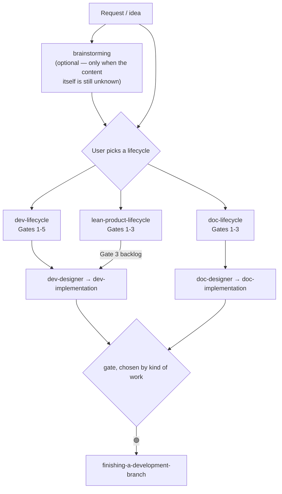

# Document Lifecycle Suite — Design Specification

> **Topic**: A second lifecycle for work whose deliverable is a document, not code
> **Date**: 2026-09-17
> **Status**: Approved Design Spec
> **Scope**: 4 new skills, 2 modified skills, 3 renames. Assumption mapping is split into its own
> spec — see [2026-09-17-assumption-mapping-design.md](../../../docs/superpowers/specs/2026-09-17-assumption-mapping-design.md)

---

## 0. Amendments after Gate 1

> [!IMPORTANT]
> **This document has been edited since it was approved.** What follows is the current design; the
> version the user approved at Gate 1 is commit `40f796d`. The changes below were decided during
> implementation, not during brainstorming, and they are listed here so the spec cannot be mistaken
> for a record of what was originally agreed.

**The architectural change.** The approved design put a `Kind` branch **inside `quality_check`**, on
the reasoning that it left `rules/CRITICAL_RULES.md` untouched. During Task 6 the user asked whether
the documentation gate should be a separate skill instead, so the skills would not couple and stay
maintainable apart. It became the standalone **`doc_quality_check`**, `quality_check` was left
byte-identical, and `CRITICAL_RULES.md` was amended after all.

**This decision never went through brainstorming.** It was taken in a two-message exchange
mid-execution. The reasoning is recorded in
[`../../../docs/adr/0001-separate-quality-gate-for-documentation.md`](../../../docs/adr/0001-separate-quality-gate-for-documentation.md),
including the two rejected alternatives and the negative consequences. It is the most consequential
decision in the epic and the one with the least process behind it.

**Every section it touched:**

| Section | Approved at Gate 1 | Now |
|---|---|---|
| §2, Goal 4 | `rules/CRITICAL_RULES.md` is not edited | `skills/quality_check/SKILL.md` is not edited; a Goal 5 on decoupling was added |
| §3.1, diagram | `quality_check` branches on `Kind` | a gate chosen by the kind of work |
| §3.3, gate table | Gate 2 approved by `quality_check` | Gate 2 approved by `doc_quality_check` |
| §4.1, Stage 2 | Gate 2 is `quality_check` with `Kind: document` | Gate 2 is `doc_quality_check` |
| §4.1, gate failure | re-run `quality_check` in full | re-run `doc_quality_check` in full |
| §4.4 | a `Kind` branch inside `quality_check` | a new standalone skill *(already marked in place)* |
| §6.1 | `quality_check` refuses the document path | `doc_quality_check` refuses the job |
| §9, out of scope | any change to `rules/CRITICAL_RULES.md` | any change to `skills/quality_check/SKILL.md` |

**A separate correction, made for a different reason.** §4.5's ADR rules were corrected in Task 1
after the primary sources were fetched: the section order was wrong, and the rejected-alternatives
rule had been **attributed to Nygard**, whose 2011 article does not mention it. That change
fixed an error in the approved spec rather than changing the design. Evidence:
[`source_fidelity_review.md`](source_fidelity_review.md).

---

## 1. Problem

The kit assumes every unit of work ends in a compiled, tested artifact. Three places hard-code that
assumption, and together they leave document work with no legal path through the kit.

**`brainstorming` is a one-way door into code.** Its own words:

> The terminal state is invoking either epic-designer or writing-plans — never both, and never any
> other implementation skill.

Both branches end in `code → test → QA → merge`. A spec whose deliverable is an ADR, a runbook or a
handbook has nowhere to go, so the agent improvises — which is the failure this kit exists to prevent.

**`quality_check` cannot verify a document, and release 1.1.1 widened the gap.** Tier C2 now compiles
a native binary (`gradlew assembleDebug`, `xcodebuild build`, `flutter build apk`). Meanwhile
`rules/CRITICAL_RULES.md` mandates:

> After completing any workflow or skill, you **MUST** use the `@quality_check` skill.

Applied to a markdown file, that instruction is unsatisfiable. An instruction that cannot be obeyed
is not a rule; it is a place where the agent learns that rules are negotiable.

**`lean-product-lifecycle` is a one-way door in the opposite direction.** It routes *down* to
`brainstorming` for small work, but `brainstorming` has no route *up*. When a brainstorming session
discovers mid-flight that nobody has validated who the customer is, the skill offers no way to stop
and go validate. It can only continue downhill into a spec.

**Concretely, four kinds of non-code task exist and only two have a home:**

| Kind of work | Home today |
|---|---|
| Validate a product idea before building | `lean-product-lifecycle` ✅ |
| Author or revise skills in this kit | `writing-skills` ✅ |
| Technical research and decision records (ADR, spike reports) | **none** ❌ |
| Operational and handover docs (runbooks, onboarding, guides) | **none** ❌ |

### 1.1 A latent bug this spec also closes

`skills/brainstorming/spec-document-reviewer-prompt.md` is 49 lines of working reviewer prompt that
**nothing in the repository references**. It was written and never wired in. Nothing currently
prevents that from recurring, so §7 adds a check for it.

---

## 2. Goals and non-goals

**Goals**

1. A document-shaped unit of work can travel from brief to merged branch without leaving the kit.
2. The human, not the agent, chooses which lifecycle a piece of work enters.
3. Document work is verified — mechanically and semantically — without pretending it can be tested.
4. `skills/quality_check/SKILL.md` is not edited. It gates every merge in every project and changed
   57 lines in 1.1.1; leaving it alone puts its regression risk at zero.
5. The two quality gates are **decoupled** — no shared file, and neither invokes the other.

**Non-goals**

1. Automatic classification of work as code vs document. Explicitly rejected — see §6.1.
2. Gate parity with `dev-lifecycle`. Document work gets **fewer** gates on purpose — see §3.3.
3. A style guide or prose-quality linter. Out of scope for this release.
4. Rewriting historical epic records under `.devtool/` to match the new names — see §4.7.

---

## 3. Design

### 3.1 Two sibling lifecycles under one umbrella

"Epic" stays the umbrella term for a unit of work large enough to need a breakdown. Beneath it sit
two lifecycles, and **the user picks one directly**.



Three lifecycles, one naming family: `dev-lifecycle`, `doc-lifecycle`, `lean-product-lifecycle`.

### 3.2 Routing lives in `description:`, not in a triage step

Because the user picks the entry point, no triage algorithm is needed. Routing still has to work
when the user simply says "help me write X" and names no skill — and in both runtimes that is
decided by skill `description:` frontmatter. So the discriminator is written there, not as a
procedure step. This is the entire routing mechanism; there is no other.

Each `description:` must state the deliverable it serves, and `dev-lifecycle`'s must retain the word
"epic" so existing activation keeps matching.

### 3.3 Document work gets three gates, not five

Code and prose differ in four ways that change what verification can mean:

| | Code | Document |
|---|---|---|
| Unit of work | an independently testable deliverable | a section or a page |
| Verification | a machine runs tests | mechanical checks plus human judgment |
| Primary constraint | architecture — who *calls* it | audience — who *reads* it |
| Cost of being wrong | high; migrations, released binaries | low; edit and re-commit |

Because the cost of being wrong is low, gate count must be low. A runbook that costs five human
approvals will not be written through this lifecycle; it will be written around it.

| Gate | Name | Approver | Handoff artefact |
|---|---|---|---|
| **1** | Brief & Outline approved | User | `<slug>.en.md` + `<slug>.vi.md` + `task_*.md` |
| **2** | Draft verified | `doc_quality_check` (machine) | 🟢 report |
| **3** | Sign-off | User | confirmation to finish the branch |

### 3.4 `brainstorming` is optional for document work

For "write a runbook for X" there is no design to explore. What is needed is a **brief**: who reads
it, which mode it is in, what it must cover. That is `doc-designer`'s job, so `doc-lifecycle` Stage 1
is `doc-designer` — not `brainstorming`.

`brainstorming` runs first only when the *content itself* is still unknown: a strategy document, a
proposal, an argument whose conclusion has not been reached.

---

## 4. Components

### 4.1 `doc-lifecycle` (new)

Mirrors `dev-lifecycle` in shape: owns sequence and gates only; each stage's method lives in that
stage's own skill.

- **Stage 0 (optional)** — `brainstorming`, per §3.4.
- **Stage 1** — `doc-designer`; exits at Gate 1.
- **Stage 2** — `doc-implementation`; exits at Gate 2 (`doc_quality_check`), then
  Gate 3 (user sign-off).
- **Stage 3** — `finishing-a-development-branch`; entered only once Gate 3 has passed.

Must carry a **When NOT to use this** section, matching `dev-lifecycle`'s. It names the escape
hatch: a typo fix, a one-line README correction, or any edit a reviewer would not meaningfully gate
is made directly, with no lifecycle. Without this section the lifecycle becomes a tax on small edits
and users route around it.

Gate failure routing:

| Gate | On failure, return to |
|---|---|
| 1 | Stage 1 — revise brief or outline |
| 2 | Stage 2 — fix findings, re-run `doc_quality_check` **in full** |
| 3 | Stage 2 — apply requested changes |

### 4.2 `doc-designer` (new) — grounded in Diátaxis

Four steps, in order:

1. **Audience and their job.** Who reads this, what they are trying to accomplish, what they already
   know. This is the document equivalent of requirements; skipping it produces text that is correct
   and unusable.
2. **Choose exactly one Diátaxis mode.** If the material spans modes, **split it into several
   documents**, one per mode. This is Diátaxis's central prescription and the single rule that
   prevents the most common defect in agent-written documentation — a "guide" that is part tutorial,
   part reference, part explanation, and serves nobody.

   | Mode | Serves | Reader's question |
   |---|---|---|
   | Tutorial | learning | "walk me through it the first time" |
   | How-to guide | working | "I need to accomplish X" |
   | Reference | looking up | "what exactly are the parameters" |
   | Explanation | understanding | "why is it designed this way" |

3. **Outline.** Section list, one line of purpose per section.
4. **Task breakdown.** One task per section. Present the list and confirm before writing task files
   — this checkpoint **is** Gate 1.

**Overview document.** Same two-language rule as `dev-designer` (`.en.md` canonical, `.vi.md` kept
in sync). BDD scenarios, architecture diagrams and sequence diagrams are **replaced**, not
supplemented, by:

```
Kind: document
Audience: <who reads this>
Diátaxis mode: tutorial | how-to | reference | explanation
Non-goals: <what this document deliberately does not cover>
Acceptance: <one thing the reader can do after reading>
```

**`Acceptance` must be a reader task, never a length or a section count.** Documentation is measured
by whether the reader can do the thing (Carroll's minimalism principle). "Explains the deploy
process" is not an acceptance criterion; "a new engineer completes a dev deploy in under 15 minutes
without asking anyone" is.

### 4.3 `doc-implementation` (new)

Reuses `dev-implementation`'s Kanban machinery unchanged: one worktree, one task at a time, one
commit per section, `.devtool/features/task_*.md` files, and the same divergence discipline — if the
draft departs from the outline, sync the outline before starting the next task.

**What replaces TDD.** There is nothing to run. In its place: after writing a section, re-read it
against that section's own one-line purpose in the outline. On mismatch, either fix the section or
change the outline deliberately. There is no third option, and "it's close enough" is not one.

### 4.4 `doc_quality_check` (new)

> [!NOTE]
> **Revised during implementation.** This section originally added a `Kind` branch inside
> `quality_check`. It now specifies a **standalone skill**, and `quality_check` is not modified at
> all. The reasoning is below.

A new skill, `skills/doc_quality_check/`, running four checks in order:

0. **Refusal rule.** If the change touches any file that ships in the build, abort and name the
   offending paths. Nothing else runs. See §6.1 for why this is mechanical.
1. **Mechanical.** No placeholder text; every internal link resolves; anchors match headings; code
   fences balanced. Executable, not a checklist:
   `skills/doc_quality_check/resources/scripts/check_document.py`. **The placeholder scan strips code
   spans and fenced blocks**, or it fires on any document that documents the check — observed, not
   hypothetical. `verify.sh` step 3 strips the same way for the same reason.
2. **Diátaxis type conformance.** Does the document stay inside its declared type? A missing type
   declaration is itself a finding. The remedy is always to relocate and link, never to delete.
3. **Content audit (subagent).** `skills/brainstorming/spec-document-reviewer-prompt.md` —
   49 lines that nothing in the repository referenced — is generalized from "spec reviewer" to
   "document reviewer" and relocated to
   `skills/doc_quality_check/references/document-reviewer-prompt.md`. Two checks are added:
   **unsupported claims**, and **whether the `Acceptance` criterion is actually met**.

**Why standalone rather than a branch inside `quality_check`:**

1. **Decoupling.** The two gates share no tier, no audit and no tooling, and neither invokes the
   other. Routing lives in `doc-lifecycle` and in `rules/CRITICAL_RULES.md` — where routing belongs.
   The skills can be maintained independently.
2. **Progressive disclosure.** Both runtimes load skills lazily, as `CLAUDE.md` states. Loading 512
   lines of Flutter, Gradle and Xcode matrices to verify a runbook is pure waste.
3. **Regression risk.** `quality_check` gates every merge in every project. Not touching it makes
   that risk zero.

**`rules/CRITICAL_RULES.md` is amended** so the mandated gate depends on the kind of work. An earlier
draft of this spec set "do not edit it" as a goal — but §1 of this same spec observes that its
mandate is *unsatisfiable* for a Markdown deliverable, and that an instruction which cannot be obeyed
teaches the agent that rules are negotiable. Those positions were in tension. Amending the rule
resolves the problem; leaving it merely avoided the file.

### 4.5 `decision-records` (new) — grounded in Nygard

Architecture Decision Records, in Nygard's own section order:
**Title / Context / Decision / Status / Consequences**.

Two rules come from the source, quoted in [source_fidelity_review.md](source_fidelity_review.md):

1. **One decision per record, immutable once `Accepted`.** An accepted ADR is never edited; it is
   superseded by a new record that references it. This is what separates an ADR from a wiki page,
   and it is why the history stays trustworthy.
2. **`Consequences` lists positive, negative and neutral outcomes** — the author names three
   categories, not two. An ADR listing only benefits is a sales pitch, not a record.

The third rule is **this kit's own addition, not Nygard's** — his article does not mention it, and
the skill must never cite him for it:

3. **Name the alternatives that were rejected, and why.** Precisely what nobody remembers six months
   later, and the reason teams reverse decisions that were correct. It comes from later ADR
   templates.

**Spike / research report variant**: Question / Method / Findings / Recommendation / Confidence /
**What would change this conclusion**. The last field forces the conclusion to be falsifiable and is
mandatory.

**Location**: `docs/adr/NNNN-kebab-title.md`, sequentially numbered, never renumbered.

**Relationship to `doc-lifecycle`**: a single ADR sits below the lifecycle's threshold (§4.1) —
invoke `decision-records` directly and skip the gates. Reach for `doc-lifecycle` only when a batch
of records is produced or backfilled as one piece of work.

### 4.6 `brainstorming` — a fourth exit (modified)

Two changes only:

- Replace the terminal-state rule with four exits: `dev-designer`, `writing-plans`, `doc-designer`,
  and `lean-product-lifecycle`.
- Add an explicit **upstream escape**: if the session reveals that the target customer or the
  underserved need has never been validated, stop and recommend `lean-product-lifecycle` rather than
  continuing into a spec. This closes the one-way door described in §1.

Everything else in `brainstorming` — the mindset, 5W1H, alternatives, self-review, the user review
gate — is unchanged.

### 4.7 Renames

| Current | New |
|---|---|
| `epic-lifecycle` | `dev-lifecycle` |
| `epic-designer` | `dev-designer` |
| `epic-implementation` | `dev-implementation` |

Unchanged: `finishing-a-development-branch` (shared by both lifecycles) and the directory
`.devtool/epic/` — "epic" remains the umbrella, both kinds live there, distinguished by `Kind:`.
**There is no data migration.**

**Blast radius is 18 live files**, not the 45 that a naive grep reports: 15 under `skills/`, plus
`rules/`, `README.md` and `CHANGELOG.md`. The remaining 28 are archived epic documents and task
files under `.devtool/`. **Those must not be rewritten** — they are the historical record of work
that was done under the old names, and editing them to match the present falsifies that record.

Required alongside the rename:

- Each renamed skill's `description:` retains the word "epic" so existing activation keeps matching.
- `CHANGELOG.md` marks the release **breaking**: the slash command `/d3nexus:epic-lifecycle` stops
  working, as do any per-project `AGENTS.md` files naming the old skills.

---

## 5. Artefact layout

```
.devtool/epic/<slug>/
  <slug>.en.md          # overview, canonical; Kind: document
  <slug>.vi.md          # translation, kept in sync
  task_01_*.md ...      # one per section
.devtool/features/      # live Kanban, unchanged
docs/adr/NNNN-*.md      # decision records
```

**Working artefacts live in `.devtool/`; the finished document lands where it belongs** — `docs/`,
`README.md`, a skill's `references/`. A finished deliverable must never be left inside `.devtool/`,
which is a workspace, not a publication target.

---

## 6. Failure modes

### 6.1 The agent mislabels code work to reach the cheaper track

The document path skips tests, the four audits, and — since 1.1.1 — a native binary build. The
development path does not. **This hands the agent a legitimate-looking lazy path**: call the work
"documentation" and the expensive gate disappears.

This is an incentive misalignment, not a comprehension failure, so it cannot be fixed by writing the
rule more clearly. The mitigation must be mechanical and independent of the agent's judgment:
**if the diff touches any file that ships in the build, it is development work** — regardless of how
much prose the task involved. `doc_quality_check` enforces this by refusing the job outright
(§4.4, check 4).

The user choosing the lifecycle by hand (§3.1) is a second, independent layer of the same defense.

### 6.2 The lifecycle becomes a tax on small edits

If fixing a typo opens gates, users abandon the lifecycle within days and the whole suite becomes
dead weight. Mitigated by the mandatory **When NOT to use this** section in §4.1, which must name
concrete examples rather than describe a threshold in the abstract.

### 6.3 The two lifecycles drift apart

Independently maintained orchestrators diverge — gates get renumbered on one side, terminology
shifts on the other, and eventually nobody can hold both in their head. Mitigated by
`doc-lifecycle` mirroring `dev-lifecycle` section-for-section, so a diff between the two files stays
readable and drift is visible.

### 6.4 A skill file is written and never wired in

Exactly what happened to `spec-document-reviewer-prompt.md` (§1.1). Mitigated by the `verify.sh`
check in §7.

---

## 7. Verification

**`scripts/verify.sh` gains two steps:**

1. **Orphan check.** Fail if any *supporting* file under `skills/*/` is referenced by no other file
   in the repository. Each skill's own `SKILL.md` is exempt — it is the entry point by definition,
   and without that exemption the check fires on every skill in the kit. Run against the current
   tree it must fail on `spec-document-reviewer-prompt.md`; if it passes, the check is broken.
2. **Rename completeness.** Fail if `epic-designer`, `epic-implementation` or `epic-lifecycle`
   appears anywhere outside `.devtool/` and the historical entries in `CHANGELOG.md`.

**Behavioural verification.** Both new methodology skills are subject to `evals/`, per §3.7 of the
README: run each scenario with and without the skill and grade blind. The delta is the finding.
Highest-value scenario: hand an agent a task whose material spans two Diátaxis modes and check
whether the skill causes it to split the document. A zero delta is a result, not a failure.

**Definition of done for this epic:** `scripts/verify.sh` passes, both new checks demonstrably fail
when their target defect is reintroduced, and `doc-lifecycle` has been run end-to-end on one real
document.

---

## 8. Assumptions, dependencies and risks

**Assumptions**

- "Epic" remains the umbrella term covering both kinds of work. Directory names and the `Kind:`
  field depend on this and change together if it is revisited.
- Document work happens on a branch, so `finishing-a-development-branch` applies unchanged.

**Dependencies**

- **Primary sources must be fetched during implementation, not recalled.** Diátaxis
  (Daniele Procida, diataxis.fr) and ADRs (Michael Nygard, *Documenting Architecture Decisions*,
  2011) are external methodologies, and neither is in `docs/books/`. This repository already holds
  the line that methodology skills are written from primary sources — `verify.sh` step 7 and
  `.devtool/epic/lean_product_suite/source_fidelity_review.md` exist precisely because
  summary-derived skills carried six behaviour-changing errors. **The first task of this epic fetches
  both sources and records a source-fidelity note**; no skill text is written before that lands.
- `writing-skills` governs how all four new skills are authored.

**Risks**

| Risk | Mitigation |
|---|---|
| Four new skills at once is a large surface to get right | Assumption mapping already split out; build and validate `doc-lifecycle` end-to-end on one real document before `decision-records` |
| Breaking rename strands existing users | `description:` retains "epic"; CHANGELOG marks it breaking; `verify.sh` proves the rename is complete |
| Diátaxis applied too rigidly forces artificial splits | The mode rule governs a *document*, not a repository; a `references/` directory may legitimately hold several modes in separate files |

---

## 9. Out of scope

- `assumption-mapping` — separate spec, separate lineage.
- Prose style enforcement (plain language, Elements of Style, vendor style guides).
- Translating existing documentation into Diátaxis modes retroactively.
- Any change to `skills/quality_check/SKILL.md`.
- The duplicate list numbering at `skills/quality_check/SKILL.md:422` and `:428`, introduced in
  1.1.1. Noted, deliberately not fixed here — unrelated to this epic.
