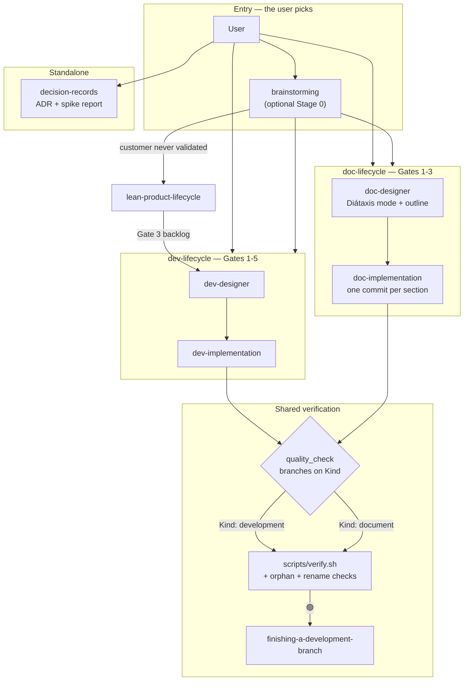
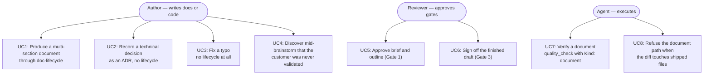
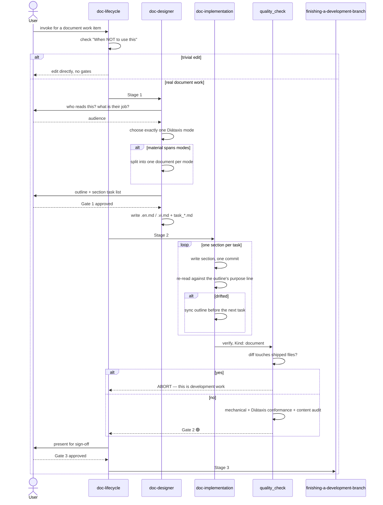

# Epic: Document Lifecycle Suite

## 1. Meta Data

| Field | Value |
|---|---|
| **Epic name** | `document_lifecycle_suite` |
| **Status** | In-Progress |
| **Target Release** | 1.2.0 (breaking) |
| **Platform** | **Agent Kit (Markdown + Bash/Python)** — see the platform note below |
| **Source Spec** | [2026-09-17-document-lifecycle-suite-design.md](2026-09-17-document-lifecycle-suite-design.md) |
| **Sibling epic** | [assumption-mapping spec](../../../docs/superpowers/specs/2026-09-17-assumption-mapping-design.md) — separate lineage, not part of this epic |

### Platform note

Step 0 platform detection found **no** `pubspec.yaml`, `melos.yaml`, `settings.gradle*`,
`build.gradle.kts`, `Project.swift`, `Tuist.swift` or `Package.swift`. The target is this repository
itself: an agent kit made of Markdown skills plus Bash and Python tooling.

The 3-Tier standard therefore maps onto this repository's own gates rather than onto a mobile
toolchain. Substituting `melos test`, `./gradlew` or `swift test` here would be a red flag, not
compliance:

| Tier | Meaning here | Command |
|---|---|---|
| **Tier A** — unit | Per-skill structure: frontmatter is exactly `name` + `description`, `name` matches its directory, relative links resolve, ToC anchors match headings | `scripts/verify.sh` steps 1–4 |
| **Tier B** — governance | Cross-namespace references, rule frontmatter, session hook JSON for both runtimes, source fidelity, plus the two new checks this epic adds | `scripts/verify.sh` steps 5–9 |
| **Tier C** — acceptance | `doc-lifecycle` driven end-to-end on one real document, and the `evals/` blind-judge ablation run on the new methodology skills | `scripts/verify.sh` in full + `evals/` per `evals/protocol.md` |

---

## 2. Background

Three places in the kit hard-code the assumption that every unit of work ends in a compiled, tested
artifact, and together they leave document work with no legal path through the kit.

- **`brainstorming` is a one-way door into code.** Its terminal state is `epic-designer` or
  `writing-plans`, "never any other implementation skill". Both branches end in code → test → QA.
- **`quality_check` cannot verify a document, and release 1.1.1 widened the gap** by adding Tier C2,
  which compiles a native binary. Meanwhile `rules/CRITICAL_RULES.md` mandates `quality_check` after
  *every* workflow. Applied to a Markdown file that instruction is unsatisfiable — and an
  instruction that cannot be obeyed teaches the agent that rules are negotiable.
- **`lean-product-lifecycle` is a one-way door the other way.** It routes *down* to `brainstorming`
  but `brainstorming` has no route *up*, so a session that discovers the customer was never
  validated can only continue downhill into a spec.

Four kinds of non-code work exist in practice; only two have a home (`lean-product-lifecycle` and
`writing-skills`). Technical decision records and operational documentation have none.

Full argument, alternatives considered and rejected: the source spec.

---

## 3. Goals & Non-Goals

### Goals

1. A document-shaped unit of work travels from brief to merged branch without leaving the kit.
2. The **human** chooses the lifecycle. No automatic code-vs-document classification.
3. Document work is verified mechanically and semantically, without pretending it can be tested.
4. `rules/CRITICAL_RULES.md` is **not edited** — it loads into every session on every project.

### Non-Goals

1. Gate parity with the development lifecycle. Document work gets **three** gates deliberately.
2. A prose style guide or writing-quality linter.
3. Rewriting the historical epic records under `.devtool/` to match the new skill names.
4. `assumption-mapping` — separate spec, separate epic, separate lineage.

---

## 4. Architecture & Technical Design

### 4.1 High-Level Architecture



### 4.2 Use Cases



### 4.3 Sequence Diagram — the primary flow



### 4.4 Check 1 — Shift-Left Impact Analysis

Run against `main` on the planned touchpoints:

```bash
python3 skills/impact-analysis/resources/scripts/check_code_impact.py \
  --files skills/brainstorming/SKILL.md skills/quality_check/SKILL.md \
          skills/epic-lifecycle/SKILL.md skills/epic-designer/SKILL.md \
          skills/epic-implementation/SKILL.md scripts/verify.sh \
          rules/CRITICAL_RULES.md README.md \
  --symbols epic-lifecycle epic-designer epic-implementation \
  --base-ref main
```

**Result: 🟢 clean against `main`, zero unmerged commits.** Two findings changed the plan:

**Finding 1 — the rename breaks an executable path, not just prose.**
`skills/finishing-a-development-branch/SKILL.md:109-112` tests for `sync_task_status.py` at a
hard-coded path under `skills/epic-implementation/`. Renaming the directory without updating this
check makes the archival step silently take its fallback branch. This is a functional break and
Task 2 owns it explicitly.

**Finding 2 — `hooks/session-start` names the skills.** That hook injects content into every session
on every project, so a stale name there propagates further than any SKILL.md.

**Verified blast radius — 19 live files.** The source spec estimated 18 and omitted `hooks/` and
`templates/`; the measured list governs:

| Area | Files |
|---|---|
| `skills/` | `brainstorming`, `epic-designer`, `epic-implementation` (SKILL.md + 5 scripts), `epic-lifecycle`, `finishing-a-development-branch`, `impact-analysis` (2), `lean-mvp-scoping` (2), `lean-product-lifecycle` |
| Other | `hooks/session-start`, `rules/CRITICAL_RULES.md`, `README.md`, `templates/AGENTS.md` |

`.devtool/` (28 further files) and `CHANGELOG.md` history are **excluded on purpose** — they record
work done under the old names, and editing them to match the present falsifies the record.

**Tool calibration note.** The script reported 🔴 0.0% coverage and "exception handling with zero
test coverage" for every Markdown file. Those are false positives: it pattern-matches source code,
and prose about errors is not error handling. The coverage thresholds in its output do not apply to
this epic; Tier A–C above is the real gate.

**Pre-existing inconsistency, noted and not fixed:** two scripts document their own invocation as
`.agents/skills/…` while their siblings use `skills/…`.

### 4.5 BDD scenarios

Summarised here, exhaustive in [bdd_scenarios.md](bdd_scenarios.md), covering all five dimensions:

1. **Happy paths** — a multi-section document travels Gate 1 → 2 → 3.
2. **Edge cases & boundaries** — material spanning two Diátaxis modes; a single-section document; an
   empty outline; a document with no identifiable audience.
3. **State transitions** — every legal and illegal gate transition, including attempts to reach
   Stage 3 without Gate 2.
4. **Async / race conditions** — a second epic active concurrently (backlog rule); two sessions
   writing task files; a republished skill mid-run.
5. **Failures & resilience** — unreachable primary source; broken relative link; unbalanced mermaid
   fence; a diff that touches shipped files; `quality_check` invoked with no `Kind`.

---

## 5. Rollout Strategy & Mitigation

**Ordering.** Task 1 (primary sources) gates all methodology text. Task 2 (rename) lands early and
alone, because every later task edits files it touches and rebasing a rename is expensive.

**Phasing.** The suite is usable after Tasks 3–5 (`doc-lifecycle` + designer + implementation);
`decision-records` (Task 8) is additive and can slip a release without stranding anything.

**Breaking change.** `/d3nexus:epic-lifecycle` stops working. Mitigations: each renamed skill keeps
the word "epic" in its `description:` so activation still matches; `CHANGELOG.md` marks 1.2.0
breaking and names the three renames; the rename-completeness check in `verify.sh` fails the release
if any live file still carries an old name.

**Fallback.** Every task is one commit. The rename is a single revertible commit, and the new skills
are additive — reverting them removes a capability without disturbing the development lifecycle.

**Do not publish** until `scripts/verify.sh` passes in full: a broken skill propagates to every
project on every machine that has the plugin installed.

---

## 6. Kanban Tasks Breakdown

| # | Task | Scope | Depends on |
|---|---|---|---|
| 1 | [Fetch Primary Sources & Generalize the Fidelity Guard](task_1_primary_sources_and_fidelity_guard.md) | Fetch diataxis.fr and Nygard 2011; write source_fidelity_review.md; make check_source_fidelity.py source-agnostic | — |
| 2 | [Rename `epic-*` Skills to `dev-*`](task_2_rename_epic_skills_to_dev.md) | 3 directory renames, 19 live files, the runtime script path probe, hooks/session-start, CHANGELOG breaking entry | — |
| 3 | [`doc-lifecycle` Orchestrator Skill](task_3_doc_lifecycle_orchestrator.md) | 3 gates, stage list, gate-failure routing, a concrete *When NOT to use this* | — |
| 4 | [`doc-designer` Skill (Diátaxis)](task_4_doc_designer_skill.md) | Four steps, the Meta Data contract, the one-mode-per-document split rule | 1 |
| 5 | [`doc-implementation` Skill](task_5_doc_implementation_skill.md) | Kanban reuse, one commit per section, outline sync, the re-read rule replacing TDD | 3 |
| 6 | [Add the `doc_quality_check` skill](task_6_doc_quality_check_skill.md) | Standalone gate: refusal rule, mechanical script, type conformance, content audit; `quality_check` untouched | 4 |
| 7 | [`brainstorming` — Fourth Exit and Upstream Escape](task_7_brainstorming_fourth_exit.md) | Four terminal states; stop-and-escape to lean-product-lifecycle | 3, 4 |
| 8 | [`decision-records` Skill (ADR + Spike Report)](task_8_decision_records_skill.md) | Nygard five-section format, immutability, rejected alternatives, negative consequences | 1 |
| 9 | [Two New `verify.sh` Checks](task_9_verify_sh_orphan_and_rename_checks.md) | Orphan check (SKILL.md exempt) and rename completeness; each proven by defect injection | 2 |
| 10 | [Tier C — End-to-End Acceptance](task_10_tier_c_acceptance.md) | One real document through all three gates; evals ablation; full verify.sh; README + CHANGELOG | 3–9 |

Task files are mirrored in `.devtool/features/` as the live Kanban board. No other epic
has an active task, so every task is created with `status: todo`.
