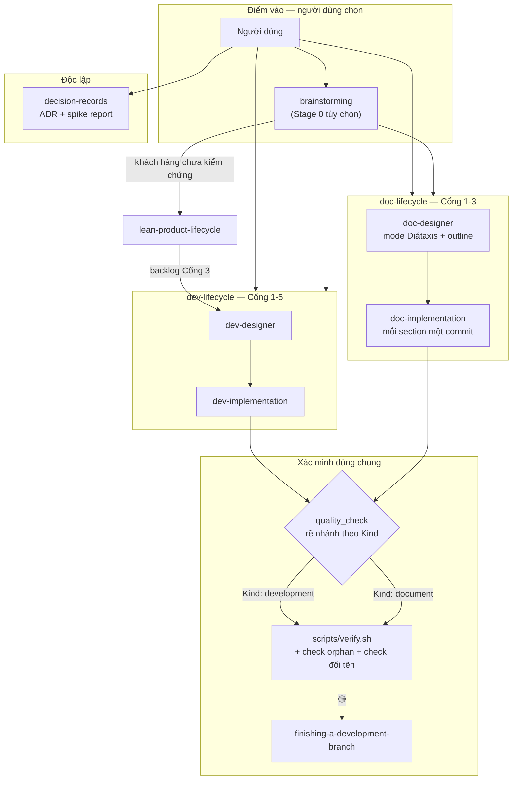
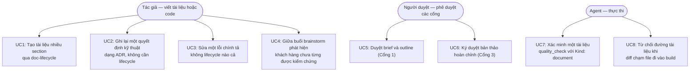
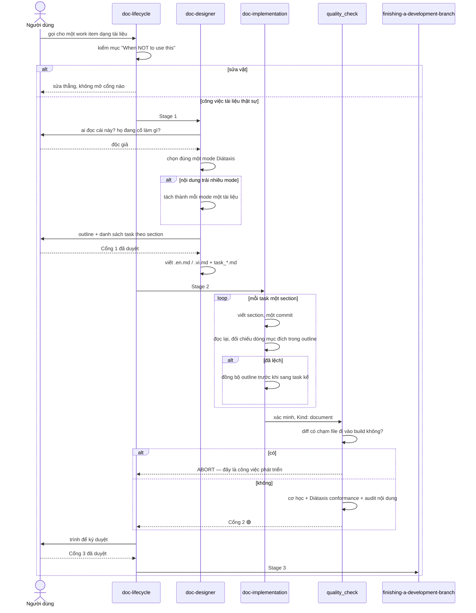

# Epic: Document Lifecycle Suite

> Bản dịch của [document_lifecycle_suite.en.md](document_lifecycle_suite.en.md). Bản tiếng Anh là
> nguồn sự thật cho tooling và agent; bản này phục vụ trao đổi trong nhóm và phải luôn đồng bộ.

## 1. Meta Data

- **Tên epic**: `document_lifecycle_suite`
- **Trạng thái**: Done
- **Bản phát hành đích**: 1.2.0 (breaking)
- **Nền tảng**: **Agent Kit (Markdown + Bash/Python)** — xem ghi chú bên dưới
- **Spec nguồn**: [2026-09-17-document-lifecycle-suite-design.md](2026-09-17-document-lifecycle-suite-design.md)
- **Epic anh em**: [spec assumption-mapping](../../../docs/superpowers/specs/2026-09-17-assumption-mapping-design.md) — dòng đời riêng, không thuộc epic này

### Ghi chú về nền tảng

Bước 0 dò nền tảng **không** tìm thấy `pubspec.yaml`, `melos.yaml`, `settings.gradle*`,
`build.gradle.kts`, `Project.swift`, `Tuist.swift` hay `Package.swift`. Đối tượng chính là repo này:
một agent kit gồm skill Markdown cùng tooling Bash và Python.

Vì vậy chuẩn 3-Tier ánh xạ vào chính các cổng của repo này, không phải vào toolchain mobile. Dùng
`melos test`, `./gradlew` hay `swift test` ở đây là red flag, không phải tuân thủ:

| Tier | Ý nghĩa ở đây | Lệnh |
|---|---|---|
| **Tier A** — unit | Cấu trúc từng skill: frontmatter đúng `name` + `description`, `name` khớp thư mục, link tương đối resolve, ToC anchor khớp heading | `scripts/verify.sh` bước 1–4 |
| **Tier B** — governance | Tham chiếu chéo namespace, frontmatter của rule, JSON của session hook cho cả hai runtime, source fidelity, cộng hai check mới epic này thêm vào | `scripts/verify.sh` bước 5–9 |
| **Tier C** — acceptance | Chạy `doc-lifecycle` đầu-cuối trên một tài liệu thật, và chạy ablation blind-judge trong `evals/` cho các skill phương pháp luận mới | `scripts/verify.sh` đầy đủ + `evals/` theo `evals/protocol.md` |

---

## 2. Bối cảnh

Ba chỗ trong kit khóa cứng giả định rằng mọi đơn vị công việc đều kết thúc bằng một artifact đã biên
dịch và đã test. Cộng lại, chúng khiến công việc tài liệu không có đường đi hợp lệ nào qua kit.

- **`brainstorming` là cánh cửa một chiều dẫn vào code.** Trạng thái kết thúc của nó là
  `epic-designer` hoặc `writing-plans`, "never any other implementation skill". Cả hai nhánh đều kết
  thúc bằng code → test → QA.
- **`quality_check` không xác minh được tài liệu, và bản 1.1.1 còn nới rộng khoảng cách** khi thêm
  Tier C2 biên dịch binary native. Trong khi đó `rules/CRITICAL_RULES.md` bắt buộc chạy
  `quality_check` sau *mọi* workflow. Áp lên một file Markdown thì chỉ thị đó không thể thực hiện —
  và một chỉ thị không thể tuân theo sẽ dạy agent rằng luật là thứ có thể thương lượng.
- **`lean-product-lifecycle` là cánh cửa một chiều theo hướng ngược lại.** Nó chỉ đường *xuống*
  `brainstorming`, nhưng `brainstorming` không có đường *lên*, nên một buổi làm việc phát hiện ra
  khách hàng chưa từng được kiểm chứng cũng chỉ có thể tiếp tục đi xuống thành spec.

Thực tế có bốn loại công việc phi-code; chỉ hai loại có nhà (`lean-product-lifecycle` và
`writing-skills`). Hồ sơ quyết định kỹ thuật và tài liệu vận hành thì không có.

Lập luận đầy đủ, các phương án đã cân nhắc và bị loại: xem spec nguồn.

---

## 3. Mục tiêu & Ngoài phạm vi

### Mục tiêu

1. Một đơn vị công việc dạng tài liệu đi được từ brief tới nhánh đã merge mà không phải rời khỏi kit.
2. **Con người** chọn lifecycle. Không tự động phân loại code hay tài liệu.
3. Công việc tài liệu được xác minh cả cơ học lẫn ngữ nghĩa, mà không giả vờ rằng nó test được.
4. **Không sửa** `rules/CRITICAL_RULES.md` — file này nạp vào mọi session trên mọi project.

### Ngoài phạm vi

1. Ngang bằng số cổng với lifecycle phát triển. Công việc tài liệu cố ý chỉ có **ba** cổng.
2. Hướng dẫn văn phong hay linter chất lượng câu chữ.
3. Viết lại các hồ sơ epic lịch sử dưới `.devtool/` cho khớp tên skill mới.
4. `assumption-mapping` — spec riêng, epic riêng, dòng đời riêng.

---

## 4. Kiến trúc & Thiết kế kỹ thuật

### 4.1 Kiến trúc tổng thể



### 4.2 Use Case



### 4.3 Sequence Diagram — luồng chính



### 4.4 Check 1 — Phân tích tác động Shift-Left

Chạy đối chiếu với `main` trên các điểm chạm dự kiến:

```bash
python3 skills/impact-analysis/resources/scripts/check_code_impact.py \
  --files skills/brainstorming/SKILL.md skills/quality_check/SKILL.md \
          skills/epic-lifecycle/SKILL.md skills/epic-designer/SKILL.md \
          skills/epic-implementation/SKILL.md scripts/verify.sh \
          rules/CRITICAL_RULES.md README.md \
  --symbols epic-lifecycle epic-designer epic-implementation \
  --base-ref main
```

**Kết quả: 🟢 sạch so với `main`, không có commit chưa merge.** Hai phát hiện đã làm đổi kế hoạch:

**Phát hiện 1 — việc đổi tên làm hỏng một đường dẫn đang chạy, không chỉ hỏng chữ nghĩa.**
`skills/finishing-a-development-branch/SKILL.md:109-112` kiểm tra sự tồn tại của
`sync_task_status.py` theo đường dẫn cứng dưới `skills/epic-implementation/`. Đổi tên thư mục mà
không sửa chỗ này sẽ khiến bước archival âm thầm rẽ sang nhánh dự phòng. Đây là hỏng chức năng, và
Task 2 chịu trách nhiệm rõ ràng cho nó.

**Phát hiện 2 — `hooks/session-start` có nhắc tên skill.** Hook này chèn nội dung vào mọi session
trên mọi project, nên một cái tên cũ sót lại ở đó lan xa hơn bất kỳ SKILL.md nào.

**Bán kính ảnh hưởng đã đo — 19 file sống.** Spec nguồn ước lượng 18 và bỏ sót `hooks/` lẫn
`templates/`; danh sách đo được mới là căn cứ:

| Khu vực | File |
|---|---|
| `skills/` | `brainstorming`, `epic-designer`, `epic-implementation` (SKILL.md + 5 script), `epic-lifecycle`, `finishing-a-development-branch`, `impact-analysis` (2), `lean-mvp-scoping` (2), `lean-product-lifecycle` |
| Khác | `hooks/session-start`, `rules/CRITICAL_RULES.md`, `README.md`, `templates/AGENTS.md` |

`.devtool/` (28 file nữa) và phần lịch sử trong `CHANGELOG.md` **cố ý bị loại trừ** — chúng ghi lại
công việc đã làm dưới tên cũ, và sửa chúng cho khớp hiện tại là làm sai hồ sơ.

**Ghi chú về hiệu chuẩn công cụ.** Script báo 🔴 0.0% coverage và "exception handling with zero test
coverage" cho mọi file Markdown. Đó là dương tính giả: nó đối sánh mẫu trên mã nguồn, còn văn xuôi
nói về lỗi thì không phải là xử lý lỗi. Các ngưỡng coverage trong output của nó không áp cho epic
này; Tier A–C ở trên mới là cổng thật.

**Bất nhất có sẵn, ghi nhận và không sửa:** hai script mô tả cách gọi chính chúng là
`.agents/skills/…` trong khi các script anh em dùng `skills/…`.

### 4.5 Kịch bản BDD

Tóm tắt ở đây, đầy đủ trong [bdd_scenarios.md](bdd_scenarios.md), phủ cả năm chiều:

1. **Happy path** — một tài liệu nhiều section đi qua Cổng 1 → 2 → 3.
2. **Edge case & biên** — nội dung trải hai mode Diátaxis; tài liệu một section; outline rỗng; tài
   liệu không xác định được độc giả.
3. **Chuyển trạng thái** — mọi chuyển cổng hợp lệ và bất hợp lệ, gồm cả việc cố sang Stage 3 khi
   chưa qua Cổng 2.
4. **Async / race condition** — một epic khác đang hoạt động song song (luật backlog); hai session
   cùng ghi task file; một skill được publish lại giữa chừng.
5. **Lỗi & khả năng chịu lỗi** — không với tới được nguồn gốc; link tương đối hỏng; fence mermaid
   lệch; diff chạm file đi vào build; gọi `quality_check` mà không có `Kind`.

---

## 5. Chiến lược triển khai & Giảm thiểu rủi ro

**Thứ tự.** Task 1 (nguồn gốc) chặn mọi phần viết phương pháp luận. Task 2 (đổi tên) làm sớm và làm
một mình, vì mọi task sau đều sửa các file nó đụng tới, và rebase một lần đổi tên thì rất đắt.

**Chia pha.** Bộ skill dùng được ngay sau Task 3–5 (`doc-lifecycle` + designer + implementation);
`decision-records` (Task 8) là bổ sung, có thể lùi một bản phát hành mà không bỏ lửng thứ gì.

**Thay đổi phá vỡ tương thích.** `/d3nexus:epic-lifecycle` sẽ ngừng hoạt động. Giảm thiểu: mỗi skill
đổi tên vẫn giữ chữ "epic" trong `description:` để activation còn bắt được; `CHANGELOG.md` đánh dấu
1.2.0 là breaking và nêu tên ba lần đổi; check rename-completeness trong `verify.sh` sẽ fail bản phát
hành nếu còn file sống nào mang tên cũ.

**Phương án lùi.** Mỗi task là một commit. Việc đổi tên là một commit revert được, và các skill mới
đều là bổ sung — revert chúng chỉ mất một năng lực chứ không động tới lifecycle phát triển.

**Không publish** cho tới khi `scripts/verify.sh` pass đầy đủ: một skill hỏng sẽ lan ra mọi project
trên mọi máy đã cài plugin.

---

## 6. Phân rã task Kanban

| # | Task | Phạm vi | Phụ thuộc |
|---|---|---|---|
| 1 | [Fetch Primary Sources & Generalize the Fidelity Guard](task_1_primary_sources_and_fidelity_guard.md) | Fetch diataxis.fr and Nygard 2011; write source_fidelity_review.md; make check_source_fidelity.py source-agnostic | — |
| 2 | [Rename `epic-*` Skills to `dev-*`](task_2_rename_epic_skills_to_dev.md) | 3 directory renames, 19 live files, the runtime script path probe, hooks/session-start, CHANGELOG breaking entry | — |
| 3 | [`doc-lifecycle` Orchestrator Skill](task_3_doc_lifecycle_orchestrator.md) | 3 gates, stage list, gate-failure routing, a concrete *When NOT to use this* | — |
| 4 | [`doc-designer` Skill (Diátaxis)](task_4_doc_designer_skill.md) | Four steps, the Meta Data contract, the one-mode-per-document split rule | 1 |
| 5 | [`doc-implementation` Skill](task_5_doc_implementation_skill.md) | Kanban reuse, one commit per section, outline sync, the re-read rule replacing TDD | 3 |
| 6 | [Add the `doc_quality_check` skill](task_6_doc_quality_check_skill.md) | Standalone gate: refusal rule, mechanical script, type conformance, content audit; `quality_check` untouched | 4 |
| 7 | [`brainstorming` — Fourth Exit and Upstream Escape](task_7_brainstorming_fourth_exit.md) | Four terminal states; stop-and-escape to lean-product-lifecycle | 3, 4 |
| 8 | [`decision-records` Skill (ADR + Spike Report)](task_8_decision_records_skill.md) | Nygard five-section format, immutability, rejected alternatives, negative consequences | 1 |
| 9 | [Two New `verify.sh` Checks](task_9_verify_sh_orphan_and_rename_checks.md) | Orphan check (SKILL.md exempt) and rename completeness; each proven by defect injection | 2 |
| 10 | [Tier C — End-to-End Acceptance](task_10_tier_c_acceptance.md) | One real document through all three gates; evals ablation; full verify.sh; README + CHANGELOG | 3–9 |
| 11 | [Áp dụng progressive disclosure cho các skill mới](task_11_progressive_disclosure_cleanup.md) | Cắt 5 description về gần mức trung bình của kit; chuyển trích dẫn nguồn sang `references/`, giữ mọi luật ở lại SKILL.md | 3–8 |

File task được mirror sang `.devtool/features/` làm bảng Kanban đang chạy. Không có epic nào
khác đang có task hoạt động, nên mọi task được tạo với `status: todo`.
