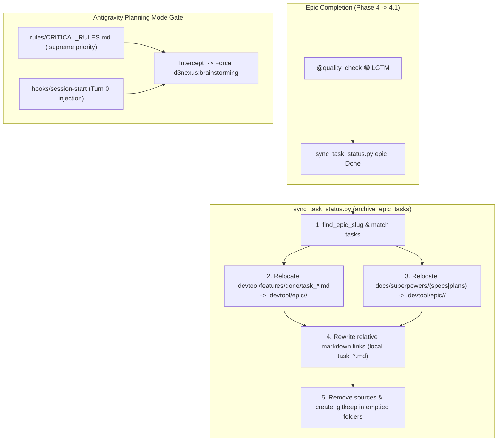

# Design Spec: Epic Done Archival & Antigravity Planning Gate

- **Date**: 2026-09-15
- **Topic**: Automatic Archival of Done Tasks/Docs on Epic Completion & Antigravity Planning Mode Governance Gate
- **Status**: Draft (In Review)
- **Author**: Antigravity AI Pair & DanhDue ExOICTIF

---

## 1. Background & Problem Statement

In agentic mobile engineering workflows using `d3nexus` on **Claude Code** and **Google Antigravity IDE**, two governance and lifecycle friction points were identified:

### 1.1 Leftover Done Tasks & Uncentralized Documents
When an epic completed in `epic-implementation`:
1. `task_*.md` files remained inside `.devtool/features/done/`, cluttering the active board directory.
2. Earlier drafting artifacts in `docs/superpowers/specs/` and `docs/superpowers/plans/` remained orphaned instead of being permanently archived alongside the parent Epic.
3. Relative links inside `task_*.md` (such as `Blocked by` / `Blocks` pointing to `../../features/`) and in Section 8 of the Epic Overview (`<epic_dir>.en.md` and `<epic_dir>.vi.md`) were left pointing to non-existent or stale paths once tasks moved.

### 1.2 Antigravity Planning Mode Bypassing Brainstorming
Google Antigravity IDE injects a system-level `<planning_mode>` instruction prompt when user requests appear complex. This caused the AI Agent to default to generating an IDE-specific `<appDataDir>/brain/.../implementation_plan.md` artifact directly, bypassing the mandatory `<HARD-GATE>` of `d3nexus:brainstorming` and the structured stages of `d3nexus:epic-lifecycle`.

---

## 2. Goals & Non-Goals

### Goals
1. **Automated Epic Done Archival**: When an epic reaches `Done` (all tasks completed and `@quality_check` reports 🟢 LGTM):
   - Move all `task_*.md` from `.devtool/features/done/` into `.devtool/epic/<epic_dir>/`.
   - Relocate related specs and plans from `docs/superpowers/` into `.devtool/epic/<epic_dir>/`.
   - Rewrite Markdown relative links to point to local sibling files within `.devtool/epic/<epic_dir>/`.
   - Clean up source files and preserve `.gitkeep` in emptied directories.
2. **CLI & Workflow Integration**:
   - Provide automatic execution within `sync_task_status.py epic <epic_dir> Done`.
   - Provide standalone CLI command `sync_task_status.py archive-epic <epic_dir>`.
   - Document Phase 4.1 in `epic-implementation`, update Gate 4 in `epic-lifecycle`, and clarify Step 2 in `epic-designer`.
3. **Antigravity Planning Mode Governance Gate**:
   - Enforce via `rules/CRITICAL_RULES.md` (which sits in `<user_rules>` with supreme precedence) that Planning Mode in Antigravity MUST invoke `d3nexus:brainstorming` (or `d3nexus:epic-lifecycle` for epic-scale work) before any implementation plan is authored.
   - Update `hooks/session-start` to inject explicit Antigravity planning mode interception instructions during turn 0.

### Non-Goals
- Modifying unrelated skills or alter the 5 standard Kanban status states (`backlog`, `todo`, `in-progress`, `review`, `done`).

---

## 3. Technical Architecture & Components



### 3.1 Component 1: `sync_task_status.py` Archival Engine

1. **`find_epic_slug(root: Path, epic_dir: str) -> str | None`**:
   Extracts `Epic: <slug>` from `<epic_dir>.en.md`, `.vi.md`, or contained `task_*.md` frontmatter.

2. **`fix_task_markdown_links(text: str, epic_dir: str) -> str`**:
   - Rewrites `](.. /epic/<epic_dir>/<file>.md)` $\rightarrow$ `](<file>.md)`.
   - Rewrites `](../../features/(?:done/)?(task_*.md))` $\rightarrow$ `]($1)`.

3. **`fix_epic_overview_links(text: str) -> str`**:
   - Rewrites Section 8 links from `](../../features/(?:done/)?(task_*.md))` $\rightarrow$ `]($1)`.

4. **`archive_superpowers_docs(root: Path, epic_dir: str, epic_slug: str | None) -> list[Path]`**:
   - Scans `docs/superpowers/plans/` and `docs/superpowers/specs/`.
   - Relocates files whose names match `<epic_dir>` or `<epic_slug>`.
   - Retains `.gitkeep` if directories become empty.

5. **`archive_epic_tasks(roots: list[Path], epic_dir: str) -> tuple[list[Path], list[Path]]`**:
   - Orchestrates multi-checkout task relocation across worktree roots.
   - Cleans up source `task_*.md` files from `.devtool/features/done/`.
   - Retains `.gitkeep` in `.devtool/features/done/`.

6. **Status Sync & CLI Binding**:
   - Automatically executed when `sync_epic` sets status to `Done` or `Hoàn thành`.
   - Exposed as standalone CLI command: `sync_task_status.py archive-epic <epic_dir>`.
   - `expected_epic` and `board_tally` updated to inspect `.devtool/epic/<epic_dir>/` so archived tasks remain resolvable.

### 3.2 Component 2: Antigravity Planning Mode Governance Gate

1. **`rules/CRITICAL_RULES.md`**:
   Add a mandatory section:
   ```markdown
   ## Antigravity Planning Mode & Brainstorming Gate

   > [!CRITICAL]
   > In Antigravity IDE, when a request warrants a plan or triggers Planning Mode:
   > 1. You **MUST NOT** bypass brainstorming to create `implementation_plan.md` directly.
   > 2. For any feature, component, or behavior modification, you **MUST invoke `d3nexus:brainstorming` first** (or `d3nexus:epic-lifecycle` if the request is epic-scale).
   > 3. Only after the design spec is written, reviewed, and approved by the user can you proceed to implementation planning.
   ```

2. **`hooks/session-start`**:
   Incorporate explicit Antigravity planning mode interception in the injected `ephemeralMessage`:
   ```bash
   context="<EXTREMELY_IMPORTANT>\nYou have the d3nexus agent kit.\n\n**CRITICAL FOR ANTIGRAVITY PLANNING MODE:**\nWhen receiving a task, if Antigravity's built-in <planning_mode> triggers, DO NOT jump directly to creating implementation_plan.md. You MUST invoke 'd3nexus:brainstorming' first (or 'd3nexus:epic-lifecycle' for epic-scale work) to explore requirements and gain design approval.\n\n**Below is the full content of the 'd3nexus:using-superpowers' skill:**\n\n${escaped}\n</EXTREMELY_IMPORTANT>"
   ```

### 3.3 Component 3: Skill Documentation Updates

1. **`skills/epic-implementation/SKILL.md`**:
   - Add **Phase 4.1: End of Epic Task Archival & Cleanup** detailing `sync_task_status.py epic <epic_dir> Done`.
   - Add red flag: *"Leaving completed `task_*.md` files in `.devtool/features/done/` after epic completion instead of archiving them into `.devtool/epic/<epic_dir>/`."*
2. **`skills/epic-lifecycle/SKILL.md`**:
   - Update Gate 4 handoff artefact to specify archived tasks.
   - Update Stage 4 entry criteria.
   - Add corresponding red flag.
3. **`skills/epic-designer/SKILL.md`**:
   - Clarify Step 2 lifecycle: active tasks in `.devtool/features/` $\rightarrow$ completed in `features/done/` $\rightarrow$ archived to `.devtool/epic/<epic_name>/` upon epic completion.

---

## 4. Verification & Testing Plan

1. **Automated Unit Tests**:
   - Run `python3 skills/epic-implementation/resources/scripts/test_sync_task_status.py -v`.
   - Verify 39 tests passing (link fixing, task archival, superpowers doc archival, tally resolution, CLI integration).
2. **Agent Kit Governance Checks**:
   - Run `bash scripts/verify.sh`.
   - Verify all JSON manifests, skill frontmatters, link integrity, ToC anchors, and session-start hook cases pass.
3. **Workspace Proof Verification**:
   - Clean `.devtool/features/done/` containing only `.gitkeep`.
   - Clean `docs/superpowers/plans/` and `docs/superpowers/specs/` containing only `.gitkeep`.
   - Fully populated and self-contained `.devtool/epic/kanban_sync_impact_analysis/`.
4. **Publish & Sync**:
   - Run `scripts/release.sh` to bump version, commit, push, and refresh local plugin cache at `~/.gemini/config/plugins/d3nexus`.
