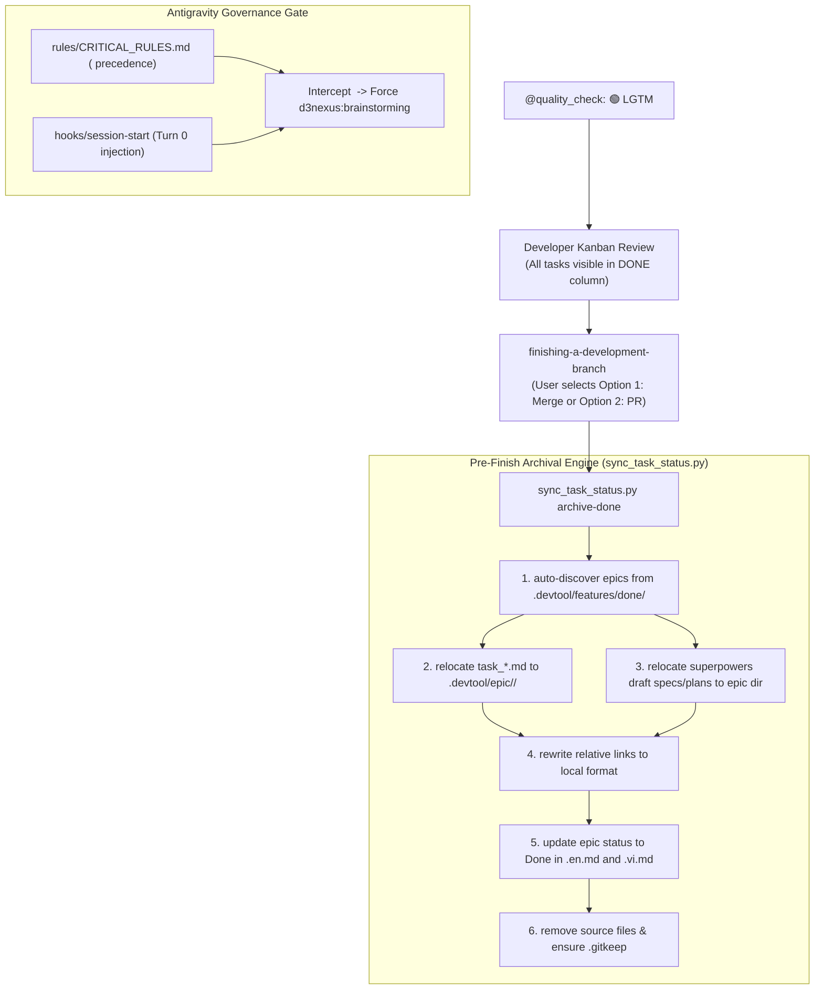
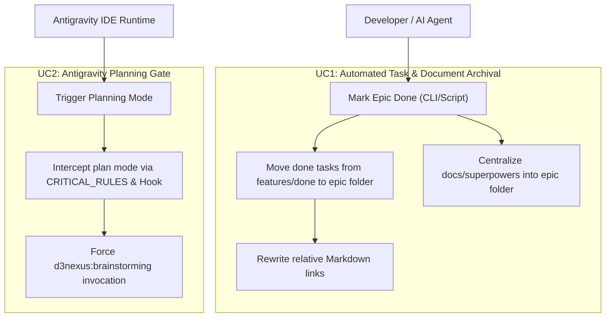
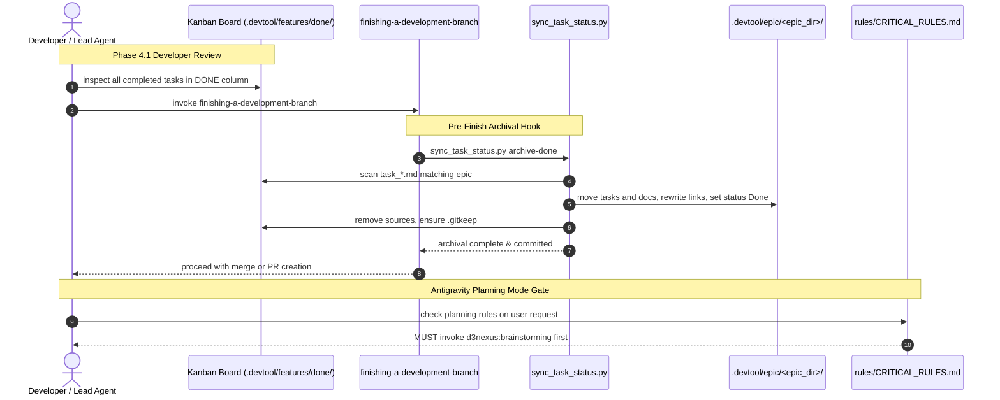

# Epic: Epic Done Archival & Antigravity Planning Gate

## 1. Meta Data
- **Epic**: epic-archival-and-planning-gate
- **Status**: Done
- **Target Release**: v1.0.15
- **Platform**: Cross-Platform Tooling (Agent Kit, Python, Bash, Markdown)
- **Source Spec**: [2026-09-15-epic-done-archival-and-antigravity-planning-gate-design.md](2026-09-15-epic-done-archival-and-antigravity-planning-gate-design.md)

---

## 2. Background
In multi-agent collaborative workflows across **Claude Code** and **Google Antigravity IDE**:
1. When an epic completes, finished tasks were lingering in `.devtool/features/done/`, and drafting artifacts were left in `docs/superpowers/`. There was no automated mechanism to relocate all completed tasks and related documents into the epic's permanent directory (`.devtool/epic/<epic_name>/`).
2. Google Antigravity IDE's `<planning_mode>` prompt caused AI agents to bypass the mandatory `<HARD-GATE>` of `d3nexus:brainstorming` and write `implementation_plan.md` in `brain/` directly.

This Epic delivers a unified automated archival engine in `sync_task_status.py` and a two-layer governance gate intercepting Antigravity's Planning Mode.

---

## 3. Goals & Non-Goals

### Goals
- Automatically move all `task_*.md` files from `.devtool/features/done/` into `.devtool/epic/<epic_dir>/` upon epic completion.
- Automatically relocate related specs and plans from `docs/superpowers/` into `.devtool/epic/<epic_dir>/`.
- Automatically rewrite relative Markdown links in task files and Section 8 of Epic Overviews to point to local files.
- Ensure `.gitkeep` files are preserved in emptied directories.
- Provide a two-layer defense in `rules/CRITICAL_RULES.md` and `hooks/session-start` preventing Antigravity from bypassing brainstorming.
- Update `epic-implementation`, `epic-lifecycle`, and `epic-designer` skills to reflect this lifecycle.

### Non-Goals
- Modifying unrelated skills or altering standard Kanban status values.

---

## 4. Architecture & Technical Design

### 4.1 High-Level Architecture

### 4.2 Use Cases

### 4.3 Sequence Diagram

### 4.4 Check 1 (Shift-Left Impact Analysis)
- **Target Files**:
  - `skills/epic-implementation/resources/scripts/sync_task_status.py`
  - `skills/epic-implementation/resources/scripts/test_sync_task_status.py`
  - `rules/CRITICAL_RULES.md`
  - `hooks/session-start`
  - `skills/epic-implementation/SKILL.md`
  - `skills/epic-lifecycle/SKILL.md`
  - `skills/epic-designer/SKILL.md`
- **Blast Radius**: Zero breaking changes to existing test suite or CLI invocation. Fully backward-compatible with 39 passing unit tests.

### 4.5 Comprehensive BDD Test Scenarios
Documented in detail in [bdd_scenarios.md](bdd_scenarios.md).

---

## 5. BDD Output in Epic Directory
The complete behavioral specifications are committed to [bdd_scenarios.md](bdd_scenarios.md).

---

## 6. Rollout Strategy & Mitigation
- **Phased Rollout**: Implement within `ai-agent-tools`, run full unit test and verification suite, and release v1.0.15 via `scripts/release.sh`.
- **Mitigation**: All file operations verify source existence before unlinking and preserve `.gitkeep` to prevent git working tree divergence.

---

## 7. Kanban Tasks Breakdown
- [Task 1: Complete Archival Engine and Link Rewriter in sync_task_status.py](task_1_archival_engine_and_link_rewriter.md)
- [Task 2: Implement Antigravity Planning Gate in CRITICAL_RULES and Hook](task_2_antigravity_planning_gate.md)
- [Task 3: Update Workflow Skills Documentation](task_3_workflow_skills_documentation.md)
- [Task 4: Complete Workspace Archival, Kit Verification, and Release](task_4_workspace_verification_and_release.md)
