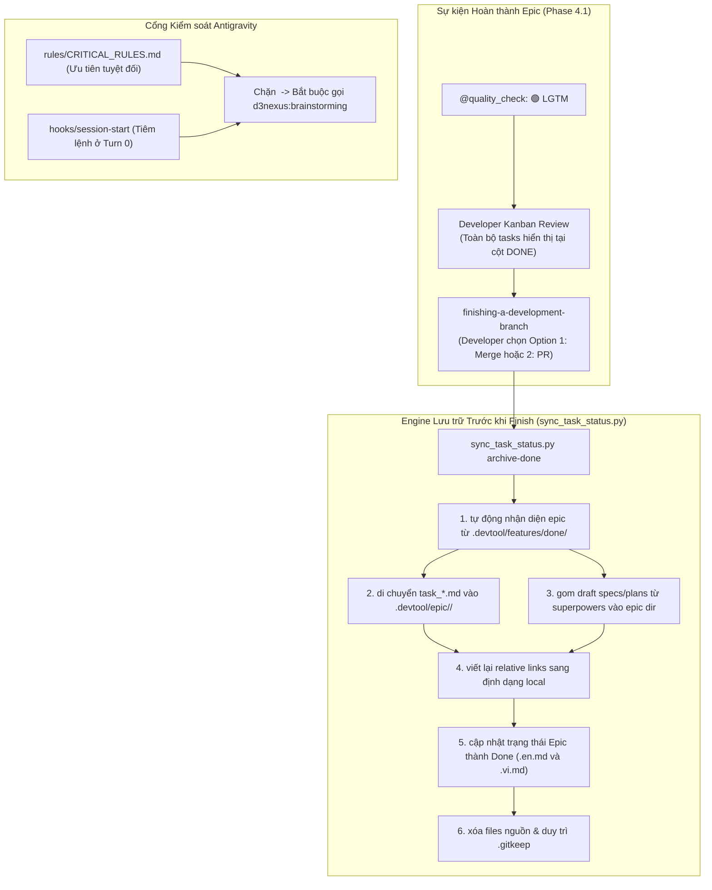
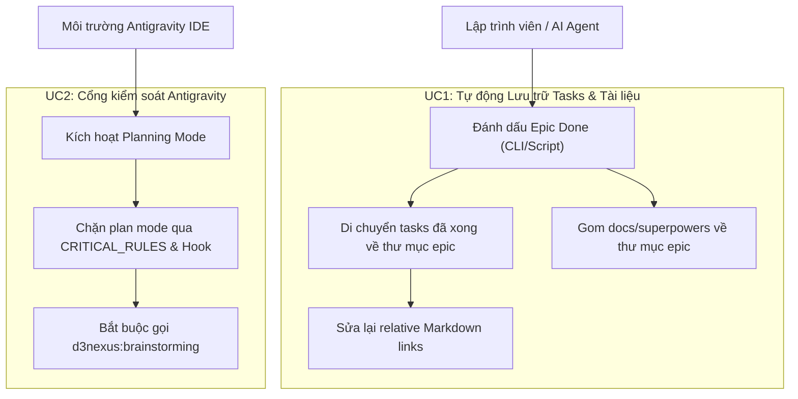
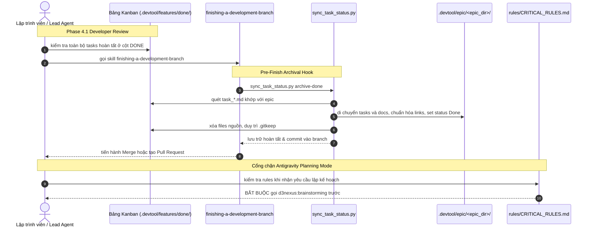

# Epic: Tự động Lưu trữ Tasks khi Done Epic & Cổng chặn Antigravity Planning Mode

## 1. Meta Data
- **Epic**: epic-archival-and-planning-gate
- **Trạng thái**: Done
- **Phiên bản mục tiêu**: v1.0.15
- **Nền tảng**: Cross-Platform Tooling (Agent Kit, Python, Bash, Markdown)
- **Tài liệu thiết kế gốc (Source Spec)**: [2026-09-15-epic-done-archival-and-antigravity-planning-gate-design.md](2026-09-15-epic-done-archival-and-antigravity-planning-gate-design.md)

---

## 2. Bối cảnh (Background)
Trong quy trình kỹ nghệ phần mềm với nhiều tác tử AI phối hợp trên **Claude Code** và **Google Antigravity IDE**:
1. Khi một epic hoàn thành, các tasks đã xong vẫn nằm lại trong `.devtool/features/done/`, và các tài liệu nháp spec/plan vẫn nằm rải rác ở `docs/superpowers/`. Chưa có cơ chế tự động di chuyển toàn bộ tasks và tài liệu liên quan về lưu trữ vĩnh viễn trong thư mục của epic (`.devtool/epic/<epic_name>/`).
2. Chỉ dẫn `<planning_mode>` của Google Antigravity IDE khiến AI agent bỏ qua cổng bắt buộc `<HARD-GATE>` của `d3nexus:brainstorming`, tự ý tạo file `implementation_plan.md` trực tiếp trong thư mục `brain/`.

Epic này cung cấp công cụ tự động lưu trữ trong `sync_task_status.py` và thiết lập 2 tầng cổng kiểm soát (governance gate) để chặn Antigravity Planning Mode.

---

## 3. Mục tiêu & Giới hạn (Goals & Non-Goals)

### Mục tiêu
- Tự động di chuyển toàn bộ các file `task_*.md` từ `.devtool/features/done/` vào `.devtool/epic/<epic_dir>/` khi epic đạt trạng thái `Done`.
- Tự động gom các specs và plans liên quan từ `docs/superpowers/` về `.devtool/epic/<epic_dir>/`.
- Tự động viết lại các relative links trong task files và Section 8 của Epic Overview trỏ về các file cục bộ.
- Duy trì các file `.gitkeep` trong các thư mục được dọn sạch.
- Thiết lập 2 tầng phòng vệ tại `rules/CRITICAL_RULES.md` và `hooks/session-start` ngăn chặn Antigravity bỏ qua brainstorming.
- Cập nhật tài liệu quy trình trong các skills `epic-implementation`, `epic-lifecycle`, và `epic-designer`.

### Giới hạn (Non-Goals)
- Không can thiệp vào các skills không liên quan hoặc thay đổi 5 trạng thái chuẩn của Kanban.

---

## 4. Kiến trúc & Thiết kế Kỹ thuật

### 4.1 Kiến trúc Tổng thể (High-Level Architecture)

### 4.2 Trường hợp Sử dụng (Use Cases)

### 4.3 Sơ đồ Tuần tự (Sequence Diagram)

### 4.4 Phân tích Tác động Tảo dịch (Check 1: Shift-Left Impact Analysis)
- **Tập tin tác động**:
  - `skills/epic-implementation/resources/scripts/sync_task_status.py`
  - `skills/epic-implementation/resources/scripts/test_sync_task_status.py`
  - `rules/CRITICAL_RULES.md`
  - `hooks/session-start`
  - `skills/epic-implementation/SKILL.md`
  - `skills/epic-lifecycle/SKILL.md`
  - `skills/epic-designer/SKILL.md`
- **Phạm vi tác động**: Không gây breaking changes, tương thích hoàn toàn ngược với 39 bài test đã pass 100%.

### 4.5 Kịch bản BDD Toàn diện
Được định nghĩa chi tiết tại [bdd_scenarios.md](bdd_scenarios.md).

---

## 5. Tài liệu BDD trong Thư mục Epic
Được lưu tại [bdd_scenarios.md](bdd_scenarios.md).

---

## 6. Chiến lược Triển khai & Giảm thiểu Rủi ro (Rollout Strategy)
- Triển khai trong `ai-agent-tools`, chạy toàn bộ unit tests và `verify.sh`, phát hành v1.0.15 qua `scripts/release.sh`.
- Mọi thao tác file đều kiểm tra sự tồn tại trước khi thao tác và bảo đảm `.gitkeep` không bị xóa.

---

## 7. Phân rã Tasks Kanban (Kanban Tasks Breakdown)
- [Task 1: Hoàn thiện Động cơ Lưu trữ và Hàm chuẩn hóa Links trong sync_task_status.py](task_1_archival_engine_and_link_rewriter.md)
- [Task 2: Triển khai Cổng kiểm soát Antigravity Planning trong CRITICAL_RULES và Hook](task_2_antigravity_planning_gate.md)
- [Task 3: Cập nhật Tài liệu Quy trình các Skills](task_3_workflow_skills_documentation.md)
- [Task 4: Hoàn tất Lưu trữ Workspace, Kiểm tra Kit và Release](task_4_workspace_verification_and_release.md)
