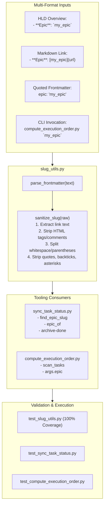

# Design Spec: Robust Epic Slug Sanitization & Normalization

- **Date**: 2026-09-15
- **Topic**: Universal Epic Slug Sanitization across Tooling Scripts (`slug_utils.py`, `sync_task_status.py`, `compute_execution_order.py`)
- **Status**: Draft (In Review)
- **Author**: Antigravity AI Pair & DanhDue ExOICTIF

---

## 1. Background & Problem Statement

In the agentic engineering workflow governed by `d3nexus:epic-lifecycle`, two core tooling scripts in `skills/epic-implementation/resources/scripts/` manage task lifecycle and ordering:
1. **`sync_task_status.py`**: Mirrors Kanban status across checkouts and archives completed tasks into `.devtool/epic/<epic_dir>/` upon epic completion (`archive-done` / `archive-epic`).
2. **`compute_execution_order.py`**: Reads `.devtool/features/task_*.md` files and computes a deterministic sequential execution order based on dependency blockers (`Blocked by [Task](...)`).

### 1.1 The Root Problem: Unnormalized Slug Mismatches
Both scripts parse epic slug identifiers from two primary sources:
- **Task YAML Frontmatter**: `epic: "slug"` or `epic: 'slug'` or `epic: `slug``
- **HLD Overview Headers**: `- **Epic**: `slug`` or `- **Epic**: "slug"` or `- **Epic**: [slug](path)`

In practice, human developers and AI subagents frequently format epic identifiers with various markdown elements or quotation conventions:
- Backticks: `` `flutter_super_app_template` ``
- Quotes: Single `'...'`, double `"..."`, and smart curly quotes (`“...”`, `‘...’`)
- Markdown formatting: `**...**`, `*...*`, `~~...~~`
- Markdown links: `[slug](url)` or `[`slug`](url)`
- HTML tags or comments: `<code>slug</code>` or `slug <!-- comment -->`
- Parenthetical notes or annotations: `slug (Flutter Super App)`
- Trailing punctuation: `slug:` or `slug,`

### 1.2 The Failure Modes
1. In `sync_task_status.py`:
   - `find_epic_slug` originally performed `match.group(1).strip()`, which retained backticks (e.g. `` `flutter_super_app_template` ``).
   - In `archive_epic_tasks`, the comparison `if epic_slug and file_epic and file_epic != epic_slug:` evaluated `` `flutter_super_app_template` `` $\neq$ `flutter_super_app_template`.
   - Result: All completed tasks in `.devtool/features/done/` were silently skipped and remained unarchived.
2. In `compute_execution_order.py`:
   - `parse_frontmatter` only stripped double quotes: `value.strip().strip('"')`.
   - `scan_tasks` performed exact string comparison `if fm.get("epic") != epic:`.
   - If the developer invoked `compute_execution_order.py `slug`` or if `epic:` contained single quotes or backticks, all tasks were reported as skipped and zero execution layers were produced.

---

## 2. Goals & Non-Goals

### Goals
1. **Unified Sanitization Module (`slug_utils.py`)**:
   - Implement a shared, stdlib-only module containing `sanitize_slug(raw: str | None) -> str | None` and `parse_frontmatter(text: str) -> dict`.
   - Robustly strip markdown links, HTML tags/comments, straight & curly quotes, formatting delimiters, parenthetical annotations, and trailing punctuation.
2. **Upgrade `sync_task_status.py`**:
   - Import and use `sanitize_slug` in `find_epic_slug`, `epic_of`, and `expected_epic`.
   - Use unified `parse_frontmatter` supporting double, single, and backtick quote stripping.
3. **Upgrade `compute_execution_order.py`**:
   - Import and use `sanitize_slug` on both the CLI target argument (`args.epic`) and task frontmatter (`fm.get("epic")`).
   - Use unified `parse_frontmatter`.
4. **Comprehensive Test Suite**:
   - Create `test_slug_utils.py` verifying all edge cases and permutations.
   - Update `test_sync_task_status.py` and `test_compute_execution_order.py` with multi-format fixtures.
5. **D3Nexus Plugin Synchronization**:
   - Ensure the updated scripts and tests are mirrored to the active global plugin configuration (`~/.gemini/config/plugins/d3nexus/`).

### Non-Goals
- Altering the 5 standard Kanban statuses (`backlog`, `todo`, `in-progress`, `review`, `done`).
- Adding external non-standard library Python dependencies (stays stdlib only).

---

## 3. Technical Architecture & Components



### 3.1 `slug_utils.py` Implementation Details
The core normalizer function handles the sanitization lifecycle:
```python
def sanitize_slug(raw: str | None) -> str | None:
    if not raw:
        return None
    cleaned = raw.strip()
    # 1. Extract link text from markdown link [slug](url) or [`slug`](url)
    link_match = re.match(r"^\[([^\]]+)\](?:\([^)]*\))?", cleaned)
    if link_match:
        cleaned = link_match.group(1).strip()
    # 2. Strip HTML comments and tags
    cleaned = re.sub(r"<!--.*?-->", "", cleaned).strip()
    cleaned = re.sub(r"<[^>]+>", "", cleaned).strip()
    # 3. Take primary token before whitespace or parentheses
    if " " in cleaned or "(" in cleaned:
        cleaned = re.split(r"[\s(]", cleaned, maxsplit=1)[0]
    # 4. Strip delimiters, quotes (straight & curly), asterisks, colons, brackets
    cleaned = cleaned.strip("`'\"“”‘’*~:,.;[]() \t\r\n")
    return cleaned or None
```

---

## 4. Verification Plan

### 4.1 Automated Test Execution
Run the complete Python test suite in `skills/epic-implementation/resources/scripts/`:
```bash
python3 -m unittest discover -s skills/epic-implementation/resources/scripts -p "test_*.py" -v
```
Verification criteria:
1. `test_slug_utils.py`: Passes 100% of cases (backticks, straight quotes, curly quotes, markdown links, HTML comments, trailing annotations, empty/whitespace).
2. `test_sync_task_status.py`: Passes all archival and syncing tests with multi-formatted epic overview headers.
3. `test_compute_execution_order.py`: Passes dependency graph resolution when tasks and CLI args contain formatted slugs.

### 4.2 End-to-End Integration Check
Verify that `sync_task_status.py archive-done` and `compute_execution_order.py` operate seamlessly across repos with both formatted and plain epic names.
