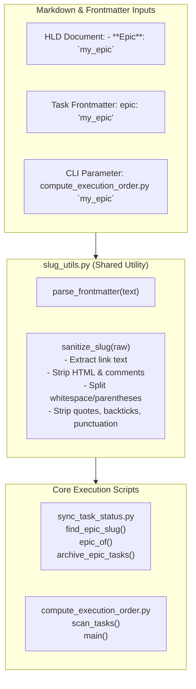
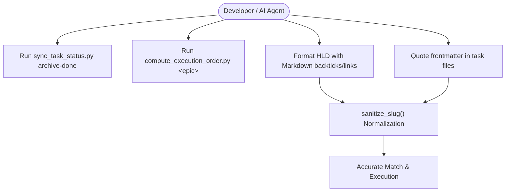
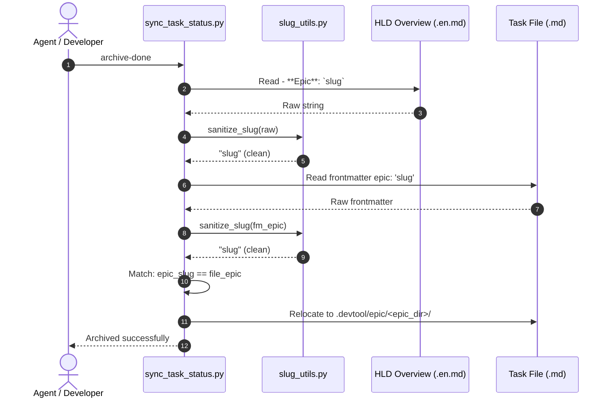

# Epic: Robust Epic Slug Sanitization & Normalization

## 1. Meta Data
- **Epic**: `epic_slug_sanitization`
- **Status**: Done
- **Target Release**: `1.0.18`
- **Platform**: `Agent Tools (Python)`
- **Source Spec**: [2026-09-15-robust-slug-sanitization-design.md](2026-09-15-robust-slug-sanitization-design.md)
- **Created**: 2026-09-15
- **Author**: Antigravity AI Pair & DanhDue ExOICTIF

---

## 2. Background
In the agentic engineering workflow governed by `d3nexus:epic-lifecycle`, two core tooling scripts in `skills/epic-implementation/resources/scripts/` manage task lifecycle and ordering:
1. `sync_task_status.py`: Synchronizes Kanban statuses across workspaces and archives completed tasks (`archive-done` / `archive-epic`).
2. `compute_execution_order.py`: Parses task dependencies and determines execution layers.

Both scripts parse epic slug identifiers from markdown headers (`- **Epic**: ...`) and YAML frontmatter (`epic: ...`). However, human developers and AI subagents frequently format these identifiers with quotes (`"..."`, `'...'`, `“...”`, `‘...’`), backticks (`` `...` ``), markdown links (`[slug](url)`), or parenthetical annotations (`slug (description)`). Without normalization, raw string mismatches cause `sync_task_status.py` to skip completed tasks during archival and cause `compute_execution_order.py` to skip tasks during dependency resolution.

---

## 3. Goals & Non-Goals

### Goals
1. **Shared Sanitization Module (`slug_utils.py`)**:
   - Provide standard library `sanitize_slug(raw: str | None) -> str | None` handling backticks, quotes (straight and curly), markdown links, HTML tags/comments, annotations, and trailing punctuation.
   - Provide unified `parse_frontmatter(text: str) -> dict` handling double, single, and backtick quote stripping.
2. **Upgrade `sync_task_status.py`**:
   - Integrate `sanitize_slug` into `find_epic_slug`, `epic_of`, and `expected_epic`.
3. **Upgrade `compute_execution_order.py`**:
   - Integrate `sanitize_slug` on CLI argument `args.epic` and task frontmatter `fm.get("epic")`.
4. **Comprehensive Unit Testing**:
   - Deliver `test_slug_utils.py` (100% test case coverage).
   - Update `test_sync_task_status.py` and `test_compute_execution_order.py` with multi-format test assertions.
5. **Sync to D3Nexus Plugin**:
   - Mirror updated scripts and test suites to `~/.gemini/config/plugins/d3nexus/`.

### Non-Goals
- Modifying the 5 standard Kanban statuses (`backlog`, `todo`, `in-progress`, `review`, `done`).
- Adding external non-standard Python dependencies (must remain 100% Python stdlib).

---

## 4. Architecture & Technical Design

### 4.1 High-Level Architecture

### 4.2 Use Cases

### 4.3 Sequence Diagram

---

## 5. Rollout Strategy & Mitigation
- **Step 1**: Build and verify `slug_utils.py` and `test_slug_utils.py` in isolation.
- **Step 2**: Integrate into `sync_task_status.py` and verify with `test_sync_task_status.py`.
- **Step 3**: Integrate into `compute_execution_order.py` and verify with `test_compute_execution_order.py`.
- **Step 4**: Run full test suite across all scripts and mirror to `~/.gemini/config/plugins/d3nexus/`.
- **Fallback**: Both scripts maintain relative fallback path resolution so execution from arbitrary working directories continues to work seamlessly.

---

## 6. Kanban Tasks Breakdown
- [Task 1: Shared Slug Sanitizer and Frontmatter Module (slug_utils.py)](task_1_slug_utils_and_tests.md)
- [Task 2: Upgrade sync_task_status.py with Robust Slug Normalization](task_2_sync_task_status_integration.md)
- [Task 3: Upgrade compute_execution_order.py with Slug Normalization](task_3_compute_execution_order_integration.md)
- [Task 4: D3Nexus Plugin Sync and End-to-End Verification](task_4_plugin_sync_and_verification.md)
