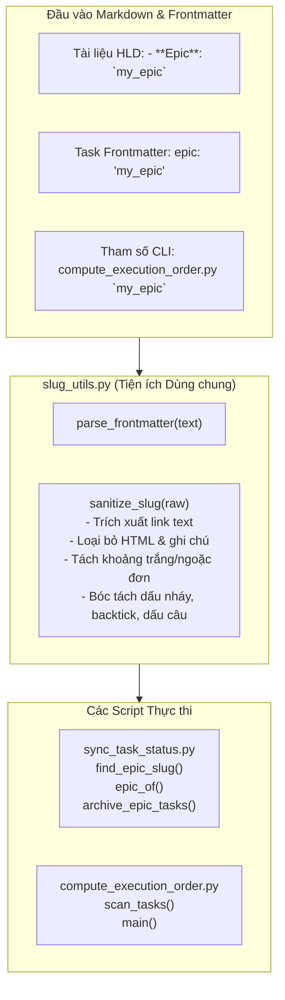
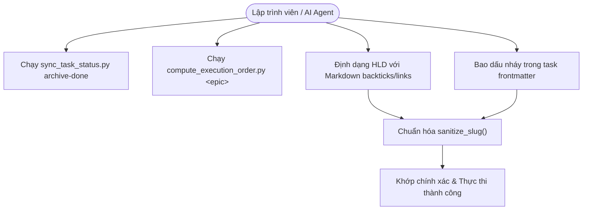
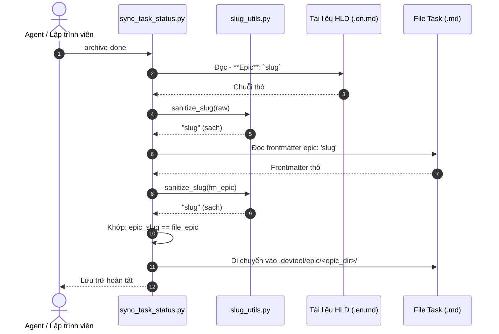

# Epic: Chuẩn Hóa & Làm Sạch Epic Slug Toàn Diện

## 1. Meta Data
- **Epic**: `epic_slug_sanitization`
- **Trạng thái**: Done
- **Phiên bản mục tiêu**: `1.0.18`
- **Nền tảng**: `Agent Tools (Python)`
- **Tài liệu thiết kế gốc**: [2026-09-15-robust-slug-sanitization-design.md](2026-09-15-robust-slug-sanitization-design.md)
- **Ngày tạo**: 2026-09-15
- **Tác giả**: Antigravity AI Pair & DanhDue ExOICTIF

---

## 2. Bối cảnh
Trong quy trình kỹ thuật AI Agent được điều phối bởi `d3nexus:epic-lifecycle`, hai script công cụ cốt lõi trong `skills/epic-implementation/resources/scripts/` quản lý vòng đời và thứ tự thực thi task:
1. `sync_task_status.py`: Đồng bộ trạng thái bảng Kanban qua các workspace và lưu trữ các task hoàn thành (`archive-done` / `archive-epic`).
2. `compute_execution_order.py`: Phân tích phụ thuộc giữa các task và xác định các layer thực thi tuần tự.

Cả hai script đều trích xuất định danh epic slug từ markdown header (`- **Epic**: ...`) và YAML frontmatter (`epic: ...`). Tuy nhiên, lập trình viên và AI subagent thường định dạng các định danh này kèm dấu ngoặc kép (`"..."`, `'...'`, `“...”`, `‘...’`), backticks (`` `...` ``), markdown links (`[slug](url)`), hoặc ghi chú mở rộng (`slug (mô tả)`). Khi thiếu cơ chế chuẩn hóa, chuỗi không khớp khiến `sync_task_status.py` bỏ qua các task đã hoàn thành trong quá trình archive và khiến `compute_execution_order.py` bỏ sót task khi tính toán đồ thị phụ thuộc.

---

## 3. Mục tiêu & Giới hạn

### Mục tiêu
1. **Module Tiện ích Dùng chung (`slug_utils.py`)**:
   - Cung cấp hàm thuần Python stdlib `sanitize_slug(raw: str | None) -> str | None` xử lý triệt để backticks, dấu nháy đơn/kép/cong, markdown links, thẻ/ghi chú HTML, chú thích ngoặc đơn và dấu câu cuối dòng.
   - Cung cấp hàm chuẩn hóa `parse_frontmatter(text: str) -> dict` hỗ trợ loại bỏ nháy kép, nháy đơn và backticks bao quanh.
2. **Nâng cấp `sync_task_status.py`**:
   - Tích hợp `sanitize_slug` vào `find_epic_slug`, `epic_of`, và `expected_epic`.
3. **Nâng cấp `compute_execution_order.py`**:
   - Tích hợp `sanitize_slug` vào tham số dòng lệnh `args.epic` và task frontmatter `fm.get("epic")`.
4. **Kiểm thử Đơn vị Toàn diện**:
   - Xây dựng `test_slug_utils.py` (đạt 100% test case coverage).
   - Cập nhật `test_sync_task_status.py` và `test_compute_execution_order.py` với các kịch bản đa định dạng.
5. **Đồng bộ Plugin D3Nexus**:
   - Đồng bộ các script và test suite đã cập nhật sang `~/.gemini/config/plugins/d3nexus/`.

### Giới hạn (Non-Goals)
- Không thay đổi 5 trạng thái Kanban tiêu chuẩn (`backlog`, `todo`, `in-progress`, `review`, `done`).
- Không thêm thư viện bên ngoài (duy trì 100% Python stdlib).

---

## 4. Kiến trúc & Thiết kế Kỹ thuật

### 4.1 Kiến trúc Mức cao

### 4.2 Use Cases

### 4.3 Biểu đồ Tuần tự (Sequence Diagram)

---

## 5. Chiến lược Triển khai & Giảm thiểu Rủi ro
- **Bước 1**: Xây dựng và kiểm thử `slug_utils.py` và `test_slug_utils.py` độc lập.
- **Bước 2**: Tích hợp vào `sync_task_status.py` và kiểm thử với `test_sync_task_status.py`.
- **Bước 3**: Tích hợp vào `compute_execution_order.py` và kiểm thử với `test_compute_execution_order.py`.
- **Bước 4**: Chạy toàn bộ test suite và đồng bộ sang `~/.gemini/config/plugins/d3nexus/`.
- **Dự phòng**: Các script duy trì cơ chế phân giải đường dẫn tương đối để luôn hoạt động tin cậy từ bất kỳ thư mục nào.

---

## 6. Phân rã Công việc Kanban
- [Task 1: Xây dựng Module Tiện ích slug_utils.py và Bộ Kiểm thử Đơn vị](task_1_slug_utils_and_tests.md)
- [Task 2: Tích hợp Chuẩn Hóa Slug vào sync_task_status.py](task_2_sync_task_status_integration.md)
- [Task 3: Tích hợp Chuẩn Hóa Slug vào compute_execution_order.py](task_3_compute_execution_order_integration.md)
- [Task 4: Đồng bộ Plugin D3Nexus và Kiểm thử Tích hợp Toàn diện](task_4_plugin_sync_and_verification.md)
