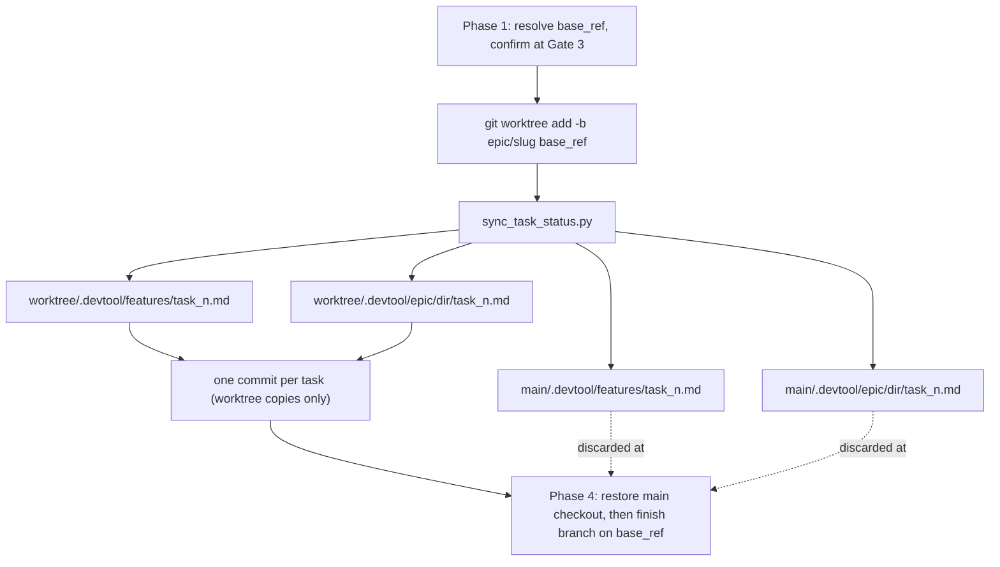

# Cross-Workspace Kanban Status Sync for `epic-implementation`

- **Date**: 2026-09-14
- **Status**: Approved (Gate 1)
- **Affects**: `skills/epic-implementation/`, `skills/epic-lifecycle/SKILL.md`
- **Next stage**: `writing-plans` (single-component change; no HLD required)

## 1. Background

`epic-implementation` drives an epic's Kanban tasks from inside an isolated git worktree. Task
state lives in git-tracked markdown frontmatter, which a Kanban dashboard reads directly off
disk. Because the skill only ever writes one copy of that state, every board except the one in
the worktree is stale for the entire duration of an epic.

Four defects, one root cause:

| # | Defect | Evidence |
|---|--------|----------|
| 1 | Status is written to one checkout only, so the other workspace's board never moves off `todo` | `skills/epic-implementation/SKILL.md` Phase 2 step 1 |
| 2 | `modified` is never written, although the schema specifies "update on every edit" | `skills/epic-designer/SKILL.md` frontmatter spec vs. Phase 2 steps 2-4 |
| 3 | `.devtool/epic/<epic_dir>/task_*.md` is frozen at design time and drifts from `.devtool/features/` | `skills/epic-designer/SKILL.md` Step 2 writes both copies; nothing updates the second |
| 4 | The Epic Overview's Meta Data `Status` field never leaves its creation value | `skills/epic-designer/SKILL.md` Step 1 / Concurrent-Epic Backlog Rule |

A fifth issue is a **precondition** rather than a symptom: Phase 1 hardcodes `develop` as the
worktree's base ref, but `epic-designer` has no branch discipline at all. If the epic docs were
committed anywhere other than `develop`, the worktree is created without the HLD or any
`task_*.md` file — Phase 0's context reload has nothing to read, `compute_execution_order.py`
scans zero tasks, and the worktree half of the mirror has no files to write into.

## 2. Goals

- Every task status transition is reflected in **all four** copies of that task: `.devtool/features/`
  and `.devtool/epic/<epic_dir>/`, in both the current checkout and the implementation worktree.
- Every transition also writes `modified`, and `completedAt` when the task reaches `done`.
- The Epic Overview's `Status` reflects reality at epic boundaries.
- The worktree is always created from a ref that actually contains the epic's documents.
- The main checkout is left clean before the epic branch merges.

## 3. Non-Goals

- Changing `epic-designer`. Its dual-write and its `modified`-at-creation are already correct, and
  base-ref auto-detection removes any need to give it branch discipline.
- Deriving live epic progress (`In Progress (4/9 done)`) into the HLD header. Status flips at epic
  boundaries only.
- Wiring the kit's Python unit tests into `scripts/verify.sh` (see §10).
- Any change to task file *structure*, the five-column status enum, or the commit-per-task rule.

## 4. Design Overview

One new script owns all multi-copy writes. `SKILL.md` stops describing hand edits and starts
calling that script. Two further edits make the surrounding phases consistent with it: base-ref
resolution in Phase 1, and a main-checkout restore in Phase 4.



The asymmetry is deliberate and is the core of the design: **worktree copies are committed; main
checkout copies are a live view only** and are restored from `HEAD` before the merge. The epic
branch remains the single source of truth for history.

## 5. Component A — `resources/scripts/sync_task_status.py` (new)

Stdlib-only Python 3, sibling to `compute_execution_order.py`, reusing its hand-rolled regex
frontmatter idiom. No PyYAML, no third-party dependency.

### 5.1 CLI

```
sync_task_status.py task <task_id> <status>
sync_task_status.py epic <epic_dir> <status>
```

### 5.2 Checkout discovery

Parse `git worktree list --porcelain` and take every line beginning `worktree `. This makes the
script symmetric by construction: identical behaviour whether invoked from the main checkout or
the worktree, correct when only one checkout exists (the user declined a worktree), and correct
with three or more.

### 5.3 `task` mode

`<status>` MUST be one of `backlog | todo | in-progress | review | done`. Anything else exits `2`
without writing. This mechanically enforces the rule currently stated only as prose in the
skill's Common Mistakes — no invented `blocked` or `in-review` values.

For each checkout root `R`, the targets are:

- `R/.devtool/features/<task_id>.md`
- every match of `R/.devtool/epic/*/<task_id>.md`

**Epic-collision guard.** Task ids are `task_<number>_<name>`, so a name like `task_1_setup` can
plausibly exist under two different epics and the `*/` glob would match both. The script therefore
reads the `epic:` field from the authoritative `.devtool/features/<task_id>.md` in the invoking
checkout, and refuses to write any candidate whose own `epic:` field differs — reporting the
skipped path. No extra CLI argument is needed; the epic is derived, not declared.

For each target that exists, rewrite **only within the leading `---` … `---` frontmatter block**,
line-scoped, never re-serializing the YAML:

| Key | Rule |
|-----|------|
| `status` | always set to `"<status>"` |
| `modified` | always set to the current timestamp |
| `completedAt` | set to the current timestamp **only** when `<status>` is `done`; otherwise left untouched |

If one of those keys is absent from the frontmatter, insert it immediately after the `status:`
line, so task files created before this change keep working.

Timestamp format: `datetime.now(timezone.utc).isoformat(timespec="seconds")` with the `+00:00`
suffix replaced by `Z`, e.g. `2026-09-14T10:23:45Z`.

Every other frontmatter key and the entire document body survive byte-for-byte.

### 5.4 `epic` mode

`<status>` is free-form prose (`In Progress`, `Done`) — the five-column enum does **not** apply
here. Targets, per checkout root `R`:

- `R/.devtool/epic/<epic_dir>/<epic_dir>.en.md`
- `R/.devtool/epic/<epic_dir>/<epic_dir>.vi.md`

Both are written in the same call so the English/Vietnamese pair can never diverge, as
`epic-designer` requires.

`epic-designer` prescribes **no line format** for the Meta Data `Status` field — it gives only the
example `Status: Queued (backlog) — behind logging-refactor`. Real HLDs may therefore render it as
`- **Status**: X`, `**Status:** X`, a plain `Status: X`, or a table row. The script therefore:

1. Narrows the search to the Meta Data section only — from the heading matching `Meta Data` to the
   next `##`-level heading — so the word "Status" elsewhere in the document can never be clobbered.
2. Within that section, matches a line whose leading token is `Status` (optionally list-bulleted
   and/or bold-wrapped) followed by `:`, and replaces only the value to the right of the colon,
   preserving the original prefix exactly.
3. **Fails loud on ambiguity.** If that section yields zero matches or more than one, the script
   writes nothing to that file and reports it, instructing the operator to edit by hand. Corrupting
   an HLD is strictly worse than skipping it.

### 5.5 Output and exit codes

One line per file written, prefixed by its checkout root, followed by a board tally for the epic:

```
backlog 0 | todo 3 | in-progress 1 | review 0 | done 4
```

A checkout that lacks the file is skipped and reported, never fatal — a checkout predating the
task file is a normal state.

| Exit | Meaning |
|------|---------|
| `0` | at least one file written |
| `1` | no file written (nothing matched) |
| `2` | invalid status or arguments |

## 6. Component B — `resources/scripts/test_sync_task_status.py` (new)

`unittest`, stdlib only, importing the sibling module via `sys.path.insert`, matching
`test_compute_execution_order.py` exactly. Run: `python3 <path> -v`.

Coverage:

- Enum rejection: a non-enum status exits `2` and writes nothing.
- Surgical rewrite: unrelated frontmatter keys and the full body are preserved byte-for-byte.
- `completedAt` is written on `done` and left untouched on every other status.
- Missing-key insertion: a task file lacking `modified` gains it after `status`.
- Missing-file skip: a checkout root without the task file is reported, exit code unaffected.
- Multi-root fan-out: a temp fixture with two roots × two directories gets all four copies updated.
- Epic-collision guard: a same-named task under a second epic directory is skipped and reported.
- Tally arithmetic across a mixed-status fixture.
- `epic` mode: each of the three Status line renderings is rewritten correctly; a section with two
  Status lines is skipped and reported rather than written.

## 7. Component C — `skills/epic-implementation/SKILL.md`

### 7.1 Phase 1 — base-ref resolution (replaces the hardcoded `develop`)

Phase 0 has already read the exact set of task files belonging to this epic, so "this ref contains
the docs" is an exact check rather than a heuristic: the HLD path **and every one of those task
paths** must exist at the ref.

1. Probe `develop` — `git cat-file -e develop:<hld_path>`, then the same for each `task_*.md` read
   in Phase 0.
2. Otherwise probe current `HEAD` the same way.
3. Otherwise locate candidates: `git log --all --format=%H --diff-filter=A -1 -- <hld_path>` gives
   the commit that introduced the HLD, and `git branch --all --contains <sha>` lists every branch
   holding it. Present that list at Gate 3 and let the user choose. An **empty** list means the
   docs were never committed — the `auto_commit: false` case — and the skill stops with that
   specific message rather than a generic "not found".
4. Record the result as `<base_ref>`.
5. If `<base_ref>` is not `develop`, show `git log --oneline develop..<base_ref>` at the
   checkpoint. That is precisely the unrelated work the epic branch would carry into `develop` at
   Phase 4. Require explicit confirmation before `git worktree add` runs.

The worktree command becomes:

```bash
git worktree add .worktrees/<epic_dir> -b epic/<epic_slug> <base_ref>
```

The Gate 3 checkpoint now confirms three things: execution order, chosen base ref, and — when the
ref is not `develop` — the inherited commit list.

### 7.2 Phase 2 — task transitions

Steps 1 through 4 become `sync_task_status.py task <task_id> <status>` calls covering
`in-progress`, `review`, the review/fix cycling, and `done`. The manual `completedAt` instruction
is removed, since the script owns that field.

Before the **first** task only, flip the Epic Overview:
`sync_task_status.py epic <epic_dir> "In Progress"`.

Step 5 gains two clarifications: `git add -A` in the worktree now also stages the epic-directory
task copy, and main-checkout copies are never staged or committed.

### 7.3 Phase 4 — closing, in order

1. After `quality_check` reports 🟢 LGTM: `sync_task_status.py epic <epic_dir> "Done"`.
2. Resolve `<main_root>`: it is the **first** entry of `git worktree list --porcelain`, which git
   always reports as the main worktree. (Equivalently, the parent of `git rev-parse
   --git-common-dir`.) Never assume it is the process's current directory — Phase 4 may run from
   either checkout.
3. Restore the main checkout:
   ```bash
   git -C <main_root> restore -- .devtool/features/ .devtool/epic/<epic_dir>/
   git -C <main_root> status --porcelain -- .devtool/features/ .devtool/epic/<epic_dir>/
   ```
   Report what was reverted. The restore is worktree-only — no `--staged` — so anything a human
   staged by hand survives it. The second command is the proof step and should print nothing; if
   it does print, a person staged or hand-edited those paths, so **stop and surface it** rather
   than forcing the merge.
4. Hand off to `finishing-a-development-branch` with **base = `<base_ref>`** recorded in Phase 1,
   not the currently hardcoded `develop`.

### 7.4 Supporting sections

- **Quick Reference**: add a "Sync task status" row; the worktree row uses `<base_ref>`.
- **Common Mistakes**: rewrite the existing base-ref entry for the new resolution rule; add
  "leaving the main checkout dirty at merge time" (with the one-line restore, also the recovery
  for an abandoned epic) and "hand-editing one copy of a task file instead of calling the script".
- **Red Flags**: add merging while the main checkout's mirrored copies are still dirty.
- **Integration**: unchanged — no new skill dependencies.

## 8. Component D — `skills/epic-lifecycle/SKILL.md`

That skill owns gate definitions, and Gate 3 now covers more than its name claims. Two cells:

- Gate 3 row: name `Execution Order` → `Execution Plan`; handoff artefact
  `confirmed order + bootstrapped worktree` → `confirmed order + base ref + bootstrapped worktree`.
- "When a Gate Fails" row 3: add re-picking the base ref alongside reordering by hand.

Sequence and the other three gates are untouched.

## 9. Failure Modes Considered

| Failure | Mitigation |
|---------|-----------|
| Merge blocked by dirty tracked files in the main checkout | Phase 4 restore (§7.3) |
| Worktree created without the epic's task files | Base-ref resolution (§7.1) |
| Epic docs never committed (`auto_commit: false`) | Resolution step 3's empty-candidate branch names it explicitly |
| Epic branch silently inherits unrelated commits | Gate 3 shows `git log --oneline develop..<base_ref>` and requires confirmation |
| Agent invents a status value | Enum guard, exit `2` (§5.3) |
| Only one checkout exists | Discovery returns one root; all writes and the tally still work |
| Epic abandoned mid-run | Main checkout left dirty; documented as a Common Mistake with the restore command |
| HLD Status line in an unanticipated format | Section-scoped match, fail-loud on zero or multiple hits (§5.4) |
| Same `task_id` exists under two epic directories | Epic-collision guard derives `epic:` from the features copy and skips mismatches (§5.3) |
| Two epics running concurrently | Script is per-`task_id`; the Concurrent-Epic Backlog Rule already prevents overlap |

## 10. Verification

Success criteria, each independently checkable:

1. `python3 skills/epic-implementation/resources/scripts/test_sync_task_status.py -v` — all pass.
2. `scripts/verify.sh` — reports `PASS`. Its relative-link and ToC-anchor checks cover the new
   `SKILL.md` prose in both edited skills.
3. Manual two-checkout fixture: a temp repo with a main checkout and one worktree, driving a task
   through `todo → in-progress → review → done` and asserting all four copies agree at every step,
   that `modified` advances on each transition, that `completedAt` appears only at `done`, and that
   `git status` in the main root is clean after the Phase 4 restore.

**Noted, not fixed:** `scripts/verify.sh` runs no Python unit tests — not the existing
`test_compute_execution_order.py`, and so not the new one either. Both must be run by hand. Wiring
them in is a kit-wide change and is out of scope for this spec.
