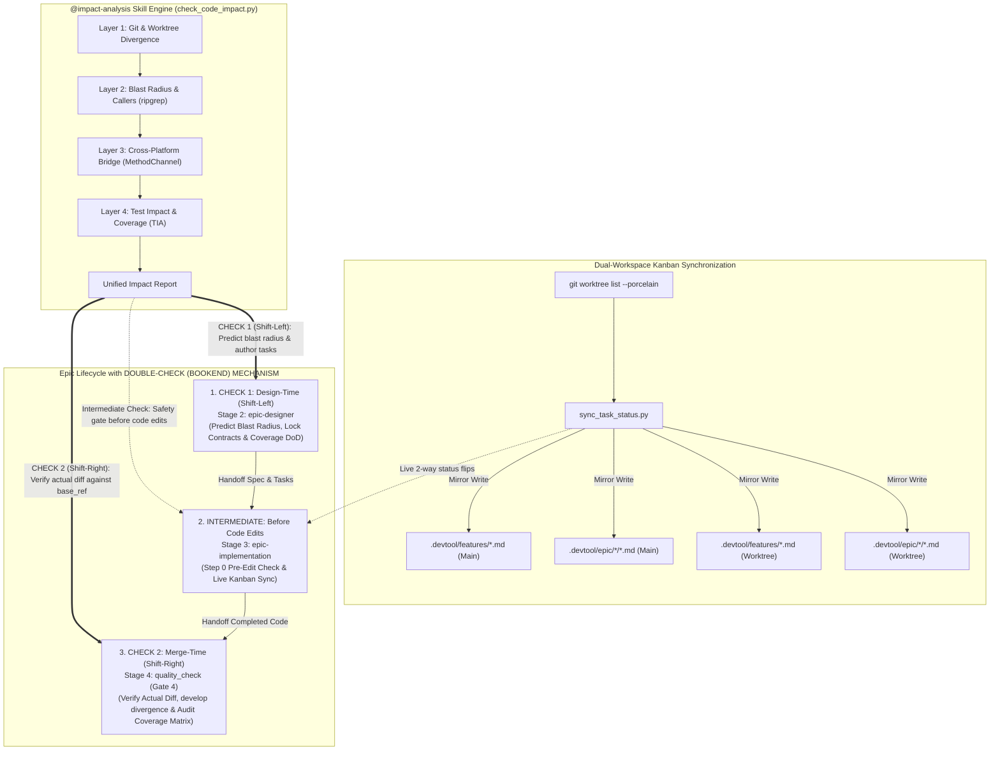
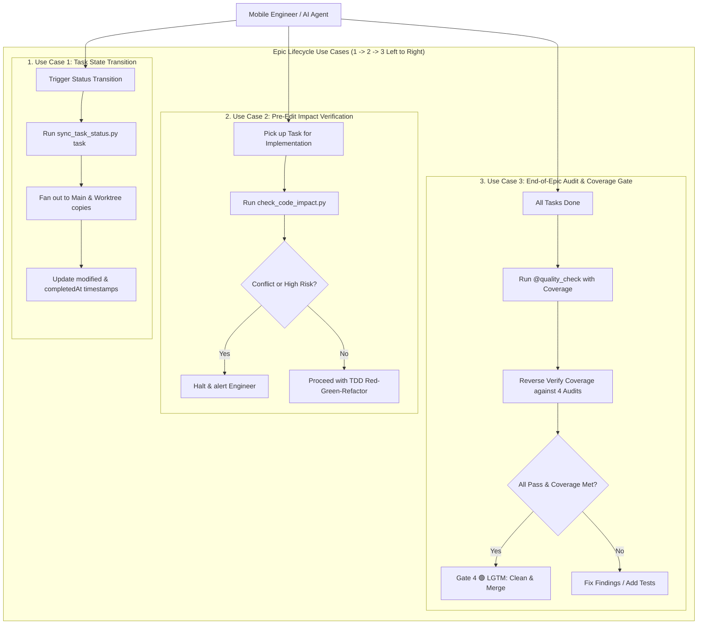
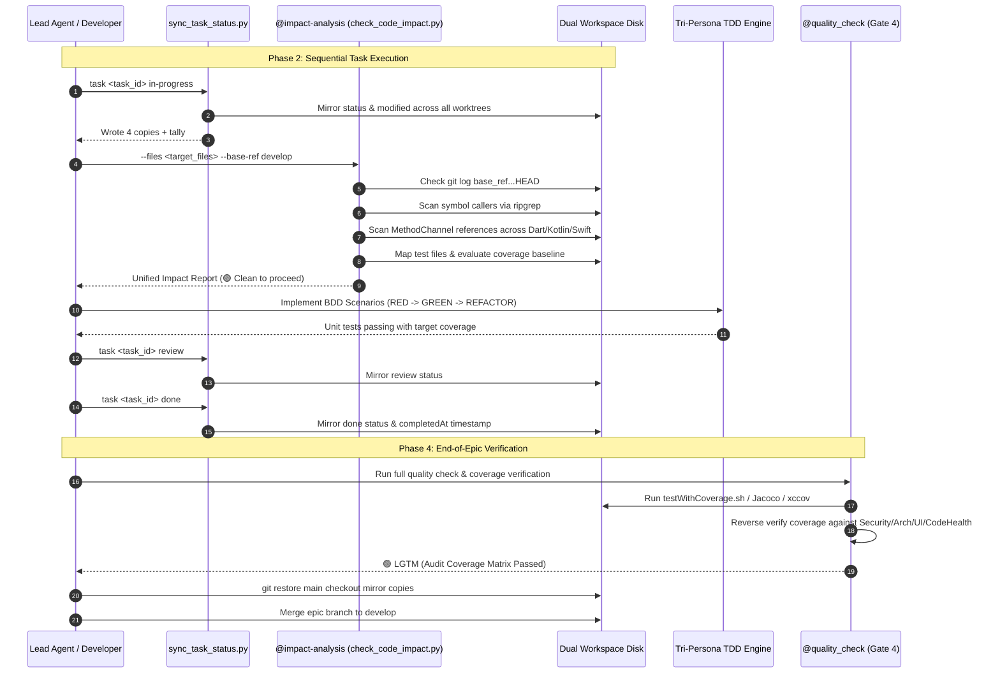
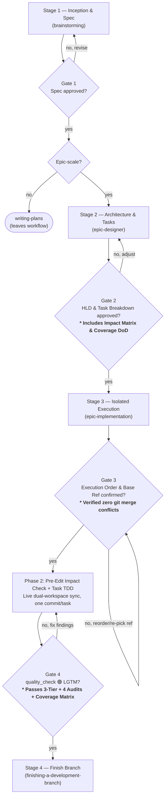
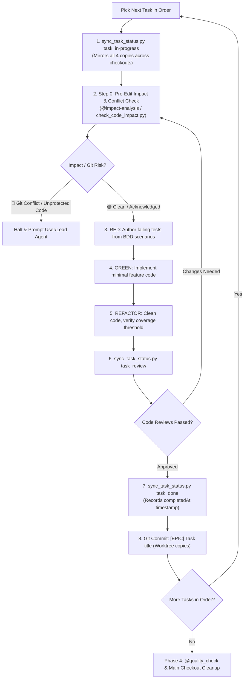
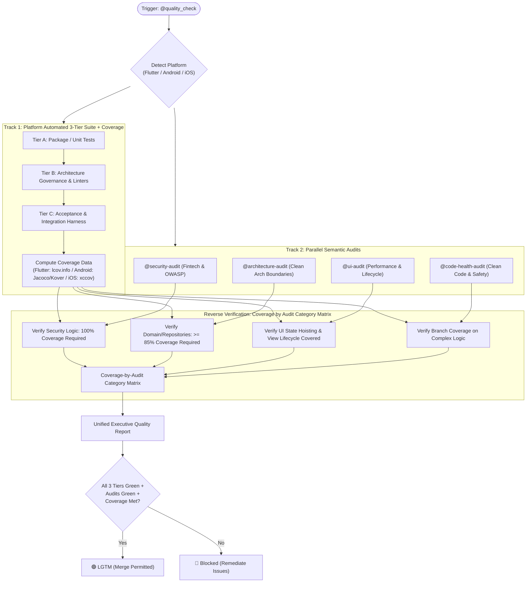
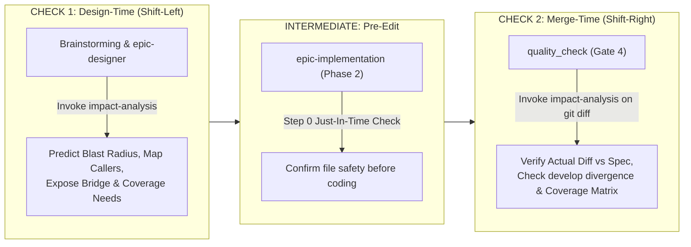

# Epic: Dual-Workspace Kanban Synchronization & Pre-Edit Impact Analysis

## 1. Meta Data
- **Epic**: kanban-sync-impact-analysis
- **Status**: In Progress
- **Target Release**: v1.1.0
- **Platform**: Cross-Platform Tooling (Flutter, Android Native, iOS Native)
- **Source Spec**: [2026-09-15-epic-kanban-sync-and-impact-analysis-design.md](2026-09-15-epic-kanban-sync-and-impact-analysis-design.md)

---

## 2. Background
In multi-agent and multi-worktree mobile software engineering across **Flutter**, **Android Native**, and **iOS Native**:
1. **Multi-Workspace Drift**: Work executed inside isolated git worktrees (`.worktrees/<epic_dir>`) leaves tasks in the main checkout frozen at `todo`, resulting in stale Kanban boards for developers watching the primary IDE window. Timestamps (`modified`, `completedAt`) are rarely updated or maintained uniformly.
2. **Blind Modifications & Regressions**: Developers and autonomous AI agents modifying existing source code often cause merge conflicts against outdated base refs, break downstream callers across package boundaries, alter public API/ABI contracts unexpectedly, and introduce runtime crashes in cross-platform bridges (e.g., Flutter `MethodChannel` $\leftrightarrow$ Kotlin/Swift).
3. **Unprotected Logic & Coverage Blind-Spots**: Editing code without baseline test coverage or neglecting BDD/TDD edge cases (nulls, timeout, offline, race conditions) introduces regressions that evade standard compile-time checks.

---

## 3. Goals & Non-Goals

### Goals
- **Dual-Workspace Live Synchronization**: Mirror every status transition (`backlog`, `todo`, `in-progress`, `review`, `done`) across all checkouts returned by `git worktree list --porcelain`, maintaining ISO-8601 UTC Zulu timestamps (`created`, `modified`, `completedAt`).
- **Dedicated `impact-analysis` Skill & Pre-Edit Checker**: Provide an automated 4-layer inspection pipeline (`check_code_impact.py` + reference manual `references/impact-mechanisms.md`):
  1. *Layer 1 (Git Conflicts)*: Detects divergence against `<base_ref>` and dirty worktree collisions.
  2. *Layer 2 (Architecture Blast Radius)*: Identifies all callers and module boundaries using fast symbol search (`ripgrep`).
  3. *Layer 3 (Cross-Platform Bridge)*: Detects Flutter `MethodChannel` and `EventChannel` couplings with Native handlers.
  4. *Layer 4 (Test Impact Analysis & Coverage)*: Maps source files to test suites, flags unprotected code (low coverage), and exposes missing edge case branches.
- **Workflow & Quality Integration**:
  - `epic-designer`: Enforces `### Impact Analysis & Blast Radius` and test coverage targets in task definitions and process diagrams.
  - `epic-implementation`: Enforces Pre-Edit Step 0 impact checking before code edits, process flow diagram updates, and live status flips.
  - `quality_check`: Enforces 3-Tier test runs with test coverage computed per platform and reverse-verified against 4 semantic audit categories (Security 100%, Architecture $\ge 85\%$, UI, Code Health).
  - `epic-lifecycle`: Updates Gate 2, Gate 3, and Gate 4 checkpoints and process flows.
- **Clean Teardown**: Automatically restore main checkout mirror copies in Phase 4 prior to branch merge.

### Non-Goals
- Replacing native compilers or static analysis linters: `check_code_impact.py` acts as a pre-flight guide; native compilers and Tier C tests remain the final dynamic enforcers.
- Expanding the status enum: Strictly five columns (`backlog | todo | in-progress | review | done`).

---

## 4. Architecture & Technical Design

### High-Level Architecture

### Use Cases Flowchart

### Primary Sequence Diagram

---

## 5. Process Flow & Diagram Updates by Skill

### 5.1 `skills/epic-lifecycle/SKILL.md` Process Flow Update
The lifecycle orchestrator sequence is upgraded to enforce Impact Analysis at Gate 2, conflict-free base ref at Gate 3, and Coverage Reverse Verification at Gate 4:

### 5.2 `skills/epic-implementation/SKILL.md` Phase 2 Process Flow Update
The Phase 2 loop inside `epic-implementation` is updated to include Step 0 (Pre-Edit Impact Check) and live dual-workspace status flips:

### 5.3 `skills/quality_check/SKILL.md` Dual-Track & Reverse Verification Update
The `@quality_check` orchestrator diagram is updated to pair automated platform test coverage with semantic audit reverse verification:

### 5.4 The Double-Check Mechanism (Bookend Verification: Design-time & Merge-time)

To guarantee end-to-end reliability and eliminate blind spots, `@impact-analysis` is applied as a **Double-Check (Bookend) Mechanism** operating at both ends of the development lifecycle:

#### Why the Double-Check Mechanism is Tremendously More Effective:
1. **Closed-Loop Feedback**:
   - *Check 1 (Planning / Design-Time)*: Establishes the expected blast radius, informs task decomposition, and identifies missing logic cases before a single line of code is written (cheapest time to fix design flaws).
   - *Check 2 (Gate 4 / Merge-Time)*: Inspects the *actual* `git diff` against the updated base branch. Catches any scope creep, unpredicted file edits, or missing test coverage that arose during implementation.
2. **Eliminates Merge Surprises in Long-Running Epics**:
   - While an epic is being implemented over days or weeks, `<base_ref>` (`develop`) moves forward. Check 2 re-evaluates divergence against the latest upstream commits right before merge, ensuring zero merge collisions.
3. **Accountability & Integrity**:
   - Proves mathematically that what was planned in Check 1 was faithfully and safely executed in Check 2.

---

## 6. BDD Output in Epic Directory (`bdd_scenarios.md`)
A dedicated behavioral specification contract is maintained in `bdd_scenarios.md` alongside this HLD, formalizing:
1. Status transition symmetry and timestamp integrity across worktrees.
2. Rejection of invalid status enumerations.
3. Pre-flight Git conflict detection and upstream divergence warnings.
4. Cross-module caller mapping and boundary protection.
5. Cross-platform MethodChannel identification.
6. Coverage blind-spot alerting and missing logic detection.
7. Main checkout cleanup and safe merge invariants.

---

## 7. Rollout Strategy & Mitigation
- **Phased Rollout**:
  - Phase 1: Deploy `sync_task_status.py` and `test_sync_task_status.py` to stabilize cross-workspace Kanban sync.
  - Phase 2: Deploy `check_code_impact.py` and `test_check_code_impact.py` to enable automated pre-edit checking.
  - Phase 3: Publish `skills/impact-analysis/` and reference documentation.
  - Phase 4: Integrate workflows across `epic-designer`, `epic-implementation`, `quality_check`, and `epic-lifecycle`.
- **Mitigation & Fallback**:
  - `sync_task_status.py` preserves unparseable documents and fails loud on ambiguity without corrupting text.
  - `check_code_impact.py` provides non-destructive read-only static analysis. If coverage reports are absent, it degrades gracefully to static test-file mapping without breaking execution.
  - Main checkout restoration uses `git restore` without `--staged`, preserving developer manual stages.

---

## 8. Kanban Tasks Breakdown
- [Task 1: Complete and Wire Dual-Workspace Status Synchronizer](../../features/task_1_kanban_sync_status.md)
- [Task 2: Build Pre-Edit Impact and Conflict Checker](../../features/task_2_pre_edit_impact_checker.md)
- [Task 3: Author Dedicated Impact Analysis Skill and Reference Manual](../../features/task_3_impact_analysis_skill.md)
- [Task 4: Integrate Workflow Gates in Epic Designer and Epic Implementation](../../features/task_4_workflow_integration.md)
- [Task 5: Integrate Quality Check Test Coverage and Reverse Verification Gate](../../features/task_5_quality_check_coverage_gate.md)
