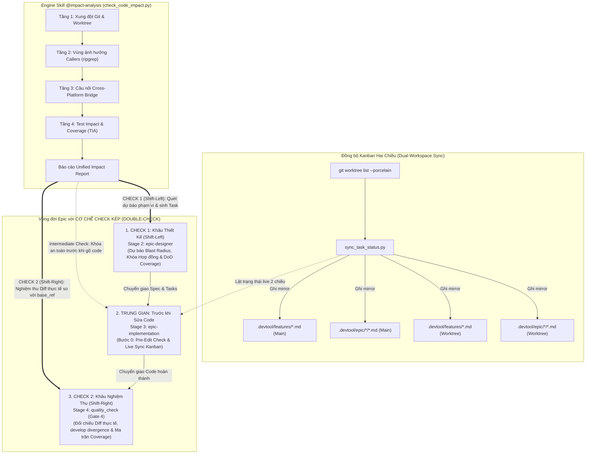
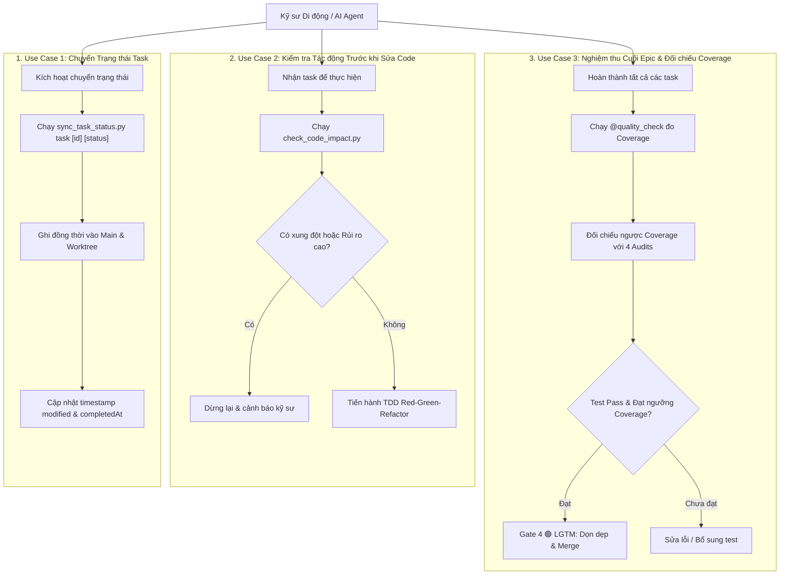
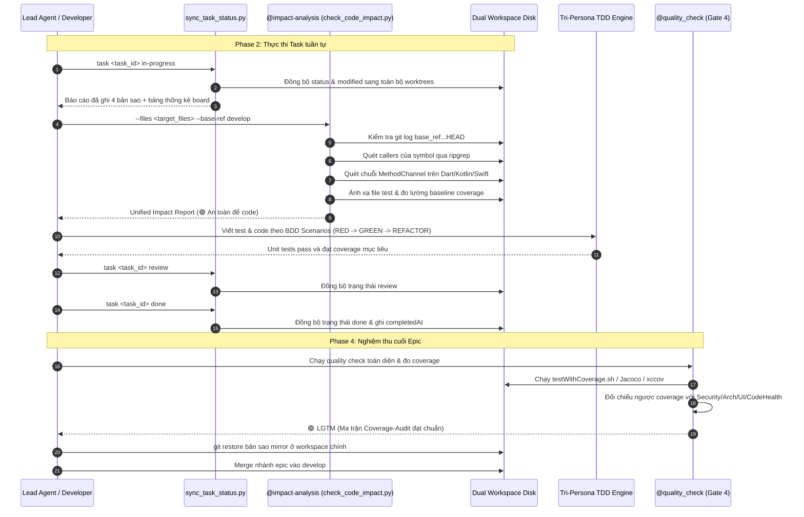
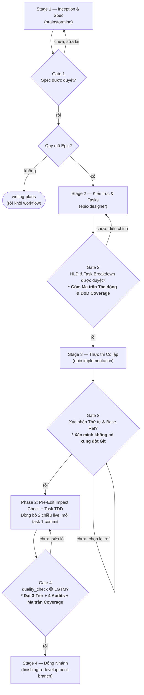
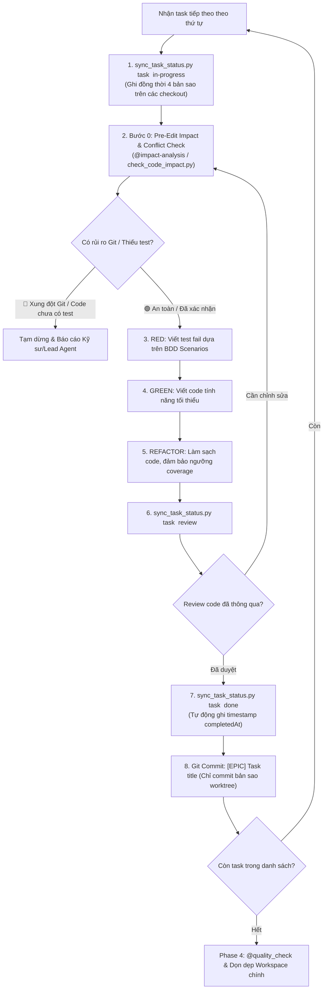
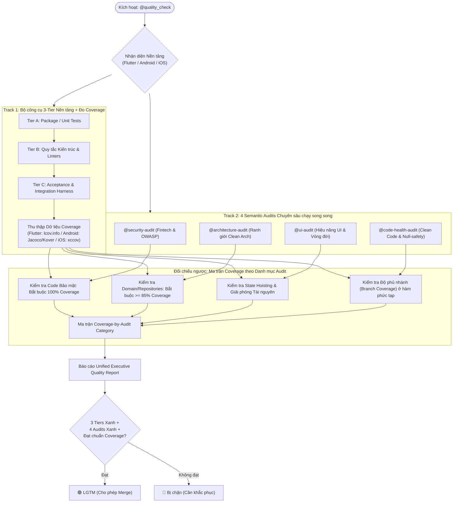
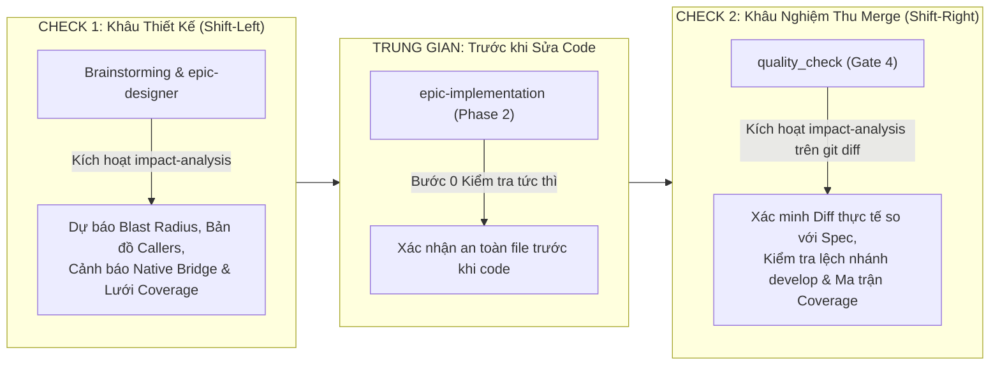

# Epic: Đồng bộ Kanban Hai Chiều & Đánh giá Tác động Trước khi Sửa Code

## 1. Meta Data
- **Epic**: kanban-sync-impact-analysis
- **Status**: Done
- **Target Release**: v1.1.0
- **Platform**: Cross-Platform Tooling (Flutter, Android Native, iOS Native)
- **Source Spec**: [2026-09-15-epic-kanban-sync-and-impact-analysis-design.md](2026-09-15-epic-kanban-sync-and-impact-analysis-design.md)

---

## 2. Bối cảnh (Background)
Trong quy trình phát triển phần mềm di động quy mô lớn với nhiều agent và git worktrees trên **Flutter**, **Android Native**, và **iOS Native**:
1. **Lệch pha giữa các Workspace**: Khi thực thi trong worktree cô lập (`.worktrees/<epic_dir>`), file task ở workspace chính bị đóng băng ở `todo`. Bảng Kanban của kỹ sư mở trên IDE chính bị cũ. Các timestamp (`modified`, `completedAt`) không được duy trì tự động.
2. **Sửa code mù & Nguy cơ Hồi quy**: Kỹ sư hoặc AI Agent khi sửa mã nguồn thường gặp rủi ro rẽ nhánh xung đột với `<base_ref>` (như `develop`), làm vỡ các component phụ thuộc ở module khác, vi phạm hợp đồng ABI công khai, hoặc làm crash cầu nối Native (như `MethodChannel` giữa Flutter và Kotlin/Swift).
3. **Vùng tối thiếu Test Coverage**: Sửa logic ở các hàm có 0% coverage mà không có lưới an toàn, hoặc bỏ sót các nhánh rẽ biên (null, timeout, mất mạng, race condition) trong BDD/TDD.

---

## 3. Mục tiêu & Giới hạn (Goals & Non-Goals)

### Mục tiêu
- **Đồng bộ trạng thái Kanban 2 chiều theo thời gian thực**: Đồng bộ hóa mọi bước chuyển trạng thái (`backlog`, `todo`, `in-progress`, `review`, `done`) trên tất cả checkout qua `git worktree list --porcelain`, duy trì timestamp chuẩn ISO-8601 UTC Zulu (`created`, `modified`, `completedAt`).
- **Skill chuyên trách `impact-analysis` & Tool Pre-Edit Check**: Cung cấp pipeline kiểm tra 4 tầng tự động (`check_code_impact.py` kèm cẩm nang `references/impact-mechanisms.md`):
  1. *Tầng 1 (Git Conflicts)*: Phát hiện rẽ nhánh với `<base_ref>` và va chạm uncommitted ở các worktree khác.
  2. *Tầng 2 (Vùng ảnh hưởng Blast Radius)*: Quét tìm tất cả callers và kiểm tra ranh giới module bằng `ripgrep`.
  3. *Tầng 3 (Cầu nối Native Bridge)*: Quét xuyên biên giới tìm `MethodChannel` và `EventChannel` giữa Dart và Native.
  4. *Tầng 4 (Test Impact Analysis & Coverage)*: Ánh xạ test tương ứng, cảnh báo code chưa có test (0% coverage), và phát hiện case logic bị bỏ sót.
- **Tích hợp Quy trình & Cổng chất lượng**:
  - `epic-designer`: Bắt buộc mục `### Impact Analysis & Blast Radius` và mục tiêu coverage trong từng task và sơ đồ quy trình.
  - `epic-implementation`: Bắt buộc Bước 0 Pre-Edit check trước khi sửa code, cập nhật sơ đồ Phase 2, và lật trạng thái live qua script.
  - `quality_check`: Đo test coverage theo từng nền tảng và đối chiếu ngược với 4 Semantic Audits (Security 100%, Architecture $\ge 85\%$, UI, Code Health).
  - `epic-lifecycle`: Cập nhật các Gate 2, Gate 3, và Gate 4.
- **Dọn dẹp an toàn**: Tự động revert bản sao mirror ở workspace chính tại Phase 4 trước khi merge nhánh.

### Giới hạn (Non-Goals)
- Không thay thế compiler hay linter: `check_code_impact.py` đóng vai trò cảnh báo sớm; compiler và Tier C integration test vẫn là người gác cổng động cuối cùng.
- Giữ nguyên enum 5 cột Kanban: `backlog | todo | in-progress | review | done`.

---

## 4. Kiến trúc & Thiết kế Kỹ thuật

### Sơ đồ Kiến trúc Tổng quan (High-Level Architecture)

### Sơ đồ Trường hợp Sử dụng (Use Cases Flowchart)

### Sơ đồ Trình tự Chính (Primary Sequence Diagram)

---

## 5. Cập nhật Quy trình & Sơ đồ theo từng Skill (Process Flow & Diagrams)

### 5.1 Cập nhật Quy trình `skills/epic-lifecycle/SKILL.md`
Quy trình điều phối vòng đời Epic được nâng cấp để áp dụng kiểm tra tác động tại Gate 2, xác nhận base-ref tại Gate 3, và đối chiếu Coverage ngược tại Gate 4:

### 5.2 Cập nhật Quy trình Phase 2 trong `skills/epic-implementation/SKILL.md`
Vòng lặp Phase 2 được tích hợp Bước 0 (Kiểm tra tác động trước khi code) và lật trạng thái live:

### 5.3 Cập nhật Quy trình Dual-Track trong `skills/quality_check/SKILL.md`
Sơ đồ điều phối `@quality_check` được bổ sung đường chạy đo lường test coverage và ma trận đối chiếu ngược:

### 5.4 Cơ chế Check Kép (Bookend Verification: Kiểm tra ở Đầu Design & Kiểm tra ở Cuối Merge)

Để bảo đảm an toàn tuyệt đối và triệt tiêu toàn bộ điểm mù, `@impact-analysis` được áp dụng như một **Cơ chế Check Kép (Double-Check / Bookend Mechanism)** hoạt động tại cả hai đầu vòng đời phát triển:

#### Tại sao cơ chế Check Kép lại mang lại hiệu quả vượt trội:
1. **Khép kín vòng lặp kiểm soát (Closed-Loop Feedback)**:
   - *Check 1 (Lúc Design/Planning)*: Lập giả thuyết vùng ảnh hưởng, định hướng phân rã task chính xác và phát hiện các case logic bị thiếu trước khi viết bất kỳ dòng code nào (sửa lỗi lúc này có chi phí rẻ nhất).
   - *Check 2 (Tại Gate 4 / Merge-Time)*: Soi chiếu trực tiếp trên `git diff` thực tế so với nhánh base. Phát hiện ngay các file bị sửa phát sinh ngoài kế hoạch (scope creep) hoặc các nhánh rẽ code bị thiếu test.
2. **Loại bỏ hoàn toàn rủi ro xung đột Git trong các Epic dài ngày**:
   - Khi làm Epic trong nhiều ngày, nhánh `develop` liên tục có commit mới từ các thành viên khác. Check 2 kiểm tra lại rẽ nhánh với commit mới nhất của `develop` ngay trước khi merge, bảo đảm không bị merge conflict.
3. **Tính minh bạch & Trách nhiệm giải trình**:
   - Khẳng định một cách định lượng rằng những gì đã cam kết và dự báo ở Check 1 đều được thực hiện trọn vẹn và an toàn ở Check 2.

---

## 6. Hợp đồng Hành vi BDD trong Thư mục Epic (`bdd_scenarios.md`)
Một file hợp đồng hành vi riêng được lưu trữ tại `bdd_scenarios.md` chuẩn hóa:
1. Tính đối xứng của việc chuyển trạng thái và tính toàn vẹn của timestamp.
2. Từ chối các trạng thái nằm ngoài enum 5 cột chuẩn.
3. Cảnh báo sớm xung đột Git và rẽ nhánh với `<base_ref>`.
4. Rà soát callers và bảo vệ ranh giới module.
5. Định danh cầu nối MethodChannel giữa Flutter và Native.
6. Cảnh báo vùng tối thiếu test (0% coverage) và case logic bị bỏ sót.
7. Dọn dẹp sạch sẽ workspace chính và bảo đảm an toàn khi merge.

---

## 7. Chiến lược Triển khai & Giảm thiểu Rủi ro (Rollout Strategy)
- **Triển khai theo giai đoạn**:
  - Giai đoạn 1: Triển khai `sync_task_status.py` và `test_sync_task_status.py` ổn định việc đồng bộ Kanban.
  - Giai đoạn 2: Triển khai `check_code_impact.py` và `test_check_code_impact.py` tự động hóa việc kiểm tra tác động.
  - Giai đoạn 3: Phát hành `skills/impact-analysis/` và tài liệu hướng dẫn.
  - Giai đoạn 4: Tích hợp quy trình trên `epic-designer`, `epic-implementation`, `quality_check`, và `epic-lifecycle`.
- **Dự phòng & Khắc phục**:
  - `sync_task_status.py` giữ nguyên nội dung văn bản nếu gặp định dạng lạ, không bao giờ tự ý sửa sai cấu trúc file HLD.
  - `check_code_impact.py` là công cụ đọc tĩnh, không làm thay đổi file mã nguồn. Nếu repo chưa có file báo cáo coverage, nó tự động hạ cấp xuống kiểm tra file test tĩnh mà không làm gián đoạn luồng làm việc.
  - Lệnh restore ở Phase 4 không dùng `--staged`, giữ an toàn các thay đổi dev đã stage thủ công.

---

## 8. Phân rã Tasks Kanban (Kanban Tasks Breakdown)
- [Task 1: Hoàn thiện và tích hợp công cụ Đồng bộ Trạng thái Kanban](task_1_kanban_sync_status.md)
- [Task 2: Xây dựng công cụ Kiểm tra Tác động và Xung đột trước khi sửa code](task_2_pre_edit_impact_checker.md)
- [Task 3: Soạn thảo Skill chuyên trách Impact Analysis và Tài liệu Hướng dẫn](task_3_impact_analysis_skill.md)
- [Task 4: Tích hợp Cổng Quy trình vào Epic Designer và Epic Implementation](task_4_workflow_integration.md)
- [Task 5: Tích hợp Đo lường Coverage và Cổng Đối chiếu Ngược vào Quality Check](task_5_quality_check_coverage_gate.md)
