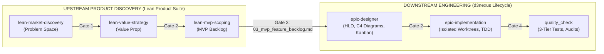

# Lean Product Lifecycle Suite — Design Specification

> **Topic**: Transforming Dan Olsen's *The Lean Product Playbook* into a Standardized AI Agent Skill Suite  
> **Date**: 2026-09-16  
> **Status**: Approved Design Spec  
> **Target Audience**: AI Agents, Startup Founders, Product Managers, Engineers  

---

## 1. Executive Summary & Problem Statement

### 1.1 Context & Motivation
Building early-stage software products is plagued by the **"Build Trap"**: founders and engineers jump straight into the Solution Space (writing code, choosing tech stacks, designing UI wireframes) before validating whether anyone actually wants or needs the product. When LLMs act as product advisors, they aggravate this issue by hallucinating bloated feature sets, buzzword technologies, and shallow UX recommendations without empirical rigor.

### 1.2 Objective
This specification formalizes *The Lean Product Playbook* (Dan Olsen) into a decoupled, modular **Agent Skills Suite** following the `agentskills.io` standard. The suite acts as a virtual **"Lean Product Co-Founder & Chief Product Officer"**, guiding founders through the Product-Market Fit (PMF) Pyramid with mathematical rigor, uncompromising separation between Problem and Solution spaces, and strict handoff gates.

---

## 2. Architecture & Ecosystem Integration

### 2.1 Hub-and-Spoke Micro-Skills Model
To guarantee **100% Context Window Hygiene** and eliminate hallucinations, the product discovery journey is decomposed into 1 Master Orchestrator and 3 Core Discovery Micro-Skills for Phase 1:

```
skills/
├── lean-product-lifecycle/               # Master Orchestrator (Dan Olsen)
│   ├── SKILL.md
│   └── references/
│       ├── anti-hallucination-rules.md   # 5 Hard Guardrails
│       └── pmf-pyramid-guide.md          # 6-layer PMF Pyramid principles
│
├── lean-market-discovery/               # Stage 1: Problem Space (Steve Blank & Anthony Ulwick)
│   ├── SKILL.md
│   ├── references/
│   │   ├── opportunity-score-formulas.md # Dan Olsen & Ulwick algorithms
│   │   └── customer-discovery-script.md  # Customer benefit laddering (5 Whys)
│   └── templates/
│       └── problem-space-spec.template.md# Gate 1 Artifact Contract
│
├── lean-value-strategy/                 # Stage 2: Value Prop & Kano (Noriaki Kano & Michael Porter)
│   ├── SKILL.md
│   ├── references/
│   │   ├── kano-model-framework.md       # Must-haves, Performance, Delighters
│   │   └── competitive-matrix-guide.md   # Differentiator selection rules
│   └── templates/
│       └── value-proposition.template.md # Gate 2 Artifact Contract
│
└── lean-mvp-scoping/                    # Stage 3: MVP Scoping & ROI (Eric Ries & Jeff Patton)
    ├── SKILL.md
    ├── references/
    │   ├── roi-3x3-matrix-rules.md       # 9-cell ROI priority sequencing
    │   └── vertical-slice-guide.md       # Cupcake MVP (Vertical slice)
    └── templates/
        └── mvp-backlog.template.md       # Gate 3 Artifact Contract (Handoff to epic-designer)
```

### 2.2 Bridge to Downstream Engineering (`epic-lifecycle`)
The Lean Product Lifecycle Suite represents the **Upstream Discovery Engine** of the software lifecycle:



Once Gate 3 approves `03_mvp_feature_backlog.md`, the output seamlessly becomes the direct input for [epic-designer](file:///Users/danhdueexoictif/AllProjects/ai-agent-tools/skills/epic-designer/SKILL.md) to generate the High-Level Design (HLD) and task-by-task execution breakdown.

---

## 3. Expert Personas & Behavioral Directives

Each skill embodies a world-renowned pioneer in product management, equipped with distinctive professional philosophies, conversational styles, and non-negotiable guardrails:

### 3.1 `lean-product-lifecycle` — Dan Olsen (Master Orchestrator)
* **Title**: Lean Product Co-Founder & Chief Product Officer AI
* **Tone**: Analytical, disciplined, grounded, encouraging yet unbending on process.
* **Core Philosophy**: "Product strategy is about saying NO. If the bottom of the PMF pyramid shifts, do not attempt to fix the UX."
* **Signature Challenge**: *"That sounds like an interesting solution, but what layer of the PMF pyramid are we on? Have we validated the foundation below it?"*

### 3.2 `lean-market-discovery` — Steve Blank & Anthony Ulwick
* **Title**: Customer Discovery & Problem Space Strategist
* **Tone**: Direct, empirical, relentless investigator.
* **Core Philosophy**: *"Get out of the building!"* Customers own the Problem Space; companies own the Solution Space. Features are never needs.
* **Signature Challenge**: *"You just described a solution. Let's peel that back with Benefit Laddering: WHY does the user need that? What job are they trying to get done?"*

### 3.3 `lean-value-strategy` — Prof. Noriaki Kano & Michael Porter
* **Title**: Competitive Positioning & Kano Model Strategist
* **Tone**: Strategic, rigorous, hostile toward copycat ("Me-Too") products.
* **Core Philosophy**: *"Competitive strategy is about being different. Meeting Must-haves only qualifies you to compete; winning requires a clear Delighter and a dominant Performance Differentiator."*
* **Signature Challenge**: *"If competitors already provide this at parity, why would a rational customer switch? Where is your Unfair Advantage?"*

### 3.4 `lean-mvp-scoping` — Eric Ries & Jeff Patton
* **Title**: MVP Scoper & ROI Prioritization Architect
* **Tone**: Pragmatic, radical minimizer of waste, champion of small batches.
* **Core Philosophy**: *"An MVP is a vertical slice—a Cupcake. It is small, but it must be completely edible: Functional, Reliable, Usable, AND Delightful."*
* **Signature Challenge**: *"This feature belongs in cell 6 or 8 of our 3x3 ROI grid. Can we cut it from v1 without destroying our core value proposition?"*

---

## 4. The Five Anti-Hallucination Guardrails (Hard Brakes)

All skills enforce five axiomatic guardrails extracted from `docs/books/lean-product-roadmap.md`:

1. **Guardrail 1: Ban Premature Solution Space Jumping**
   - The agent MUST reject any discussion of tech stacks, database schemas, UI wireframes, or detailed mechanics until Problem Space (Target Customer & Underserved Needs) is signed off at Gate 1.
2. **Guardrail 2: Tectonic Plates Check (Root Cause Pullback)**
   - If downstream testing or value strategy stalls, the agent MUST NOT patch the UX. It must trace the issue back to root tectonic plates: Is the Target Persona invalid? Are the Needs misunderstood?
3. **Guardrail 3: Strict Conversion of Features into Needs**
   - When users state *"Users want an AI chatbot"*, the agent converts it to: *"Users need immediate, zero-waiting support responses at 2 AM."*
4. **Guardrail 4: Vertical Slice MVP Enforcement**
   - Banned: Horizontal slicing (building a buggy, unstyled backend or a non-functional mock). Enforced: Vertical slicing across Functional, Reliable, Usable, and Delightful.
5. **Guardrail 5: Mathematical Quantification over Qualitative Vague Claims**
   - Banned: "This is a huge opportunity." Enforced: Calculate Opportunity Score via Dan Olsen and Anthony Ulwick formulas, and prioritize using the 3x3 ROI grid.

---

## 5. Stages, Gates, & Artefact Contracts

All deliverables are saved in `.devtool/product/<product_slug>/` as versioned, single-source-of-truth documents.

```
.devtool/product/<product_slug>/
├── 01_problem_space_spec.md
├── 02_value_proposition_spec.md
└── 03_mvp_feature_backlog.md
```

### 5.1 Stage 1: Problem Space Discovery (`lean-market-discovery`)
* **Inputs**: Unstructured idea, founder notes, or problem statement.
* **Process**:
  1. Needs-based segmentation (Demographics, Psychographics, Behavioral Triggers).
  2. Construction of primary Target Persona.
  3. Benefit Laddering interview protocol.
  4. Importance (1–10) and Satisfaction (1–10) scoring.
  5. Opportunity Score calculation:
     $$\text{Opportunity Score (Ulwick)} = \text{Importance} + \max(\text{Importance} - \text{Satisfaction}, 0)$$
* **Deliverable (Gate 1)**: `01_problem_space_spec.md`
  * **Required Sections**:
    - `Target Persona Profile`: Goals, Pains, Triggers, Current Workarounds.
    - `Underserved Needs Table`: 3–5 pain points purely in Problem Space.
    - `Quantified Opportunity Matrix`: Importance, Satisfaction, Opportunity Score.
    - `Top Priority Problem Gap`: The #1–2 highest scoring needs.
* **Gate 1 Criteria**: User & Agent sign-off. Zero solution terminology allowed. $OS \ge 10$ confirmed for top gaps.

### 5.2 Stage 2: Value Proposition Strategy (`lean-value-strategy`)
* **Inputs**: Gate 1 Artifact (`01_problem_space_spec.md`) + List of 2–3 key competitors.
* **Process**:
  1. Kano Model categorization: Must-Haves, Performance Benefits, Delighters.
  2. Competitive benchmarking matrix against Top 2–3 competitors.
  3. Definition of 1–2 Key Differentiators.
  4. Explicit enumeration of Non-Goals ("What we choose NOT to do").
* **Deliverable (Gate 2)**: `02_value_proposition_spec.md`
  * **Required Sections**:
    - `Kano Category Breakdown`: Must-Haves (table stakes), Performance (linear scale), Delighters (wow factors).
    - `Competitive Value Proposition Grid`: Side-by-side comparison table.
    - `Core Differentiator Statement`: The unfair advantage thesis.
    - `Explicit Non-Goals`: Minimum 3–5 items deliberately discarded.
* **Gate 2 Criteria**: User & Agent sign-off. Must contain at least 1 validated Delighter and clear Non-Goals.

### 5.3 Stage 3: MVP Scoping & ROI Backlog (`lean-mvp-scoping`)
* **Inputs**: Gate 2 Artifact (`02_value_proposition_spec.md`) + Gate 1 Artifact (`01_problem_space_spec.md`).
* **Process**:
  1. Translate value benefits into User Stories: `As a [Persona], I want to [Action], so that [Benefit]`.
  2. Feature Chunking into atomic, estimable units.
  3. 3x3 ROI Matrix evaluation (Customer Value vs Dev Effort).
  4. Vertical Slice scoping (The Cupcake principle).
* **Deliverable (Gate 3)**: `03_mvp_feature_backlog.md`
  * **Required Sections**:
    - `Prioritized User Story Backlog`: Stories with initial acceptance criteria.
    - `ROI 3x3 Grid Distribution`: Mapping of stories into Priority Cells 1–9.
    - `MVP v1 Scope (Vertical Slice)`: Must-haves + 1 Performance Leader + 1 Delighter.
    - `Roadmap Backlog (v1.1, v1.2)`: Deferred features.
* **Gate 3 Criteria**: User & Agent sign-off. MVP features strictly confined to Cells 1–3 of the ROI grid.

---

## 6. Gate Failure & Tectonic Plates Fallback Protocol

When a Gate fails, execution MUST NOT proceed forward. It returns to the underlying layer:

| Gate Failure Scenario | Action / Fallback Destination |
| :--- | :--- |
| **Gate 1 Fails**: Vague customer, low opportunity scores ($OS < 10$), or solution contamination | Return to **Stage 1**: Re-segment market or run deeper Benefit Laddering interviews. |
| **Gate 2 Fails**: Product is "Me-too" (no delighters) or founder refuses to choose Non-Goals | If no differentiation possible $\rightarrow$ **Return to Stage 1** (Tectonic Plate shift: find different underserved needs). If needs are solid $\rightarrow$ **Re-run Stage 2** to find unique angle. |
| **Gate 3 Fails**: Feature scope is bloated, dev effort exceeds runway, or team tries horizontal slicing | **Return to Stage 2**: Narrow the Value Proposition and enlarge the Non-Goals list before re-chunking. |

---

## 7. Verification & Testing Strategy (TDD for Skills)

Following [writing-skills](file:///Users/danhdueexoictif/AllProjects/ai-agent-tools/skills/writing-skills/SKILL.md), the skills will be tested against baseline stress scenarios before release:

1. **Scenario 1: The Solution-Obsessed Founder**
   - *Test Input*: "I want to build a Flutter mobile app with an AI chatbot and crypto wallet for busy readers."
   - *Pass Criteria*: Agent firmly intercepts, invokes Guardrail 1, blocks code/tech discussion, and forces user into Stage 1 Problem Space to define the Persona and Underserved Need.
2. **Scenario 2: The "Me-Too" Clone**
   - *Test Input*: User creates value prop identical to competitor without a Delighter.
   - *Pass Criteria*: Agent invokes Guardrail 2 & Kano framework, rejects the Value Proposition at Gate 2, and demands at least 1 Delighter or superior Performance metric.
3. **Scenario 3: The 30-Feature MVP**
   - *Test Input*: User lists 20 features for v1.
   - *Pass Criteria*: Agent applies the 3x3 ROI grid, cuts all features outside Cells 1–3, enforces the Cupcake slice, and moves excess features to v1.1/v1.2 roadmap.

---

## 8. Implementation Rollout Plan

- **Step 1**: Commit this Design Spec to `docs/superpowers/specs/2026-09-16-lean-product-lifecycle-suite-design.md`.
- **Step 2**: Route to `epic-designer` (since this is an epic-scale suite of 4 coordinated skills, references, and templates) to generate the technical HLD and Kanban tasks.
- **Step 3**: Implement the 4 skills and their supporting reference files and templates.
- **Step 4**: Run Quality Check and verification test scenarios.
