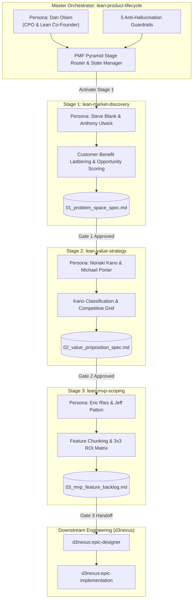
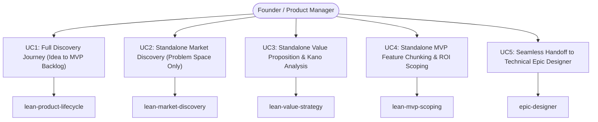
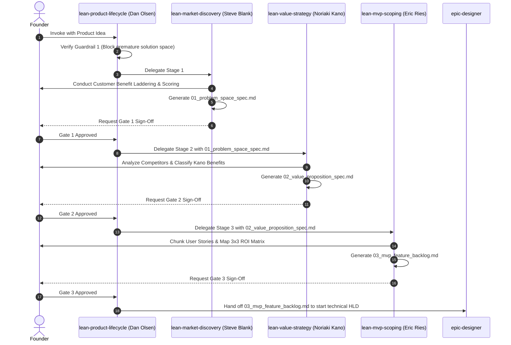

# Epic: Lean Product Lifecycle Suite

## 1. Meta Data
- **Epic**: `lean_product_suite`
- **Status**: Done — released in 1.1.0
- **Target Release**: `1.1.0`
- **Platform**: `Agent Tools (Markdown, YAML, Shell)`
- **Source Spec**: [2026-09-16-lean-product-lifecycle-suite-design.md](2026-09-16-lean-product-lifecycle-suite-design.md)
- **BDD Scenarios**: [bdd_scenarios.md](bdd_scenarios.md)
- **Source Fidelity Review**: [source_fidelity_review.md](source_fidelity_review.md)
- **Primary Source**: *The Lean Product Playbook*, Dan Olsen (Wiley, 2015)
- **Created**: 2026-09-16
- **Author**: Antigravity AI Pair & DanhDue ExOICTIF

---

## 2. Background
Early-stage software development consistently falls into the **"Build Trap"**: developers and founders race into the Solution Space—writing code, provisioning databases, and sketching UI wireframes—without validating whether the underlying problem actually exists or is underserved. General LLM assistants exacerbate this by prematurely proposing bloated feature sets, complex architectures, and shallow UX mockups.

Based on Dan Olsen's seminal work *The Lean Product Playbook*, this epic establishes an **Upstream Product Discovery & Validation Lifecycle** implemented as a standardized suite of AI Agent Skills. It guarantees disciplined separation between Problem Space and Solution Space, enforces 5 anti-hallucination guardrails, embodies legendary product personas, and delivers structured, machine-verifiable artifacts through human-in-the-loop gates before engineering begins.

---

## 3. Goals & Non-Goals

### Goals
1. **Master Orchestrator Skill (`lean-product-lifecycle`)**:
   - Persona: **Dan Olsen** (CPO / Lean Product Co-Founder).
   - Carries two distinct models: the **5-layer PMF Pyramid** (Target Customer → Underserved Needs →
     Value Proposition | Feature Set → UX) used for diagnosis and rollback, and the **6-step Lean
     Product Process** used for routing. Conflating them was the prior model's central error.
   - Enforces the 5 Hard Anti-Hallucination Guardrails.
   - Implements the Tectonic Plates Fallback Protocol when gates fail.
2. **Stage 1 Micro-Skill (`lean-market-discovery`)**:
   - Persona: **Steve Blank & Anthony Ulwick**.
   - Focus: Needs-based personas, Customer Benefit Laddering (5 Whys), Importance/Satisfaction survey
     design (5-point unipolar / 7-point bipolar + normalization), and dual Opportunity Score
     calculation — Gate 1 requires at least one need at $OS > 15$ on Ulwick's 0–20 scale.
   - Deliverable: `.devtool/product/<slug>/01_problem_space_spec.md`.
3. **Stage 2 Micro-Skill (`lean-value-strategy`)**:
   - Persona: **Prof. Noriaki Kano & Michael Porter**.
   - Focus: Kano categorization (Must-haves, Performance, Delighters), a competitive grid that admits
     the customer's current workaround as a column, selection of exactly **one** performance benefit to
     win on with parity elsewhere, Core Differentiator, and Non-Goals.
   - Deliverable: `.devtool/product/<slug>/02_value_proposition_spec.md`.
4. **Stage 3 Micro-Skill (`lean-mvp-scoping`)**:
   - Persona: **Eric Ries & Jeff Patton**.
   - Focus: User story mapping, atomic feature chunking, numeric ROI prioritization (3x3 grid only as
     declared fallback), the **MVP Candidate Grid** of benefits × chunks, and completeness against the
     MVP Attribute Pyramid (functional, reliable, usable, delightful).
   - Deliverable: `.devtool/product/<slug>/03_mvp_feature_backlog.md`.
5. **Engineering Bridge to `d3nexus:epic-designer`**:
   - Directly feeds the approved `03_mvp_feature_backlog.md` into `epic-designer` to initiate HLD, C4 diagrams, and Kanban tasks.
6. **Self-Contained References & Templates**:
   - Equip every skill with dedicated `references/` (mathematical formulas, interview scripts, kano guides, roi rules) and `templates/` (contract specs).

### Non-Goals
- Phase 2 skills (`lean-ux-testing` and `lean-analytics-optimization`) are out of scope for this epic and deferred to Release 1.2.0.
- No third-party runtime dependencies (all skills use standard Agent Skill markdown/YAML frontmatter specification).

---

## 4. Architecture & Technical Design

### 4.1 High-Level Architecture

### 4.2 Use Cases

### 4.3 Sequence Diagram

### 4.4 Source Fidelity Controls
Every methodological claim implemented by these skills is traced to *The Lean Product Playbook* itself,
not to the summaries in `docs/books/`. Those summaries are derivatives and contained six
behaviour-changing errors, catalogued with the book's own wording in
[source_fidelity_review.md](source_fidelity_review.md). Task 0 corrects them at source so they cannot
re-propagate into a future revision of these skills.

### 4.5 Shift-Left Impact Analysis
- **Blast Radius**: Zero runtime risk to active mobile codebases (`digital_wallet`, etc.). The new skills reside strictly under `skills/` and will be mirrored to `.gemini/config/plugins/d3nexus/skills/`.
- **Interoperability**: Complies 100% with `agentskills.io` standard and the existing `epic-lifecycle` orchestrator.

### 4.6 BDD Scenarios Reference
Detailed Gherkin scenarios across all 5 dimensions are cataloged in [bdd_scenarios.md](bdd_scenarios.md).

---

## 5. Rollout Strategy & Mitigation
- **Phased Rollout**: Implement core skills, templates, and references in `skills/`.
- **Validation**: Execute the 3 baseline TDD pressure test scenarios documented in the Design Spec.
- **Sync**: Mirror to `~/.gemini/config/plugins/d3nexus/skills/` to empower IDE agents globally.

---

## 6. Kanban Tasks Breakdown

The implementation of this epic is decomposed into 6 atomic tasks:

- [Task 0: Correct the `docs/books/` Source Derivatives](task_0_book_reference_corrections.md)
- [Task 1: Master Orchestrator (`lean-product-lifecycle`) & Guardrails](task_1_lean_product_lifecycle_orchestrator.md)
- [Task 2: Stage 1 (`lean-market-discovery`), Opportunity Scoring, & Gate 1](task_2_lean_market_discovery_skill.md)
- [Task 3: Stage 2 (`lean-value-strategy`), Kano Framework, & Gate 2](task_3_lean_value_strategy_skill.md)
- [Task 4: Stage 3 (`lean-mvp-scoping`), 3x3 ROI Grid, & Gate 3](task_4_lean_mvp_scoping_skill.md)
- [Task 5: End-to-End Suite Integration, Plugin Sync, & TDD Verification](task_5_suite_integration_and_verification.md)
