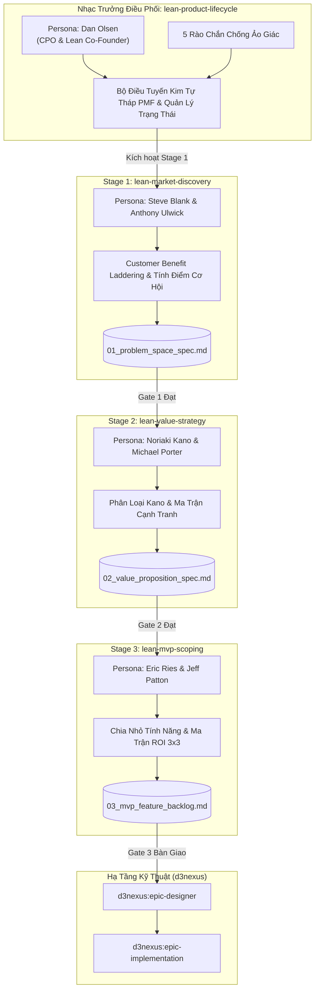
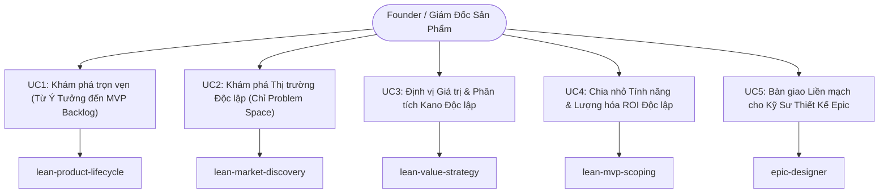
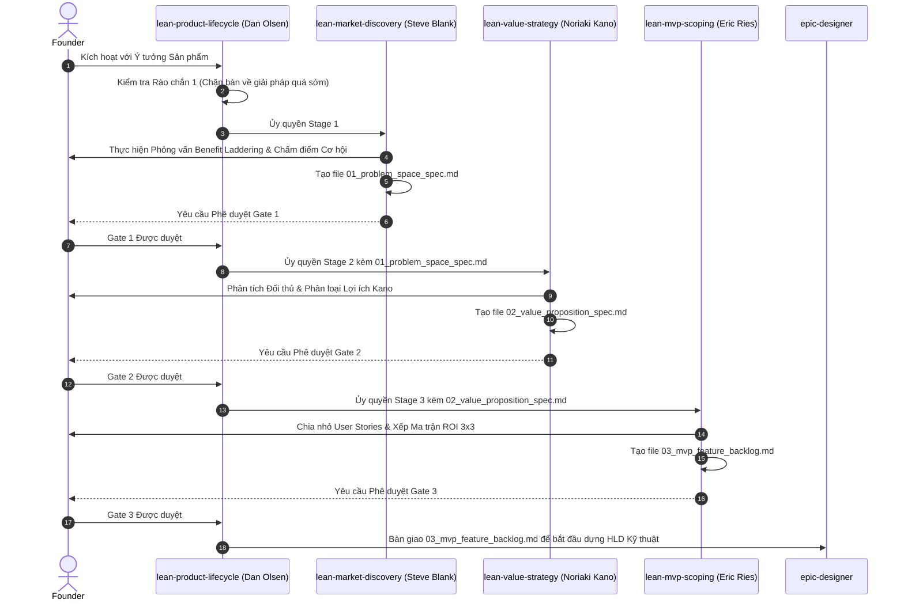

# Epic: Bộ Kỹ Năng Vòng Đời Khám Phá Sản Phẩm Tinh Gọn (Lean Product Lifecycle Suite)

## 1. Meta Data
- **Epic**: `lean_product_suite`
- **Status**: In-Progress
- **Target Release**: `1.1.0`
- **Platform**: `Agent Tools (Markdown, YAML, Shell)`
- **Source Spec**: [2026-09-16-lean-product-lifecycle-suite-design.md](2026-09-16-lean-product-lifecycle-suite-design.md)
- **BDD Scenarios**: [bdd_scenarios.md](bdd_scenarios.md)
- **Created**: 2026-09-16
- **Author**: Antigravity AI Pair & DanhDue ExOICTIF

---

## 2. Bối Cảnh (Background)
Phát triển phần mềm ở giai đoạn sớm thường xuyên rơi vào **"Cái bẫy Xây dựng" (Build Trap)**: các lập trình viên và nhà sáng lập vội vã lao vào Solution Space (Không gian Giải pháp) — viết mã nguồn, thiết kế cơ sở dữ liệu, dựng giao diện UI — mà chưa kiểm chứng xem nhu cầu người dùng có thực sự tồn tại hay có đang bị bỏ quên (Underserved) hay không. Các mô hình LLM thông thường càng làm trầm trọng hóa vấn đề này khi vội vàng đề xuất danh sách tính năng cồng kềnh, kiến trúc phức tạp và các giao diện nông cạn.

Dựa trên tác phẩm kinh điển *The Lean Product Playbook* của Dan Olsen, Epic này thiết lập **Vòng đời Thượng nguồn Khám phá & Xác thực Sản phẩm Tinh gọn (Upstream Product Discovery & Validation Lifecycle)** dưới dạng một bộ AI Agent Skills chuẩn hóa. Bộ kỹ năng đảm bảo sự tách biệt kỷ luật giữa Problem Space và Solution Space, thực thi 5 rào chắn chống ảo giác (Anti-hallucination guardrails), hóa thân thành các chuyên gia sản phẩm huyền thoại, và xuất ra các tài liệu đặc tả có cấu trúc thông qua các cổng phê duyệt (Gates) trước khi kỹ thuật bắt đầu.

---

## 3. Mục Tiêu & Giới Hạn (Goals & Non-Goals)

### Mục Tiêu (Goals)
1. **Master Orchestrator Skill (`lean-product-lifecycle`)**:
   - Persona: **Dan Olsen** (CPO / Lean Product Co-Founder).
   - Quản lý quá trình chuyển tầng có trạng thái xuyên suốt Kim tự tháp PMF 6 tầng.
   - Thực thi 5 Rào chắn Chống Ảo giác cứng.
   - Triển khai Giao thức phục hồi Mảng Kiến tạo (Tectonic Plates Fallback Protocol) khi Gate thất bại.
2. **Stage 1 Micro-Skill (`lean-market-discovery`)**:
   - Persona: **Steve Blank & Anthony Ulwick**.
   - Trọng tâm: Personas theo nhu cầu, Phỏng vấn Benefit Laddering (5 Whys), và Tính điểm cơ hội ($OS \ge 10$).
   - Sản phẩm bàn giao: `.devtool/product/<slug>/01_problem_space_spec.md`.
3. **Stage 2 Micro-Skill (`lean-value-strategy`)**:
   - Persona: **GS. Noriaki Kano & Michael Porter**.
   - Trọng tâm: Phân loại Kano (Must-haves, Performance, Delighters), Bảng so sánh đối thủ, Chọn Differentiator cốt lõi, và Danh sách Non-Goals.
   - Sản phẩm bàn giao: `.devtool/product/<slug>/02_value_proposition_spec.md`.
4. **Stage 3 Micro-Skill (`lean-mvp-scoping`)**:
   - Persona: **Eric Ries & Jeff Patton**.
   - Trọng tâm: User Story mapping, Chia nhỏ tính năng (Feature Chunking), Ưu tiên theo Ma trận ROI 3x3 (Ô 1–3), và Lát cắt dọc Cupcake MVP.
   - Sản phẩm bàn giao: `.devtool/product/<slug>/03_mvp_feature_backlog.md`.
5. **Cầu Nối Kỹ Thuật sang `d3nexus:epic-designer`**:
   - Chuyển giao trực tiếp file `03_mvp_feature_backlog.md` đã được duyệt cho `epic-designer` để dựng HLD, sơ đồ C4 và các task Kanban lập trình.
6. **Tài Liệu Tham Khảo & Templates Tự Quản**:
   - Trang bị cho mỗi skill thư mục `references/` (công thức toán, kịch bản phỏng vấn, hướng dẫn kano, quy tắc roi) và `templates/` (khung đặc tả hợp đồng).

### Giới Hạn (Non-Goals)
- Các kỹ năng Giai đoạn 2 (`lean-ux-testing` và `lean-analytics-optimization`) nằm ngoài phạm vi của epic này và được dời sang bản phát hành 1.2.0.
- Không sử dụng phụ thuộc runtime của bên thứ ba (mọi skill đều tuân theo chuẩn markdown/YAML frontmatter của Agent Skill).

---

## 4. Kiến Trúc & Thiết Kế Kỹ Thuật

### 4.1 Kiến Trúc Tổng Thể (High-Level Architecture)

### 4.2 Trường Hợp Sử Dụng (Use Cases)

### 4.3 Sơ Đồ Tuần Tự (Sequence Diagram)

### 4.4 Phân Tích Tác Động Tả Ngạn (Shift-Left Impact Analysis)
- **Vùng ảnh hưởng (Blast Radius)**: Không ảnh hưởng đến mã nguồn ứng dụng di động (`digital_wallet`). Các kỹ năng mới nằm gọn trong thư mục `skills/` và được đồng bộ tới `.gemini/config/plugins/d3nexus/skills/`.
- **Khả năng tương thích**: Tuân thủ 100% chuẩn `agentskills.io` và phối hợp nhịp nhàng với orchestrator `epic-lifecycle`.

### 4.5 Kịch Bản BDD Tham Chiếu
Toàn bộ kịch bản Gherkin chi tiết trải rộng trên 5 chiều kiểm thử được lưu trữ tại [bdd_scenarios.md](bdd_scenarios.md).

---

## 5. Chiến Lược Triển Khai & Kiểm Thử
- **Triển khai từng phần**: Xây dựng các kỹ năng lõi, biểu mẫu (templates) và tài liệu tham khảo trong `skills/`.
- **Kiểm chứng**: Chạy 3 kịch bản thử thách TDD (Pressure tests) đã được định nghĩa trong Design Spec.
- **Đồng bộ**: Đồng bộ vào `~/.gemini/config/plugins/d3nexus/skills/` để mọi agent trong IDE đều kích hoạt được.

---

## 6. Phân Rã Các Công Việc Kanban (Kanban Tasks Breakdown)

Quá trình hiện thực hóa Epic này được phân rã thành 5 nhiệm vụ nguyên tử:

- [Task 1: Master Orchestrator (`lean-product-lifecycle`) & Rào Chắn Guardrails](task_1_lean_product_lifecycle_orchestrator.md)
- [Task 2: Stage 1 (`lean-market-discovery`), Chấm Điểm Cơ Hội & Gate 1](task_2_lean_market_discovery_skill.md)
- [Task 3: Stage 2 (`lean-value-strategy`), Mô Hình Kano & Gate 2](task_3_lean_value_strategy_skill.md)
- [Task 4: Stage 3 (`lean-mvp-scoping`), Ma Trận ROI 3x3 & Gate 3](task_4_lean_mvp_scoping_skill.md)
- [Task 5: Tích Hợp Toàn Diện Bộ Suite, Đồng Bộ Plugin & Kiểm Thử TDD](task_5_suite_integration_and_verification.md)
