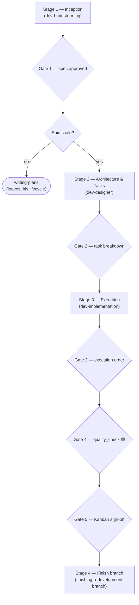
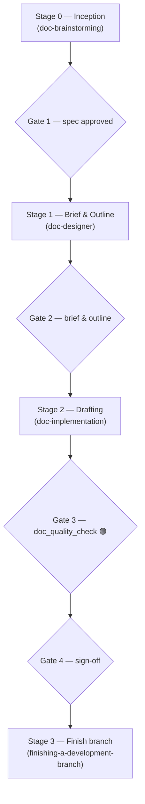
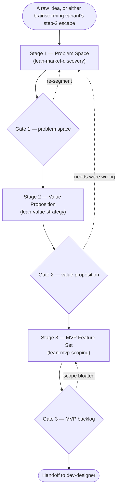
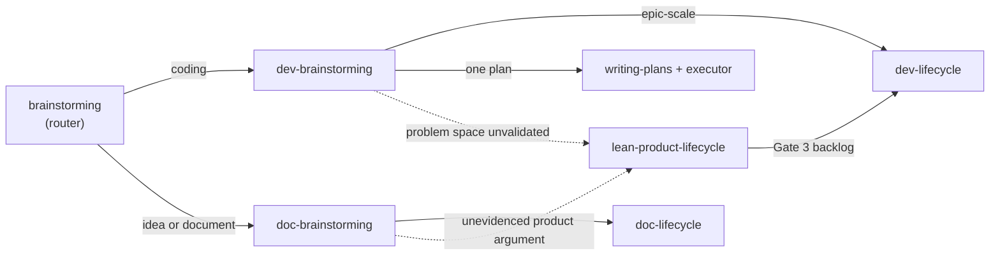

# The three lifecycles

Reference for what each lifecycle in this kit is for, what it produces, and how it runs.

This page **describes**.
To decide which one a specific piece of work belongs to, see [choosing-a-lifecycle.en.md](choosing-a-lifecycle.en.md).

## Contents

1. [At a glance](#at-a-glance)
2. [dev-lifecycle](#dev-lifecycle)
3. [doc-lifecycle](#doc-lifecycle)
4. [lean-product-lifecycle](#lean-product-lifecycle)
5. [What is not a lifecycle](#what-is-not-a-lifecycle)
6. [How they connect](#how-they-connect)

## At a glance

Each lifecycle is defined by what exists when it ends.

| | `dev-lifecycle` | `doc-lifecycle` | `lean-product-lifecycle` |
|---|---|---|---|
| **Purpose** | Build code that ships | Produce a document someone reads | Decide what to build, and for whom |
| **Produces** | A merged branch | A published document | A validated MVP backlog |
| **Gates** | 5 | 3 | 3 |
| **Gate approvers** | 4 human, 1 machine | 2 human, 1 machine | 3 human |
| **Artefacts live in** | `.devtool/epic/<slug>/` | `.devtool/epic/<slug>/`, deliverable in `docs/` | `.devtool/product/<slug>/` |
| **Verified by** | `quality_check` | `doc_quality_check` | human judgement only |

The two quality gates share no tier, no audit and no tooling, and neither invokes the other.

## dev-lifecycle

**Purpose.** Orchestrate epic-scale code work from an idea to a merged branch.
It owns sequence and gates only; each stage's method lives in that stage's own skill.

**What it produces.** A merged branch, plus a High-Level Design in English and Vietnamese,
a Gherkin BDD suite, and one task file per unit of work
— all archived into `.devtool/epic/<slug>/` when the epic closes.

**When it does not apply.** A single component that one implementation plan covers.
That work uses `dev-brainstorming` then `writing-plans`, which leaves this lifecycle and its remaining gates behind.

Gate 4 is the only machine verdict in this kit's development path.
It grants 🟢 on a complete run of the 3-tier suite, the four semantic audits,
the reverse-coverage thresholds and the pre-merge impact diff — never on a partial re-run.

## doc-lifecycle

**Purpose.** Orchestrate work whose deliverable is a document rather than code
— a runbook, a handbook, an onboarding guide, a set of reference pages.

**What it produces.** The finished document, in the place it belongs: `docs/`, a README, a skill's `references/`.
Its working artefacts — the brief, the outline, one task per section — stay in `.devtool/epic/<slug>/`.
A deliverable left inside `.devtool/` has not shipped.

**Why four gates and not five.** Code and prose differ in four ways that change what verification can mean:
the unit of work is a section rather than an independently testable deliverable;
verification is mechanical checks plus human judgement rather than a machine running tests;
the governing constraint is the **audience** rather than the architecture;
and the cost of being wrong is low.
Because the cost of being wrong is low, the gate count stays below the development side's five.

The first of the four is inception, and it is **not optional**.
It was once, and its skip condition asked whether the content was already known
— a question an agent answers yes to essentially always.
What makes a mandatory stage affordable is that its *depth* scales while its *existence* does not:
a runbook still passes through Stage 0, and its spec is three sentences.
A runbook that costs five approvals does not get written through the lifecycle
— it gets written around it.

**When it does not apply.** A typo, a broken link, a single Architecture Decision Record,
or any change a reviewer would not meaningfully gate.

Stage 0 is mandatory — its depth scales, its existence does not.
Stage 1 establishes the audience, classifies the document into exactly one Diátaxis type,
and turns the outline into one task per section.

## lean-product-lifecycle

**Purpose.** Decide what to build and for whom, before any engineering begins.
It implements Dan Olsen's Lean Product Process and enforces problem-space discipline:
needs are described as needs, not as the features someone already has in mind.

**What it produces.** Three signed-off specifications in `.devtool/product/<slug>/` — `01_problem_space_spec.md`, `02_value_proposition_spec.md`, `03_mvp_feature_backlog.md`.
The backlog is what engineering receives.

**What it does not cover.** Steps 5 and 6 of Olsen's process
— building an MVP prototype and testing it with customers — are not implemented in this release.
The orchestrator says so at Gate 3 rather than implying the journey is complete.

The dotted edges are the Tectonic Plates protocol: when a gate fails,
the failing hypothesis is located on the five-layer Product-Market Fit Pyramid and re-validated from there upward,
rather than patched at the layer the work is standing on.

## What is not a lifecycle

Five things route work without being lifecycles themselves.

| | What it is | Gates |
|---|---|---|
| `brainstorming` | The router. Asks whether the work is idea development, a document, or coding, then invokes the matching variant. Holds no process of its own | None — it routes and is finished |
| `dev-brainstorming` | Turns an idea for code work into an approved design spec. Exits to `dev-designer`, `writing-plans` or `lean-product-lifecycle` | A design approval and a spec review, both human |
| `doc-brainstorming` | Turns an idea or a document request into an approved content spec. Exits to `doc-designer`, `decision-records` or `lean-product-lifecycle` | A design approval and a spec review, both human |
| `writing-plans` + an executor | The small-code path. `writing-plans` produces the plan; `subagent-driven-development` or `executing-plans` carries it out | None of its own |
| `decision-records` | A single Architecture Decision Record or spike report, written and committed directly | None |

## How they connect

Two rules hold across every connection.
**The deliverable decides, not the amount of writing involved**
— if the work changes a file that ships in the build, it is development work.
And **two specs are never merged into one epic**:
each keeps its own spec → design → implementation lineage.
