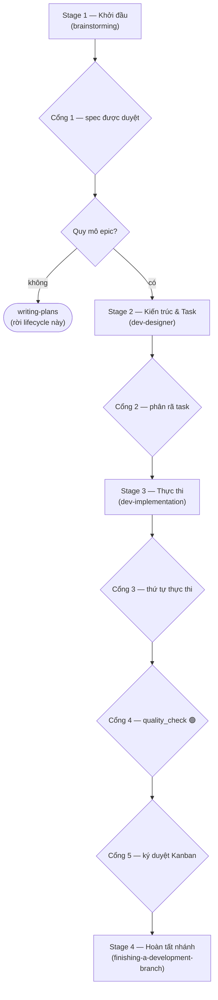
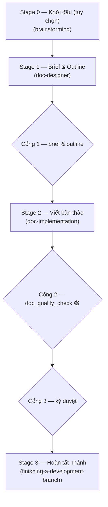
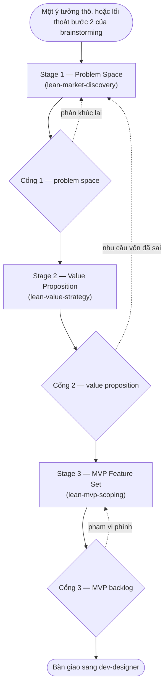
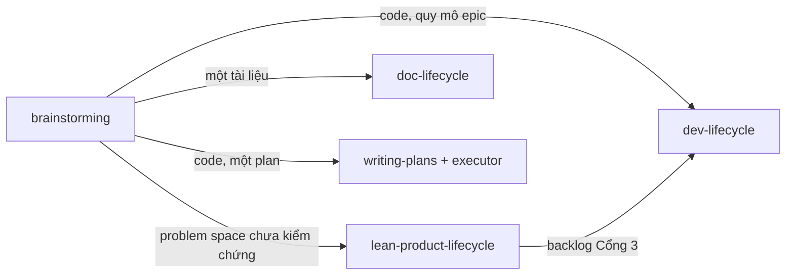

# Ba lifecycle

> Bản dịch của [lifecycles.en.md](lifecycles.en.md). Bản tiếng Anh là nguồn sự thật cho tooling và
> agent; bản này phục vụ trao đổi trong nhóm và phải luôn đồng bộ về cấu trúc lẫn sự kiện.

Tài liệu tra cứu về việc mỗi lifecycle trong kit này dùng để làm gì, cho ra cái gì, và chạy ra sao.

Trang này **mô tả**. Muốn quyết định một việc cụ thể thuộc lifecycle nào,
xem [choosing-a-lifecycle.vi.md](choosing-a-lifecycle.vi.md).

## Mục lục

1. [Tổng quan](#tổng-quan)
2. [dev-lifecycle](#dev-lifecycle)
3. [doc-lifecycle](#doc-lifecycle)
4. [lean-product-lifecycle](#lean-product-lifecycle)
5. [Những thứ không phải lifecycle](#những-thứ-không-phải-lifecycle)
6. [Chúng nối với nhau thế nào](#chúng-nối-với-nhau-thế-nào)

## Tổng quan

Mỗi lifecycle được định nghĩa bằng **thứ tồn tại khi nó kết thúc**.

| | `dev-lifecycle` | `doc-lifecycle` | `lean-product-lifecycle` |
|---|---|---|---|
| **Mục đích** | Xây code đi vào build | Tạo ra tài liệu có người đọc | Quyết định nên xây gì, cho ai |
| **Cho ra** | Một nhánh đã merge | Một tài liệu đã xuất bản | Một MVP backlog đã kiểm chứng |
| **Số cổng** | 5 | 3 | 3 |
| **Ai duyệt cổng** | 4 người, 1 máy | 2 người, 1 máy | 3 người |
| **Artefact nằm ở** | `.devtool/epic/<slug>/` | `.devtool/epic/<slug>/`, thành phẩm ở `docs/` | `.devtool/product/<slug>/` |
| **Xác minh bởi** | `quality_check` | `doc_quality_check` | chỉ bằng phán đoán người |

Hai cổng chất lượng **không chia sẻ tier, audit hay tooling nào**, và không cái nào gọi cái kia.

## dev-lifecycle

**Mục đích.** Điều phối công việc code quy mô epic, từ ý tưởng tới nhánh đã merge. Nó chỉ sở hữu
trình tự và các cổng; cách làm của từng stage nằm trong skill của stage đó.

**Cho ra cái gì.** Một nhánh đã merge, cộng với một High-Level Design bằng tiếng Anh và tiếng Việt,
một bộ BDD viết bằng Gherkin, và mỗi đơn vị công việc một file task — tất cả được archive vào
`.devtool/epic/<slug>/` khi epic đóng.

**Khi nào không áp dụng.** Một thành phần đơn lẻ mà một implementation plan là đủ.
Việc đó dùng `brainstorming` rồi `writing-plans`, tức là rời khỏi lifecycle này cùng các cổng
còn lại của nó.

Cổng 4 là cổng máy duy nhất trên nhánh phát triển của kit này. Nó cấp 🟢 dựa trên
**một lần chạy đầy đủ** bộ 3-tier, bốn semantic audit, các ngưỡng reverse-coverage và bản diff tác
động trước merge — không bao giờ dựa trên một lần chạy lại từng phần.

## doc-lifecycle

**Mục đích.** Điều phối công việc mà sản phẩm cuối là **tài liệu**, không phải code — runbook,
sổ tay, hướng dẫn onboarding, một bộ trang tra cứu.

**Cho ra cái gì.** Tài liệu hoàn chỉnh, đặt đúng nơi nó thuộc về: `docs/`, một README,
thư mục `references/` của một skill. Các artefact quá trình — brief, outline, mỗi section một task —
ở lại `.devtool/epic/<slug>/`. **Một thành phẩm còn nằm trong `.devtool/` là chưa ship.**

**Vì sao ba cổng chứ không phải năm.** Code và văn bản khác nhau ở bốn chỗ làm đổi ý nghĩa của
việc xác minh: đơn vị công việc là một section chứ không phải một deliverable test được độc lập;
xác minh là kiểm tra cơ học cộng phán đoán người chứ không phải máy chạy test; ràng buộc chi phối là
**độc giả** chứ không phải kiến trúc; và chi phí sai là thấp. Vì chi phí sai thấp nên số cổng thấp.
Một runbook mà tốn năm lần phê duyệt thì sẽ không được viết *qua* lifecycle — nó sẽ được
viết *vòng qua* lifecycle.

**Khi nào không áp dụng.** Một lỗi chính tả, một link hỏng, một ADR lẻ, hay bất kỳ thay đổi nào
không người review nào buồn gate.

Stage 0 được bỏ qua bất cứ khi nào nội dung đã rõ và chỉ còn hình hài là mở. Stage 1 xác lập độc
giả, phân loại tài liệu vào **đúng một** mode Diátaxis, và biến outline thành mỗi section một task.

## lean-product-lifecycle

**Mục đích.** Quyết định nên xây gì và cho ai, **trước khi** bắt đầu bất kỳ việc kỹ thuật nào.
Nó hiện thực hóa Lean Product Process của Dan Olsen và thi hành kỷ luật problem-space:
nhu cầu phải được mô tả như nhu cầu, không phải như tính năng mà ai đó đã nghĩ sẵn trong đầu.

**Cho ra cái gì.** Ba đặc tả đã được ký duyệt trong `.devtool/product/<slug>/` —
`01_problem_space_spec.md`, `02_value_proposition_spec.md`, `03_mvp_feature_backlog.md`.
Backlog là thứ mà bên kỹ thuật nhận được.

**Nó không phủ cái gì.** Bước 5 và 6 trong quy trình của Olsen — dựng prototype MVP và đem thử với
khách hàng — **chưa được hiện thực** trong bản này. Bộ điều phối nói thẳng điều đó ở Cổng 3 thay vì
để người dùng tưởng hành trình đã trọn vẹn.

Các cạnh nét đứt là giao thức Tectonic Plates: khi một cổng fail,
ta **định vị giả thuyết hỏng** trên kim tự tháp Product-Market Fit năm tầng rồi kiểm chứng lại từ đó
đi lên, thay vì vá ngay tại tầng mình đang đứng.

## Những thứ không phải lifecycle

Ba thứ định tuyến công việc mà bản thân không phải lifecycle.

| | Là cái gì | Cổng |
|---|---|---|
| `brainstorming` | Cửa chung. Biến một ý tưởng thành spec được duyệt và chọn spec đó vào lifecycle nào. Có bốn lối ra: `dev-designer`, `writing-plans`, `doc-designer`, `lean-product-lifecycle` | Một lần duyệt thiết kế và một lần soát spec, đều là người |
| `writing-plans` + một executor | Đường code nhỏ. `writing-plans` sinh ra plan; `subagent-driven-development` hoặc `executing-plans` thực thi nó | Không có cổng riêng |
| `decision-records` | Một ADR hoặc một spike report lẻ, viết rồi commit thẳng | Không |

## Chúng nối với nhau thế nào

Hai luật đúng cho mọi kết nối. **Sản phẩm cuối quyết định, không phải lượng chữ phải viết** —
chỉ cần việc đó đổi một file đi vào build thì đó là việc phát triển.
Và **không bao giờ gộp hai spec vào một epic**: mỗi spec giữ dòng đời spec → thiết kế → thi công của
riêng nó.
