# Dual-Workspace Kanban Synchronization and Pre-Edit Impact Analysis

- **Date**: 2026-09-15
- **Status**: Proposed (Gate 1 In Progress)
- **Affects**:
  - `skills/epic-lifecycle/SKILL.md`
  - `skills/epic-designer/SKILL.md`
  - `skills/epic-implementation/SKILL.md`
  - `skills/impact-analysis/SKILL.md` (New Skill)
  - `skills/impact-analysis/references/impact-mechanisms.md` (New Reference Document)
  - `skills/epic-implementation/resources/scripts/sync_task_status.py`
  - `skills/epic-implementation/resources/scripts/check_code_impact.py` (New Script)

---

## 1. Background

In epic-scale software development across **Flutter**, **Android Native**, and **iOS Native** monorepos:
1. **Stale Kanban Boards Across Worktrees**:
   `epic-implementation` drives tasks inside an isolated git worktree (`.worktrees/<epic_dir>`), but tasks exist in four copies: `.devtool/features/` and `.devtool/epic/<epic_dir>/`, both in the main checkout and in the worktree. Writing status to only one copy leaves the other workspace (where the developer has their IDE and Kanban board open) frozen at `todo`. Additionally, `modified` timestamps are rarely maintained, and `completedAt` timestamps are missing or hand-edited.
2. **Blind Source Code Modifications (Impacts & Conflicts)**:
   When modifying existing code during an epic, developers or AI agents risk:
   - **Git Divergence & Merge Conflicts**: Edits made against outdated base refs when `<base_ref>` (e.g. `develop`) has moved ahead, or colliding with edits from another active worktree.
   - **Blast Radius & Downstream Breakages**: Changing a class, function, or DTO without identifying all callers across modules or checking public ABI contracts.
   - **Cross-Platform Bridge Mismatch**: In Flutter apps communicating with Android (Kotlin) or iOS (Swift) via `MethodChannel` or `EventChannel`, changing channel or method names in Dart causes silent runtime crashes (`MissingPluginException`) because standard compilers inspect only their own language.
   - **Unprotected Code & Missing Logic Cases**: Editing code that has 0% or low test coverage without a safety net, or introducing new logic without addressing boundary values, error branches, and race conditions.

---

## 2. Goals

1. **Dual-Workspace Live Kanban Synchronization**:
   - Every task status transition (`backlog`, `todo`, `in-progress`, `review`, `done`) is mirrored simultaneously to all four copies across all active checkouts discovered via `git worktree list --porcelain`.
   - The `modified` timestamp is updated automatically on every transition with ISO-8601 UTC Zulu format (`YYYY-MM-DDTHH:MM:SSZ`), and `completedAt` is recorded when reaching `done`.
   - The Epic Overview (`<epic_dir>.en.md` and `.vi.md`) Meta Data `Status` field updates at epic boundaries (`In Progress` at first task start, `Done` at Phase 4 completion).
   - The main checkout's mirrored copies are restored to clean git status before branch merge.
2. **Dedicated `impact-analysis` Skill & Pre-Edit Impact Checker**:
   - A standalone, reusable skill `skills/impact-analysis/SKILL.md` and automated CLI script `check_code_impact.py`.
   - Accompanied by a detailed reference document `skills/impact-analysis/references/impact-mechanisms.md` explaining the "What, Why, Benefit, and Failure Modes" of each check.
   - **Layer 1 (Git & Workspace Conflicts)**: Detects branch divergence against `<base_ref>` and overlapping edits across active worktrees.
   - **Layer 2 (Architecture & Blast Radius)**: Maps module dependency graphs and scans symbol references/callers across packages using fast text search (`ripgrep`), warning of public ABI/contract changes.
   - **Layer 3 (Cross-Platform Bridge)**: In Flutter projects, performs cross-boundary string scanning across `lib/` and `android/` / `ios/` to link `MethodChannel` and `EventChannel` callers with native handlers.
   - **Layer 4 (Test Impact Analysis & Missing Logic Detection)**: Maps modified files to associated unit/integration tests, runs test baselines, flags unprotected code (low/zero coverage), and detects untested error/edge branches.
3. **Seamless Workflow Integration**:
   - **`epic-designer`**: Adds an explicit `### Impact Analysis & Blast Radius` section to every generated `task_*.md` and an overview in the HLD.
   - **`epic-implementation`**: Embeds **Step 0 in Phase 2: Pre-Edit Impact & Conflict Check** (calling `@impact-analysis`) before writing code, and executes live status flips via `sync_task_status.py`.
   - **`epic-lifecycle`**: Updates Gate 2 (HLD & Task Breakdown mandates blast radius assessment) and Gate 3 (Execution Plan verifies conflict-free base ref).

---

## 3. Non-Goals

- Replacing the compiler or test suite: `check_code_impact.py` provides pre-flight static guidance; the compiler, linters, and Tier C integration tests remain the final dynamic enforcers.
- Expanding the Kanban status enum: Strictly five columns (`backlog`, `todo`, `in-progress`, `review`, `done`).
- Merging multiple specs into one epic: Each sub-project retains its independent lifecycle.

---

## 4. Architecture Overview

```mermaid
flowchart TD
    subgraph STAGE2["Stage 2: epic-designer"]
        S2_HLD["Create HLD with Impact Overview"]
        S2_TASKS["Generate Tasks with '### Impact Analysis & Blast Radius'"]
        S2_HLD --> S2_TASKS
    end

    subgraph STAGE3["Stage 3: epic-implementation"]
        P1["Phase 1: Base-ref Resolution & Gate 3 Checkpoint"]
        P2_START["Phase 2: Task Pick-up"]
        SYNC_INP["sync_task_status.py task <id> in-progress<br/>(Mirrors all 4 copies in all checkouts)"]
        
        subgraph IMPACT_SKILL["@impact-analysis (check_code_impact.py)"]
            CHK_GIT["1. Git Divergence & Worktree Conflict Check"]
            CHK_BLAST["2. Blast Radius & Caller Scan (ripgrep)"]
            CHK_BRIDGE["3. Cross-Platform Bridge Scan (MethodChannel)"]
            CHK_TEST["4. Test Impact Analysis (TIA) & Coverage Check"]
            REPORT["Unified Impact Report"]
            CHK_GIT --> CHK_BLAST --> CHK_BRIDGE --> CHK_TEST --> REPORT
        end

        TDD["Tri-Persona TDD Implementation (Red-Green-Refactor)"]
        SYNC_REV["sync_task_status.py task <id> review"]
        SYNC_DONE["sync_task_status.py task <id> done"]
        P4_RESTORE["Phase 4: git restore main checkout & merge"]

        P1 --> P2_START --> SYNC_INP
        SYNC_INP --> CHK_GIT
        REPORT -->|🟢 Clean / Acknowledged| TDD
        REPORT -->|🔴 Conflict Detected| HALT["Halt & Prompt for Resolution"]
        TDD --> SYNC_REV --> SYNC_DONE
        SYNC_DONE --> P4_RESTORE
    end

    STAGE2 --> STAGE3
```



---

## 5. Detailed Component Specifications

### 5.1 Component A: `skills/impact-analysis/SKILL.md` (New Skill)

* **Location**: `skills/impact-analysis/SKILL.md`
* **Reference Guide**: `skills/impact-analysis/references/impact-mechanisms.md`
* **Purpose**: Analyzes source code impacts, blast radius, test coverage, and git conflicts before modifying any file.
* **CLI Tool**: `skills/epic-implementation/resources/scripts/check_code_impact.py`
* **Invocation**:
  ```bash
  python3 skills/epic-implementation/resources/scripts/check_code_impact.py --files <path1> <path2> --base-ref <base_ref> [--symbols <sym1> <sym2>]
  ```

#### The 4-Layer Check Pipeline

```mermaid
flowchart LR
    subgraph L1["Layer 1: Git Conflicts"]
        G_LOG["git log base_ref...HEAD -- files"]
        G_DIFF["git diff base_ref...HEAD -- files"]
        G_WT["Active worktrees uncommitted edit scan"]
    end

    subgraph L2["Layer 2: Blast Radius"]
        MOD_GRAPH["Module Dependency Mapping"]
        RG_SCAN["Symbol Callers Scan (ripgrep)"]
        ABI_CHK["Public API / Contract Boundary Check"]
    end

    subgraph L3["Layer 3: Cross-Bridge"]
        DART_SCAN["Dart MethodChannel Extraction"]
        NATIVE_SCAN["Native Kotlin/Swift Handler Matching"]
    end

    subgraph L4["Layer 4: Test & Coverage (TIA)"]
        TEST_MAP["Map Source -> Test Files"]
        COV_CHK["Coverage Blind-spot Detection"]
        EDGE_CHK["Missing Logic / Edge Case Analysis"]
    end

    L1 --> L2 --> L3 --> L4
```



1. **Layer 1: Git & Workspace Conflict Detection**:
   - Compares target files against `<base_ref>` using `git merge-base` and `git log <base_ref>...HEAD -- <files>`. If upstream `<base_ref>` contains commits touching these files that are not in the current branch, a divergence warning is generated.
   - Scans active worktrees from `git worktree list --porcelain` to ensure no other branch has unstaged or conflicting changes on the same files.
2. **Layer 2: Architecture & Blast Radius Analysis**:
   - Detects platform type via `detect_project_type.sh`.
   - For modified symbols/classes, executes fast regex search (`ripgrep`) to identify all importing files and callers.
   - Evaluates module boundaries:
     - *Flutter*: Verifies whether caller is within the same package or across `packages/` / `features/`.
     - *Android*: Verifies whether caller is in the same Gradle module or across `:features:*` / `:core:*`.
     - *iOS*: Verifies whether caller is within the same SPM package or across `Packages/` / `Features/`.
3. **Layer 3: Cross-Platform Bridge Scanning**:
   - If project is `flutter` and any target file is in `android/`, `ios/`, or contains `MethodChannel` / `EventChannel`:
   - Extracts channel identifiers (e.g. `"com.example/channel"`) and invoked method names (e.g. `"authenticate"`).
   - Searches across `lib/**/*.dart`, `android/**/*.kt`, `android/**/*.java`, and `ios/**/*.swift`.
   - Flags all coupled native and Dart counterparts to ensure contract synchronization.
4. **Layer 4: Test Impact Analysis (TIA) & Missing Logic Detection**:
   - Maps target source files to their test files (`*Test.kt`, `*_test.dart`, `*Tests.swift`).
   - Runs affected test files to establish a green baseline before modifications.
   - Checks coverage status: flags files/functions with 0% or low test coverage as `UNPROTECTED CODE`.
   - Analyzes missing edge cases against the 5 BDD dimensions (Null/Empty, State Transitions, Failures/Timeouts, Race Conditions).

#### Output Report Format
Prints a structured markdown report:
```text
## 🔍 Impact Analysis Report
- Target Files: :features:payment/PaymentRepository.kt
- Base Ref: develop
- Git Conflict: 🟢 CLEAN (No upstream divergence)
- Owning Module: :features:payment
- Downstream Callers: 2 files
  * features/payment/PaymentViewModel.kt:32
  * features/payment/PaymentUseCase.kt:18
- Public Contract / ABI Risk: 🟢 NONE (Internal class)
- Cross-Platform Bridge: 🟢 NONE
- Test Impact (TIA): 2 Associated Test Files
  * features/payment/PaymentRepositoryTest.kt (12 tests - PASSING)
  * features/payment/PaymentViewModelTest.kt (8 tests - PASSING)
- Coverage Safety Net: 🟢 85% Covered
- Missing Logic Alert: ⚠️ Function processPayment() has an unhandled timeout branch in existing tests.
- Verdict: PROCEED WITH CAUTION (Add timeout test case first)
```

---

### 5.2 Component B: `skills/impact-analysis/references/impact-mechanisms.md` (New Reference Document)

A comprehensive guide explaining the rationale, mechanics, and failure modes of each check:

| Check Layer | What is Checked? (Check gì?) | Why? (Tại sao?) | What is the Benefit? (Tác dụng gì?) | Failure Mode if Omitted |
|---|---|---|---|---|
| **1. Git & Workspace Conflicts** | Diffs against `<base_ref>` and dirty files across worktrees | Avoid coding on stale base or clobbering concurrent work | Guarantees zero merge conflicts at Phase 4 finish | Painful git merge conflicts requiring manual resolution |
| **2. Blast Radius & Callers** | All files/modules that import or call modified symbols | Code changes ripple outward to unsuspecting consumers | Accurately scopes edits and prevents breaking public contracts | Silent compile errors or runtime crashes in other modules |
| **3. Cross-Platform Bridge** | MethodChannel names and method calls across Dart & Native | Compilers inspect only their own language; bridges are string-coupled | Prevents cross-language desynchronization | `MissingPluginException` or crashes on physical devices |
| **4. Test Impact & Coverage (TIA)** | Associated test files, current coverage, missing edge branches | Untested code cannot be safely refactored or modified | Provides immediate regression feedback and reveals logic blind spots | Regressions shipped to production; edge case crashes |

---

### 5.3 Component C: `sync_task_status.py` (Dual-Workspace Sync)

* **Location**: `skills/epic-implementation/resources/scripts/sync_task_status.py`
* **Test Suite**: `skills/epic-implementation/resources/scripts/test_sync_task_status.py`
* **CLI Commands**:
  ```bash
  sync_task_status.py task <task_id> <status>
  sync_task_status.py epic <epic_dir> <status>
  ```
* **Status Enum**: Exactly `backlog | todo | in-progress | review | done` (exit code `2` on invalid status).
* **Timestamps**:
  - `modified`: Always updated on every transition to `datetime.now(timezone.utc).isoformat(timespec="seconds")` with `Z` suffix.
  - `completedAt`: Set to current ISO timestamp when `<status>` is `done`; left untouched otherwise.
* **Target Resolution**:
  - Discovers all checkout roots via `git worktree list --porcelain`.
  - In each checkout `R`, targets `R/.devtool/features/<task_id>.md` and `R/.devtool/epic/<epic_dir>/<task_id>.md`.
  - Epic-collision guard: Derives authoritative `epic:` from `features/<task_id>.md` and refuses to modify any file whose `epic:` frontmatter disagrees.
* **Epic Overview Sync**:
  - Rewrites the `Status` field in `R/.devtool/epic/<epic_dir>/<epic_dir>.en.md` and `.vi.md` simultaneously.

---

### 5.4 Component D: Skill Integrations

#### 1. `skills/epic-designer/SKILL.md`
- **Step 1 (HLD)**: Mandates an **Impact Analysis & Blast Radius Overview** subsection in the Epic Overview document.
- **Step 2 (Task Breakdown)**: In the task file template, adds:
  ```markdown
  ### Impact Analysis & Blast Radius
  - **Modified Files**: List of exact files to touch.
  - **Dependent Modules & Callers**: Expected blast radius.
  - **Public Contracts & ABI**: Interfaces, DTOs, or routes affected.
  - **Cross-Platform Bridge**: MethodChannel names if applicable.
  - **Associated Tests & Coverage**: Unit test files and coverage status.
  ```

#### 2. `skills/epic-implementation/SKILL.md`
- **Phase 1 (Execution Plan)**: Resolves `<base_ref>` dynamically (validating that the ref carries the HLD and all task files) rather than hardcoding `develop`.
- **Phase 2 (Sequential Task Execution)**:
  - Before dispatching implementer:
    1. Runs `sync_task_status.py task <task_id> in-progress` (and `sync_task_status.py epic <epic_dir> "In Progress"` on first task).
    2. Runs `check_code_impact.py` on the task's target files. If a Git conflict, untested blind spot, or unexpected blast radius is found, halts and surfaces to user.
  - When implementer reports `DONE`: runs `sync_task_status.py task <task_id> review`.
  - When reviews pass: runs `sync_task_status.py task <task_id> done`.
  - Exactly one commit per task committing worktree copies.
- **Phase 4 (Close-out)**:
  1. Runs `sync_task_status.py epic <epic_dir> "Done"`.
  2. Restores main checkout's mirrored copies via `git -C "$MAIN_ROOT" restore -- .devtool/features/ .devtool/epic/<epic_dir>/`.
  3. Verifies `git status --porcelain` is clean in main checkout.
  4. Finishes epic branch against `<base_ref>`.

#### 3. `skills/epic-lifecycle/SKILL.md`
- **Gate 2 (HLD & Task Breakdown)**: Explicitly checks that every task includes an Impact Analysis & Blast Radius assessment with test mapping.
- **Gate 3 (Execution Plan)**: Confirms execution order, `<base_ref>`, and verified absence of upstream Git merge conflicts.
- **Stage 3 Invariant**: Mandates pre-edit impact checks, TIA verification, and live dual-workspace status sync.

---

## 6. Verification & Test Plan

1. **Automated Unit Tests**:
   - `test_sync_task_status.py`: 47 test cases covering frontmatter parsing, key insertion, timestamp generation, worktree fan-out, collision guard, and CLI exit codes.
   - `test_check_code_impact.py`: Unit tests covering Git divergence checking, symbol caller search, module boundary validation, cross-platform MethodChannel extraction, and test file mapping using mock temporary directory structures.
2. **Skill Verification**:
   - Run `bash scripts/verify.sh` to ensure all frontmatters (`name`, `description`), cross-skill links, and in-page anchors across `skills/**/*.md` pass cleanly.

---

## 7. Spec Self-Review

- **Placeholder Scan**: Zero "TBD", "TODO", or missing sections.
- **Consistency**: The five-column status enum, timestamp ISO format, and 4 check layers match across all tools and skills.
- **Scope**: Covers dual-workspace Kanban synchronization, timestamp tracking, dedicated `impact-analysis` skill, and detailed reference documentation.
