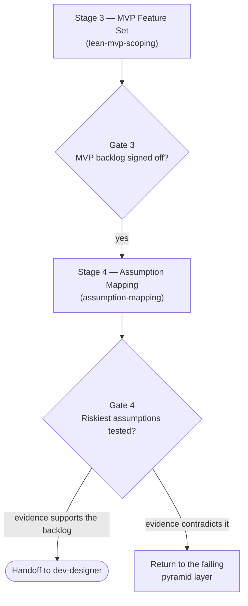

# Assumption Mapping — Design Specification

> **Topic**: Closing the Lean Product Process at steps 5-6 — testing ideas before building them
> **Date**: 2026-09-17
> **Status**: Approved Design Spec
> **Scope**: One new skill, `assumption-mapping`, extending the upstream discovery suite

---

## 1. Problem

The README states the gap plainly:

> **Steps 5 (create your MVP prototype) and 6 (test your MVP with customers) are not implemented.**

So `lean-product-lifecycle` currently ends at Gate 3 and hands `03_mvp_feature_backlog.md` straight
to engineering. That backlog is a **stack of untested hypotheses presented as a plan**. Every layer
of the Product-Market Fit Pyramid beneath it — target customer, underserved needs, value proposition
— was reasoned about carefully and validated by nobody.

The orchestrator is honest about this at Gate 3, telling the founder what they still owe themselves:
a low-fidelity prototype and waves of five to eight target customers. But honesty about a gap is not
a way through it. The founder is told to go test, handed no method, and the path of least resistance
runs directly into engineering.

This is the Build Trap arriving one step later than usual, with better paperwork.

### 1.1 Why this is a separate spec

`assumption-mapping` belongs to the **upstream discovery suite**, not to the document lifecycle. It
extends `lean-product-lifecycle`, writes into `.devtool/product/<slug>/`, and draws on a different
methodology and a different author. It ships independently and delivers value with or without
[the document lifecycle suite](2026-09-17-document-lifecycle-suite-design.md).

---

## 2. Goals and non-goals

**Goals**

1. Turn an MVP backlog into a ranked list of the assumptions holding it up.
2. Identify the assumption that is most important and least evidenced, and design the cheapest
   experiment capable of killing it.
3. Force the success threshold to be committed **before** the experiment runs.
4. Keep a durable record of what was tested, what was learned, and what changed as a result.

**Non-goals**

1. Running the experiments. The skill designs and records them; a human talks to customers.
2. Building prototypes. Step 5 of the Lean Product Process remains partly uncovered, and the skill
   must say so rather than implying completeness.
3. Replacing Gate 3. This adds a stage after it; it does not relitigate the backlog.

---

## 3. Design

### 3.1 Where it sits



Gate 4 is a **human approval**, consistent with the other three gates in the suite.

`lean-product-lifecycle` needs three edits: the sequence diagram gains Stage 4, the gates table
gains Gate 4, and the *Handoff to engineering* section stops being the terminus.

### 3.2 The method — grounded in Bland & Osterwalder

**Step 1 — Extract the assumptions.** Read `03_mvp_feature_backlog.md` and the two specs beneath it
and surface what must be true for the plan to work, in three families:

| Family | The question it asks |
|---|---|
| **Desirability** | Do they want it? |
| **Viability** | Can we make money from it? |
| **Feasibility** | Can we build and run it? |

Agents reliably over-produce feasibility assumptions, because feasibility is the family visible from
inside a codebase. The skill must push back toward desirability, which is where ideas actually die.

**Step 2 — Map on two axes.** Importance (does the idea collapse if this is false?) against evidence
(how much do we actually have, today, beyond opinion?).

```
              high importance
                    │
   TEST FIRST       │      already known
   (little          │      (strong evidence)
    evidence)       │
  ──────────────────┼──────────────────  evidence →
   ignore for now   │      noise
                    │
              low importance
```

Only the **high-importance, low-evidence** quadrant earns an experiment. The discipline is in what
gets left alone: a map on which everything is critical has ranked nothing.

**Step 3 — Design the cheapest falsifying test.** Two rules:

- **Cheapest first.** A conversation beats a landing page beats a prototype beats a build. Spending
  a sprint to learn what an afternoon of interviews would have told you is the failure this whole
  process exists to prevent.
- **It must be able to fail.** An experiment with no outcome that would change the plan is theatre.
  If no result would alter the backlog, do not run it — and say why out loud.

**Step 4 — Pre-commit the threshold.** Write the pass/fail number *before* running the experiment:
"at least 6 of 10 interviewees raise this unprompted". Without a pre-committed threshold, any result
can be read as encouraging, and the experiment measures the founder's hope rather than the market.

**Step 5 — Record the learning and act on it.** Result, verdict against the threshold, and what
changes. A contradicted assumption routes back through the existing Tectonic Plates protocol in
`lean-product-lifecycle` — find the failing pyramid layer and re-validate from there upward, rather
than patching the layer you happen to be standing on.

### 3.3 Artefacts

Continuing the suite's existing numbering in `.devtool/product/<slug>/`:

| File | Holds |
|---|---|
| `04_assumption_map.md` | Every assumption, its family, its quadrant, and the ranked test queue |
| `05_experiment_log.md` | One entry per experiment: hypothesis, method, pre-committed threshold, result, verdict, what changed |

`05_experiment_log.md` is **append-only**. Entries are never edited after their result lands; a
superseded conclusion gets a new entry referencing the old one. An editable log of what you believed
is worthless precisely when it matters, because it will have been quietly updated to agree with
whatever happened.

---

## 4. Failure modes

| Failure | Mitigation |
|---|---|
| Threshold rationalized after the fact | Pre-commit it in `05_experiment_log.md` before running; the entry is written in two sittings, and the skill refuses to record a result into an entry with no threshold |
| Experiments that cannot fail | Every designed test states, in writing, which result would change the backlog. No such result, no experiment |
| Everything mapped as critical | The quadrant is a ranking, not a label; the skill names the top 3 and explicitly parks the rest |
| Feasibility assumptions crowd out desirability | The skill requires at least one desirability assumption in the top 3, or a written reason there is none |
| Becomes a stalling device | Cap: three assumptions per round. Stage 4 has a bottom, and the skill says where it is |

---

## 5. Verification

Subject to `evals/`, per README §3.7. The sharpest scenario: hand an agent a plausible MVP backlog
whose weakest point is a **desirability** assumption dressed as a feasibility question, and check
whether the skill causes the agent to name and test the desirability assumption instead. Grade blind
against the source, not against the skill.

---

## 6. Dependencies and risks

**Blocking dependency — primary source acquisition.**

The primary source is **David J. Bland & Alexander Osterwalder, *Testing Business Ideas* (Wiley,
2019)**, and it is a book: it cannot be fetched from the web the way diataxis.fr or Nygard's post
can. This repository holds a hard line that methodology skills are written from primary sources —
`verify.sh` step 7 and `.devtool/epic/lean_product_suite/source_fidelity_review.md` exist because
summary-derived skills carried six behaviour-changing errors into the Lean Product suite.

That line applies here, so implementation is **blocked** until one of the following is true:

1. The book is placed in `docs/books/`, as *The Lean Product Playbook* already is. Preferred, and
   consistent with how the suite was built.
2. The skill is grounded on the authors' own published material at strategyzer.com — author-written,
   therefore primary, but partial. If this route is taken it must be stated in the skill's
   source-fidelity note, naming what the partial grounding does not cover.

Do not begin writing skill text until this is resolved. The decision is the founder's, not the
agent's.

**Other risks**

| Risk | Mitigation |
|---|---|
| Founders experience Stage 4 as an obstacle before engineering | Frame it by cost: an afternoon of interviews against a sprint. Cap at three assumptions per round |
| Overlaps `lean-market-discovery`'s opportunity scoring | Different objects: discovery scores *needs*, this scores *the beliefs holding up a plan*. Say so explicitly in both skills to keep the boundary visible |
| Step 5 stays partly uncovered | Say so at Gate 4, exactly as the orchestrator already does at Gate 3. Do not imply the process is complete when it is not |

---

## 7. Out of scope

- The document lifecycle suite — separate spec, separate lineage.
- Automated experiment execution, survey tooling, or interview transcription.
- Prototype construction (step 5 proper).
