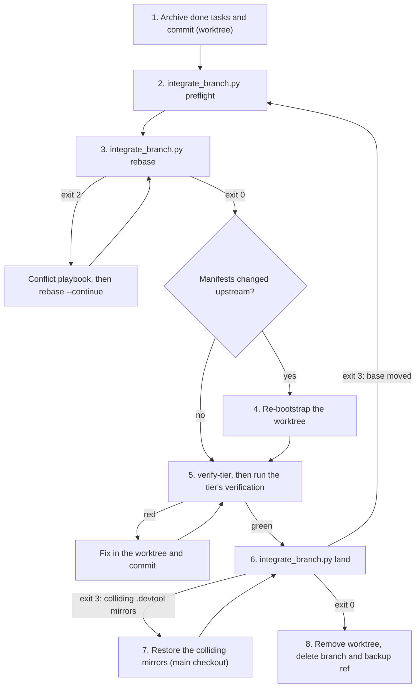

# Finishing Branch Rebase Integration Design

- **Date**: 2026-10-09
- **Status**: Draft, awaiting user review
- **Scope**: `finishing-a-development-branch`, `dev-implementation`, `dev-lifecycle`, a new shared
  integration script, `scripts/verify.sh`
- **Next step**: `writing-plans` (one implementation plan, no HLD)

## Table of Contents

- [1. Background](#1-background)
- [2. Goals and Non-Goals](#2-goals-and-non-goals)
- [3. Decisions](#3-decisions)
- [4. Invariants](#4-invariants)
- [5. Components](#5-components)
- [6. Integration Script](#6-integration-script)
- [7. Finishing Flow](#7-finishing-flow)
- [8. Per-Task Integration in dev-implementation](#8-per-task-integration-in-dev-implementation)
- [9. Lifecycle Changes](#9-lifecycle-changes)
- [10. Conflict Playbook](#10-conflict-playbook)
- [11. Error Handling](#11-error-handling)
- [12. Testing](#12-testing)
- [13. Risks and Dependencies](#13-risks-and-dependencies)
- [14. Out of Scope](#14-out-of-scope)

## 1. Background

Option 1 of [finishing-a-development-branch](../../../skills/finishing-a-development-branch/SKILL.md)
integrates by running `git checkout <base> && git pull && git merge <feature-branch>` in the main
checkout and testing afterwards. For a developer who works alone and merges epics into `develop`
locally, this carries the risk the request names: features and epics that landed on `develop` after
the branch point can break, and so can the epic being finished.

Concrete weaknesses, all present in the current text:

1. **Conflicts are resolved on `develop` itself**, in the main checkout, which lacks the bootstrapped
   build environment the epic worktree has (`.dart_tool`, Pods, Gradle state).
2. **Tests run only after the merge.** A red result leaves `develop` merged and broken. The skill
   calls this recoverable but never says how.
3. **Gate 4 judged a different tree.** `quality_check` granted 🟢 on the epic tree at its old base;
   the tree that lands on `develop` was never verified. The skill's own rationalization table says
   "A green run only proves the tree it ran on", and the flow contradicts it.
4. **Semantic conflicts go undetected.** An upstream change to a contract the epic calls produces no
   textual conflict. Only tests on the integrated tree catch it.
5. **Known ordering defect.** `dev-implementation` Phase 5 restores the main checkout *before* the
   archival hook runs, and the hook's mirrored writes re-dirty it, so the first merge attempt aborts.
6. **The archival hook cannot find its script under Claude Code.** It probes the repository-relative
   path and the Antigravity install path only. In a consumer project under Claude Code neither
   exists, `SYNC_SCRIPT` stays empty, and archival is skipped without a message.

## 2. Goals and Non-Goals

**Goals:**

- Resolve every conflict on the epic branch, inside its isolated worktree, never on `develop`.
- Verify the integrated tree, so that work landed on `develop` after the branch point and the epic
  under development are both proven to work together.
- Let `develop` receive only a tree that passed verification.
- Integrate continuously: rebase after every epic task, so the finish-time rebase is small or empty.
- Fix defects 5 and 6 above, since the new flow passes through both.

**Non-Goals:**

- Rebasing a branch that was already pushed. That needs a force-push, which
  [CRITICAL_RULES](../../../rules/CRITICAL_RULES.md) forbids without explicit permission.
- Making Step 1 of the finishing skill platform-aware.
- The subagent-dispatch problem in `dev-implementation`, deferred to its own spec.

## 3. Decisions

Each decision was taken with the user during brainstorming.

| ID | Decision | Rationale |
|----|----------|-----------|
| D1 | Rebase is the default integration method | Epic branches are never pushed before finishing, so rewriting their history is safe |
| D2 | Re-verification is tiered by what the rebase did | A clean rebase cannot change the epic's own code, so audits need not rerun; resolved conflicts are new code and must |
| D3 | Mechanical conflicts are resolved by the agent; semantic conflicts stop and ask the user | Asking on every import conflict is noise; resolving logic conflicts silently is how features break |
| D4 | History is semi-linear: rebase, then `merge --no-ff` | One merge commit marks each epic, `git revert -m 1` undoes a whole epic, and `git log --first-parent develop` lists epics |
| D5 | Rebase after every epic task, plus a final rebase at finish | Conflicts stay small and are resolved while the task's context is fresh; Gate 4 runs on the latest base |
| D6 | Git mechanics live in one shared script; judgement lives in prose | The rebase runs at N+1 points across two skills; one tested script keeps them identical |
| D7 | The base is resolved against its remote before every rebase and before landing | Rebasing onto a stale local `develop` would miss work that already exists on the remote |
| D8 | Per-task integration runs in the `dev-implementation` orchestrator, outside the subagent loop | `subagent-driven-development` forbids mid-run stops except for four named reasons; integration needs stop points of its own |

## 4. Invariants

The implementation must preserve all four. Each maps to a check in the script or a rule in prose.

1. **I1**: conflicts are resolved only in the branch's worktree, never on `develop`.
2. **I2**: `develop` only receives a `--no-ff` merge commit whose tree is identical to the tree of
   the verified SHA. The script checks this before and after merging.
3. **I3**: every rebase has a backup ref, and every step can be aborted.
4. **I4**: the verification tier is measured by the script from git evidence, not judged by the agent.

## 5. Components

| Component | Change |
|-----------|--------|
| `skills/finishing-a-development-branch/resources/scripts/integrate_branch.py` | **New.** Five commands: `sync-base`, `preflight`, `rebase`, `verify-tier`, `land` |
| `skills/finishing-a-development-branch/resources/scripts/test_integrate_branch.py` | **New.** `unittest` suite against temporary git repositories |
| `skills/finishing-a-development-branch/references/conflict-playbook.md` | **New.** Conflict classification, generated-file handling, the stop-and-ask template |
| `skills/finishing-a-development-branch/SKILL.md` | Update-onto-base step for Options 1 and 2; Option 1 lands through the script; reordered steps; script lookup through `SKILL_DIR`; new rationalizations; redrawn diagram |
| `skills/dev-implementation/SKILL.md` | `sync-base` before creating the worktree; Phase 2 step 0 rebases through the script; new Phase 2 step 7; Gate 3 authorization; Phase 5 loses its restore step |
| `skills/dev-lifecycle/SKILL.md` | Stage 3 wording, Gate 4 note on stale verdicts, one new red flag |
| `scripts/verify.sh` | Runs the new test suite |

`doc-lifecycle`, `executing-plans` and `subagent-driven-development` are not edited. They reach the
new behaviour through `finishing-a-development-branch` and get only the finish-time rebase.

## 6. Integration Script

`integrate_branch.py` is standard-library Python 3.10, matching the kit's other scripts. It always
operates on the current branch. Common flags: `--base <branch>` (default `develop`), `--no-fetch`,
and `--format markdown|json` (default `markdown`).

### 6.1 Resolve Base

Runs inside `sync-base`, `rebase` and `land`. `preflight` runs only its read half: it fetches and
reports, and never moves a local branch.

1. If the base branch has an upstream (for example `origin/develop`), run `git fetch <remote> <base>`.
   A failed fetch adds a warning and continues with the local base. `--no-fetch` skips this.
2. Compare the local base with its upstream:

| Relation | Action |
|----------|--------|
| No remote or no upstream configured | Use the local base |
| Equal, or local ahead (unpushed local merges) | Use the local base |
| Local strictly behind | Fast-forward with `git -C <base checkout> merge --ff-only <upstream>`; if git refuses because a dirty file would be overwritten, stop and ask |
| Diverged | Stop and ask; reconciling `develop` is a `develop`-level task, not part of the epic |

The script never rebases onto the remote-tracking ref directly. Doing so would put remote commits
on the second-parent side of the epic's merge commit and break the first-parent epic history from D4.

### 6.2 Commands

| Command | Writes | Behaviour |
|---------|--------|-----------|
| `sync-base` | Yes | Resolve Base, including the fast-forward. Phase 1 calls it before `git worktree add` |
| `preflight` | No | Report only (fields below) |
| `rebase` | Yes | Refuse on a detached HEAD, a dirty worktree, a rebase already in progress, or a branch that tracks a remote branch (already pushed; a local upstream does not count). Run `sync-base`. Force-update `backup/<branch>` to the current HEAD, every time. If the base is already an ancestor, stop with tier `noop`. Otherwise run `git -c rerere.enabled=true rebase <base>`. `--continue` and `--abort` wrap the matching git commands, with rerere enabled on `--continue` so resolutions are recorded |
| `verify-tier` | No | Measure the tier (6.3) and print the required verification for both contexts (finish and task boundary), the regression checklist, the overlap files and the candidate SHA |
| `land --verified <sha> --title "<title>"` | Yes | Run `sync-base`, check preconditions, merge with `--no-ff` in the checkout that has the base checked out (or write the same merge with plumbing when there is none), check postconditions |

`preflight`, `rebase`, `verify-tier` and `land` refuse to run on the base branch itself: from the
main checkout they would find nothing to integrate and report `noop` silently.

`preflight` reports:

- the branch, the base, the resolved target and the merge-base;
- upstream commits since the merge-base;
- **upstream epics**: directories under `.devtool/epic/` with changes since the merge-base, each with
  its `bdd_scenarios.en.md` path when present. An epic's directory is created at design time, often
  before the branch point; its archival lands later. This is the regression checklist;
- **overlap files**: files changed on both sides since the merge-base;
- the **predicted tier**: `noop` when the base is an ancestor of HEAD, otherwise `clean` or
  `conflicts` from `git merge-tree --write-tree`. Each predicted conflict file is tagged
  `regenerate` or `review`;
- whether dependency manifests changed upstream, meaning the worktree needs a fresh bootstrap;
- warnings: failed fetch, rebase in progress, dirty worktree, branch already pushed.

`regenerate` patterns: `*.g.dart`, `*.freezed.dart`, `*.mocks.dart`, `*.gr.dart`, `pubspec.lock`,
`Podfile.lock`, `Package.resolved`, `gradle.lockfile`, `*.lockfile`, `package-lock.json`, `yarn.lock`.

Manifest patterns: `pubspec.yaml`, `melos.yaml`, `build.gradle`, `build.gradle.kts`,
`settings.gradle`, `settings.gradle.kts`, `gradle/libs.versions.toml`, `Package.swift`,
`Project.swift`, `Podfile`.

`land` details:

- **Title**: must match `[SCOPE] Title`, with no trailing period. The body is generated as one
  `- <subject>` line per commit in `<base>..<sha>`, oldest first, with no trailer of any kind.
- **Preconditions**: `<sha>` names a commit; the branch tip equals `<sha>`; the base is an ancestor
  of `<sha>`; the branch has at least one commit the base lacks. When the base is checked out: that
  checkout has no merge or rebase in progress, no staged changes, and none of its dirty files are
  among the files the merge changes. Unrelated dirty files, such as Kanban mirrors of another epic
  running in parallel, are left alone. A refusal for colliding files names them.
- **Merge failure**: the merge runs with `--no-log`. If `git merge` itself fails, for example
  because a commit-msg hook rejects the message, abort the merge in that checkout and exit 1.
- **No base checkout**: in a plain repository whose only checkout holds the feature branch, write the
  merge with `git commit-tree <sha>^{tree} -p <base> -p <sha>` and move the base with
  `git update-ref`, guarded by its old value. The tree is the verified tree by construction.
- **Postconditions**: `<base>^{tree}` equals `<sha>^{tree}`; `<base>^1` is the pre-merge base;
  `<base>^2` is `<sha>`. On failure, run `git reset --keep <pre-merge base>` in that checkout, or
  `update-ref` back when there is none.

### 6.3 Tier Measurement

The tier is measured after the rebase completes. Prediction is not enough: a rebase can stop on an
intermediate commit even when `merge-tree` predicts a clean merge.

- `onto` is `merge-base(HEAD, base)`: the base commit the branch now sits on.
- `before` is `git diff -U0 merge-base(backup, onto) backup`.
- `after` is `git diff -U0 onto HEAD`.
- Both diffs are normalised by dropping `index` lines and hunk-header line numbers.

| Tier | Condition | Meaning |
|------|-----------|---------|
| `noop` | HEAD equals `backup/<branch>` | Nothing was replayed |
| `clean` | Normalised `before` equals `after` | The epic's net change is textually unchanged |
| `conflicts` | Anything else | The epic's code changed while integrating |

Zero-context diffs keep a clean rebase `clean` even when upstream edited lines adjacent to the
epic's hunks. Any commit added after the rebase, such as a regeneration commit or a fix for a failed
verification, changes `after` and raises the tier to `conflicts`. That is deliberate: false alarms
are allowed in the safe direction only.

### 6.4 Exit Codes

| Code | Meaning |
|------|---------|
| `0` | Success, including tier `noop` |
| `1` | Unexpected git failure; message printed, no traceback |
| `2` | Rebase stopped on conflicts; conflicted files listed with tags and the commit being replayed |
| `3` | Precondition failed; reason printed |
| `4` | Postcondition failed after merging; rolled back |

## 7. Finishing Flow

Steps 1 to 4 (verify tests, detect environment, determine base, present the menu) are unchanged.
`SKILL_DIR` is resolved the way `dev-implementation` already does it, and the archival hook finds
`sync_task_status.py` at `"$SKILL_DIR"/../dev-implementation/resources/scripts/`.

### 7.1 Option 1 — Merge Locally

1. **Archive.** Run the pre-finish archival hook in the worktree and commit.
2. **Preflight.** Show the user the upstream commits and epics about to be pulled in and the predicted
   tier.
3. **Rebase.** On exit 2, follow the conflict playbook and continue; the user may ask for `--abort`
   at any point.
4. **Re-bootstrap** the worktree when `preflight` reported changed manifests.
5. **Verify by tier.** Run `verify-tier`, then the verification for the measured tier:

| Tier | Verification |
|------|--------------|
| `noop` | Keep the existing verdict: the Gate 4 🟢 or the Step 1 run |
| `clean` | Full test suite (the 3-tier suite for mobile projects), Check 2 of `impact-analysis`, and a check that the run included the integration tests of every epic on the regression checklist |
| `conflicts` | The invoking lifecycle's full gate: `quality_check` for code, `doc_quality_check` for documents, the full test suite outside a lifecycle |

   On red, stop. The branch and worktree stay; fix in the worktree, commit, and rerun `verify-tier`.
6. **Land** with `--verified <sha> --title "[EPIC_NAME] Merge epic/<slug>"`. Exit 3 because the base
   moved during verification sends the flow back to step 2, unless the rebase was skipped because the
   branch was already pushed: then stop and ask.
7. **Restore on collision.** When `land` exits 3 naming colliding files and every one is under
   `.devtool/` or `docs/superpowers/` (copies the archival script writes into every checkout),
   restore the tracked ones in the main checkout, delete the untracked ones, and land again. Any
   other colliding file means stop and ask. Restoring only after archival fixes defect 5.
8. **Clean up**: remove the worktree (existing Step 6), then `git branch -d <branch>` and
   `git branch -D backup/<branch>`. In a plain repository, check out the base first.

`git checkout <base> && git pull && git merge <feature-branch>` is removed.

### 7.2 Option 2 — Push and Create PR

Run steps 1 to 5 of Option 1, then `git push -u origin <branch>` and create the PR. Because the branch
has never been pushed (D1), this first push needs no force. If the branch already has an upstream,
skip the rebase and tell the user; never force-push on your own initiative.

### 7.3 Option 3 — Keep As-Is

Unchanged.

New rows for the rationalization table:

| Excuse | Reality |
|--------|---------|
| "The rebase was clean, so tests are unnecessary" | Semantic conflicts produce no textual conflict. Tier `clean` still runs the full suite |
| "`develop` just moved; merge now and test later" | `land` refuses. Go back to `preflight` |
| "This conflict is only mechanical" | If it touches logic, it is semantic. Stop and ask |
| "Take `--ours` to keep my change" | During a rebase `--ours` is `develop`. Read the playbook |

## 8. Per-Task Integration in dev-implementation

| Location | Change |
|----------|--------|
| Phase 1, step 4 | Run `sync-base` before `git worktree add .worktrees/<epic_dir> -b epic/<epic_slug> develop` |
| Phase 1, Gate 3 checkpoint | Ask once, alongside the execution order, for authorization to fast-forward local `develop` from its upstream for the duration of the epic; if declined, skip `sync-base` in Phase 1 |
| Phase 2, step 0 | On `🔴 DIVERGENCE DETECTED`, run `integrate_branch.py rebase` instead of `git fetch && git rebase origin/<base_ref>` |
| **Phase 2, new step 7** | **Integrate with base**, after step 5's commit and step 6's doc sync, when the worktree is guaranteed clean |
| Phase 5 | Drop step 1 (restore main checkout); it moved into the finishing flow, after archival |

Step 7 runs in the orchestrator, outside the `subagent-driven-development` per-task loop:

1. `preflight`. On `noop`, continue to the next task.
2. `rebase`. On exit 2, follow the conflict playbook.
3. Re-bootstrap if manifests changed.
4. `verify-tier`, then run the task-boundary verification:

| Tier | Task-boundary verification |
|------|----------------------------|
| `noop` | None |
| `clean` | Analyze, build, and Tier A unit tests, using the platform commands Phase 2 already names |
| `conflicts` | The full 3-tier test suite. Audits stay at Gate 4, which audits the whole diff including resolution code |

5. On red, fix before the next task starts and commit as
   `[EPIC_NAME] Fix integration with develop after <task_title>`.
6. Report in one short block: commits pulled in, upstream epics, tier.

Step 7 runs from the epic worktree and stops in exactly three cases: a semantic conflict, a diverged
base, and a fast-forward git refuses because it would overwrite a dirty file. When the user declined
the Gate 3 authorization, a base behind its upstream is a fourth. Gate 3's authorization
covers the fast-forward of `develop`, so it does not count as an unauthorized side effect outside the
worktree.

Running step 7 after the last task means Gate 4 judges the latest base, and the finish-time rebase is
usually `noop`. Tier C integration tests are not run at task boundaries: on Android and iOS they cost
too much per task, and Gate 4 runs them on the final tree.

## 9. Lifecycle Changes

`dev-lifecycle`:

- Stage 3 reads "one task at a time, one commit per task, integrate with `develop` after each task".
- Gate 4 notes that its 🟢 belongs to one SHA. If `develop` moves after Gate 4, Stage 4 re-verifies
  by tier.
- Stage 4 exit reads "epic branch rebased onto `develop`, re-verified by tier, landed with `--no-ff`,
  and done tasks archived".
- New red flag: starting a task while the previous task's integration is red.

## 10. Conflict Playbook

`references/conflict-playbook.md` opens with the rebase terminology trap: during a rebase `--ours` is
the base (`develop`) and `--theirs` is the epic commit being replayed, the reverse of a merge.

| Class | Examples | Handling |
|-------|----------|----------|
| `regenerate` (tagged by the script) | Generated Dart, lockfiles | Never hand-merge. Take the base side during the rebase; after it completes, run codegen or install once and commit `[EPIC_NAME] Regenerate after rebase onto develop` |
| Mechanical (agent resolves and records) | Imports; both sides appending distinct entries to a list, enum, DI module or route table; formatting-only or comment-only differences | Keep both sides; list every resolution in the report |
| Semantic (stop and ask) | The same function body changed on both sides; signature, nullability or contract changes; modify/delete conflicts; configuration values and feature flags; security-sensitive files (crypto, auth, keychain) | Present with the template below |

The stop-and-ask template gives:

- the location as `file:hunk`;
- the upstream intent: commit subject, and the epic it belongs to when there is one;
- the epic intent: task file and task title;
- a proposed resolution as a diff;
- the choices: accept the proposal, take upstream, take the epic side, resolve it yourself, or
  `--abort`.

Default rule: when the intent of either side cannot be stated in one sentence, treat the conflict as
semantic.

## 11. Error Handling

| Situation | Behaviour |
|-----------|-----------|
| Rebase stopped on conflicts (exit 2) | Playbook, then `--continue`; `--abort` restores `backup/<branch>` |
| Verification red after a rebase | Branch stays; fix with a new commit; `develop` untouched |
| Base diverged from its upstream | Stop and ask |
| Dirty file in the base checkout that the merge or fast-forward changes, outside `.devtool/` and `docs/superpowers/` | Stop and ask; colliding archival copies are restored and the land retried |
| Command run on the base branch itself | Exit 3: run it from the branch's worktree |
| `git merge` fails inside `land` (a hook rejects the message) | `merge --abort` in that checkout; exit 1; the base is unchanged |
| Fetch failed | Warning; at finish, ask before landing |
| `land` precondition failed (base moved, SHA mismatch) | Exit 3; restart from `preflight` |
| `land` postcondition failed | `reset --keep` to the pre-merge base, or `update-ref` back without a checkout; exit 4 |
| Rebase in progress from an earlier session | `preflight` reports it; continue or abort it, never start another |
| Detached HEAD, or git older than 2.38 | Exit 3 with a clear message |
| Branch already pushed | `rebase` exits 3; finishing skips the rebase and tells the user |

## 12. Testing

`test_integrate_branch.py` uses `unittest` against a temporary bare remote, a clone and a worktree,
following the precedent of `test_check_code_impact.py`. Cases:

1. Tier `noop`, tier `clean` (including an upstream edit adjacent to an epic hunk), tier `conflicts`.
2. `--abort` restores HEAD to the backup ref.
3. `regenerate` tagging; upstream-epic detection with its BDD file; manifest-change detection.
4. Resolve Base: no upstream, local ahead, local behind (fast-forward), diverged (stop), fetch failure.
5. `land`: two-parent merge commit, matching tree, generated body without trailers; refusal when the
   base moved, when a dirty file collides with the merge, on a malformed title and on SHA mismatch;
   an unrelated dirty file is preserved; landing through `commit-tree` when the base is not checked
   out; aborting a merge a commit-msg hook rejects.
7. Guards: refusing to integrate the base itself; a local upstream is not treated as a push.
6. Parallel epics: epic A lands, then epic B picks A up at its next integration.

Also:

- `scripts/verify.sh` runs the suite with `python3 -m unittest`.
- `SKILL.md` edits follow `d3nexus:writing-skills`, as `CLAUDE.md` requires for skill changes.
- The finishing skill's mermaid diagram is redrawn and checked to render.
- Final gates: `scripts/verify.sh` and `doc_quality_check` on changed documents.

## 13. Risks and Dependencies

1. **Rebasing is safe only because epic branches are never pushed before finishing (D1).** If that
   practice changes, `rebase` detects the upstream and refuses rather than forcing.
2. **Per-task cost.** Fetch and `preflight` are cheap. A re-bootstrap after a manifest change, such as
   `pod install`, can take minutes.
3. **False `conflicts` tiers** after regeneration commits trigger a full `quality_check`. Accepted
   as the safe direction.
4. **Requires git 2.38 or newer** for `merge-tree --write-tree`. The development machine has 2.54.
5. **Blast radius.** The change reaches every project with the plugin installed. Version bump and
   release are a separate step.
6. **Depends on the deferred subagent fix only loosely.** Step 7 works whether tasks run in subagents
   or inline.

## 14. Out of Scope

- Rebasing a pushed branch, or any force-push.
- `git rebase --exec` to build every replayed commit.
- Platform-aware test commands in Step 1 of the finishing skill.
- The `origin/<base_ref>` rebase advice in `impact-analysis`, left as is.
- Known kit tooling defects 1, 2 and 4 (execution-order parser, done-folder move, `verify.sh` step 8).
- The subagent-dispatch problem in `dev-implementation`.
