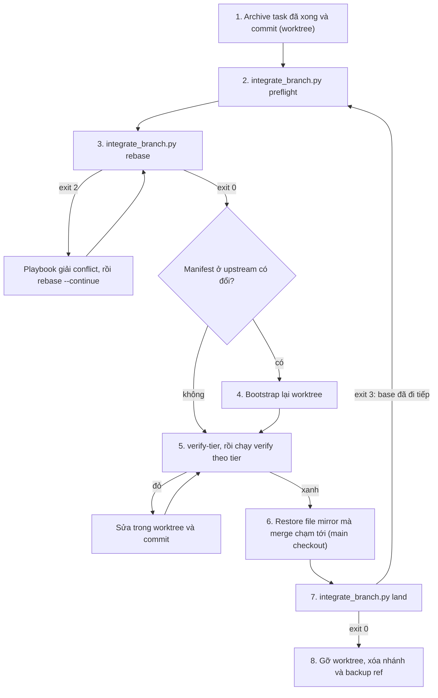

# Thiết kế tích hợp rebase cho finishing branch

- **Ngày**: 2026-10-09
- **Trạng thái**: Bản nháp, chờ người dùng review
- **Phạm vi**: `finishing-a-development-branch`, `dev-implementation`, `dev-lifecycle`, một script
  tích hợp dùng chung mới, `scripts/verify.sh`
- **Bước tiếp theo**: `writing-plans` (một implementation plan, không cần HLD)

## Mục lục

- [1. Bối cảnh](#1-bối-cảnh)
- [2. Mục tiêu và ngoài mục tiêu](#2-mục-tiêu-và-ngoài-mục-tiêu)
- [3. Quyết định](#3-quyết-định)
- [4. Bất biến](#4-bất-biến)
- [5. Thành phần](#5-thành-phần)
- [6. Script tích hợp](#6-script-tích-hợp)
- [7. Luồng finishing](#7-luồng-finishing)
- [8. Tích hợp sau mỗi task trong dev-implementation](#8-tích-hợp-sau-mỗi-task-trong-dev-implementation)
- [9. Thay đổi lifecycle](#9-thay-đổi-lifecycle)
- [10. Playbook giải conflict](#10-playbook-giải-conflict)
- [11. Xử lý lỗi](#11-xử-lý-lỗi)
- [12. Kiểm thử](#12-kiểm-thử)
- [13. Rủi ro và phụ thuộc](#13-rủi-ro-và-phụ-thuộc)
- [14. Ngoài phạm vi](#14-ngoài-phạm-vi)

## 1. Bối cảnh

Option 1 của [finishing-a-development-branch](../../../skills/finishing-a-development-branch/SKILL.md)
tích hợp bằng cách chạy `git checkout <base> && git pull && git merge <feature-branch>` trong main
checkout, rồi mới chạy test. Với một developer làm một mình và merge các epic vào `develop` ở local,
cách này mang đúng rủi ro mà yêu cầu nêu ra: các feature và epic đã vào `develop` sau điểm rẽ nhánh
có thể bị vỡ, và chính epic đang finish cũng vậy.

Những điểm yếu cụ thể, đều có trong nội dung hiện tại:

1. **Conflict được giải ngay trên `develop`**, trong main checkout. Nơi này không có môi trường build
   đã bootstrap như worktree của epic (`.dart_tool`, Pods, trạng thái Gradle).
2. **Test chỉ chạy sau khi merge.** Nếu kết quả đỏ, `develop` đã bị merge và đang hỏng. Skill gọi
   tình huống này là khôi phục được nhưng không nói cách khôi phục.
3. **Gate 4 đánh giá một tree khác.** `quality_check` cho 🟢 trên tree của epic với base cũ; tree
   thực sự vào `develop` chưa từng được verify. Bảng rationalization của chính skill ghi "A green run
   only proves the tree it ran on", vậy mà luồng lại làm ngược.
4. **Semantic conflict không bị phát hiện.** Khi upstream đổi một contract mà epic đang gọi, git
   không báo conflict text nào. Chỉ test trên tree đã tích hợp mới bắt được.
5. **Lỗi thứ tự đã biết.** Phase 5 của `dev-implementation` restore main checkout *trước* khi
   archival hook chạy, và các lần ghi mirror của hook làm main checkout bẩn trở lại, nên lần merge
   đầu tiên bị hủy.
6. **Archival hook không tìm được script khi chạy dưới Claude Code.** Hook chỉ dò đường dẫn tương
   đối trong repo và đường dẫn cài đặt của Antigravity. Trong một project dùng plugin dưới Claude
   Code, cả hai đều không tồn tại, `SYNC_SCRIPT` để trống, và bước archive bị bỏ qua mà không báo gì.

## 2. Mục tiêu và ngoài mục tiêu

**Mục tiêu:**

- Giải mọi conflict trên nhánh epic, bên trong worktree cô lập của nó, không bao giờ trên `develop`.
- Verify tree đã tích hợp, để chứng minh phần việc đã vào `develop` sau điểm rẽ nhánh và epic đang
  phát triển chạy được cùng nhau.
- `develop` chỉ nhận một tree đã pass verify.
- Tích hợp liên tục: rebase sau mỗi task của epic, để lần rebase lúc finish nhỏ hoặc trống.
- Sửa lỗi 5 và 6 ở trên, vì luồng mới đi qua cả hai.

**Ngoài mục tiêu:**

- Rebase một nhánh đã push. Việc đó cần force-push, mà
  [CRITICAL_RULES](../../../rules/CRITICAL_RULES.md) cấm nếu không có cho phép rõ ràng.
- Làm cho Step 1 của skill finishing nhận diện theo nền tảng.
- Vấn đề dispatch subagent trong `dev-implementation`, được tách thành spec riêng.

## 3. Quyết định

Mỗi quyết định đều được chốt cùng người dùng trong buổi brainstorming.

| ID | Quyết định | Lý do |
|----|------------|-------|
| D1 | Rebase là cách tích hợp mặc định | Nhánh epic không bao giờ được push trước khi finish, nên viết lại history của nó là an toàn |
| D2 | Mức verify lại phân tầng theo việc rebase đã làm | Rebase sạch không thể đổi code của chính epic nên không cần chạy lại audit; conflict đã giải là code mới nên bắt buộc chạy |
| D3 | Conflict cơ học do agent tự giải; conflict ngữ nghĩa dừng lại hỏi người dùng | Hỏi cho mỗi conflict import là ồn; tự giải conflict logic một cách lặng lẽ là con đường làm vỡ feature |
| D4 | History dạng semi-linear: rebase, rồi `merge --no-ff` | Mỗi epic có một merge commit đánh dấu, `git revert -m 1` gỡ cả epic, và `git log --first-parent develop` liệt kê các epic |
| D5 | Rebase sau mỗi task của epic, cộng thêm một lần rebase cuối lúc finish | Conflict nhỏ và được giải khi context của task còn nóng; Gate 4 chạy trên base mới nhất |
| D6 | Phần cơ chế git nằm trong một script dùng chung; phần phán đoán nằm trong prose | Rebase chạy ở N+1 điểm trên hai skill; một script có test giữ cho chúng giống hệt nhau |
| D7 | Base được resolve với remote trước mỗi lần rebase và trước khi land | Rebase lên một `develop` local đã cũ sẽ bỏ sót phần việc đã có trên remote |
| D8 | Tích hợp sau mỗi task chạy trong orchestrator `dev-implementation`, bên ngoài vòng lặp subagent | `subagent-driven-development` cấm dừng giữa chừng trừ bốn lý do đã nêu; bước tích hợp cần các điểm dừng riêng của nó |

## 4. Bất biến

Implementation phải giữ được cả bốn. Mỗi bất biến ứng với một kiểm tra trong script hoặc một quy tắc
trong prose.

1. **I1**: conflict chỉ được giải trong worktree của nhánh, không bao giờ trên `develop`.
2. **I2**: `develop` chỉ nhận một merge commit `--no-ff` có tree giống hệt tree của SHA đã verify.
   Script kiểm tra điều này trước và sau khi merge.
3. **I3**: lần rebase nào cũng có backup ref, và bước nào cũng hủy được.
4. **I4**: tier verify do script đo từ bằng chứng git, không do agent tự đánh giá.

## 5. Thành phần

| Thành phần | Thay đổi |
|------------|----------|
| `skills/finishing-a-development-branch/resources/scripts/integrate_branch.py` | **Mới.** Năm lệnh: `sync-base`, `preflight`, `rebase`, `verify-tier`, `land` |
| `skills/finishing-a-development-branch/resources/scripts/test_integrate_branch.py` | **Mới.** Bộ `unittest` chạy trên các git repo tạm |
| `skills/finishing-a-development-branch/references/conflict-playbook.md` | **Mới.** Phân loại conflict, cách xử lý file generated, mẫu câu hỏi khi dừng |
| `skills/finishing-a-development-branch/SKILL.md` | Bước update-onto-base cho Option 1 và 2; Option 1 land qua script; sắp lại thứ tự các bước; tìm script qua `SKILL_DIR`; thêm rationalization; vẽ lại diagram |
| `skills/dev-implementation/SKILL.md` | `sync-base` trước khi tạo worktree; Phase 2 step 0 rebase qua script; Phase 2 step 7 mới; cho phép ở Gate 3; Phase 5 bỏ bước restore |
| `skills/dev-lifecycle/SKILL.md` | Câu chữ Stage 3, ghi chú ở Gate 4 về verdict hết hạn, một red flag mới |
| `scripts/verify.sh` | Chạy bộ test mới |

`doc-lifecycle`, `executing-plans` và `subagent-driven-development` không bị sửa. Chúng nhận hành vi
mới thông qua `finishing-a-development-branch` và chỉ có lần rebase lúc finish.

## 6. Script tích hợp

`integrate_branch.py` là Python 3.10 chỉ dùng thư viện chuẩn, giống các script khác trong kit. Script
luôn làm việc trên nhánh hiện tại. Các cờ chung: `--base <branch>` (mặc định `develop`),
`--no-fetch`, và `--format markdown|json` (mặc định `markdown`).

### 6.1 Resolve base

Chạy bên trong `sync-base`, `rebase` và `land`. `preflight` chỉ chạy nửa chỉ-đọc: fetch và báo cáo,
không bao giờ di chuyển nhánh local.

1. Nếu nhánh base có upstream (ví dụ `origin/develop`), chạy `git fetch <remote> <base>`. Fetch lỗi
   thì thêm cảnh báo và tiếp tục với base local. `--no-fetch` bỏ qua bước này.
2. So sánh base local với upstream của nó:

| Quan hệ | Hành động |
|---------|-----------|
| Không có remote hoặc chưa cấu hình upstream | Dùng base local |
| Bằng nhau, hoặc local đi trước (có merge local chưa push) | Dùng base local |
| Local tụt sau hoàn toàn | Fast-forward bằng `git -C <base checkout> merge --ff-only <upstream>`; nếu git từ chối vì sẽ ghi đè một file bẩn, dừng lại hỏi |
| Đã tách nhánh | Dừng lại hỏi; hòa giải `develop` là việc ở cấp `develop`, không thuộc epic |

Script không bao giờ rebase thẳng lên remote-tracking ref. Làm vậy sẽ đẩy các commit remote sang phía
parent thứ hai của merge commit của epic, và phá vỡ history first-parent theo epic của D4.

### 6.2 Các lệnh

| Lệnh | Có ghi | Hành vi |
|------|--------|---------|
| `sync-base` | Có | Resolve base, kể cả fast-forward. Phase 1 gọi lệnh này trước `git worktree add` |
| `preflight` | Không | Chỉ báo cáo (các mục bên dưới) |
| `rebase` | Có | Từ chối khi HEAD detached, worktree bẩn, đang có rebase dở, hoặc nhánh đã có upstream (đã push). Chạy `sync-base`. Ghi đè `backup/<branch>` bằng HEAD hiện tại, lần nào cũng vậy. Nếu base đã là tổ tiên thì dừng với tier `noop`. Ngược lại chạy `git -c rerere.enabled=true rebase <base>`. `--continue` và `--abort` bọc các lệnh git tương ứng; `--continue` có bật rerere để ghi nhớ cách giải |
| `verify-tier` | Không | Đo tier (6.3) và in ra mức verify cần chạy, checklist regression, các file giao nhau và SHA ứng viên |
| `land --verified <sha> --title "<title>"` | Có | Chạy `sync-base`, kiểm tra điều kiện trước, merge `--no-ff` trong checkout đang giữ base, kiểm tra điều kiện sau |

`preflight` báo cáo:

- nhánh, base, target đã resolve và merge-base;
- các commit upstream kể từ merge-base;
- **các epic upstream**: những thư mục được thêm vào `.devtool/epic/` kể từ merge-base, mỗi thư mục
  kèm đường dẫn `bdd_scenarios.en.md` nếu có. Đây là checklist regression;
- **các file giao nhau**: file bị cả hai phía sửa kể từ merge-base;
- **tier dự đoán**: `noop` khi base là tổ tiên của HEAD, ngược lại là `clean` hoặc `conflicts` theo
  `git merge-tree --write-tree`. Mỗi file dự đoán conflict được gắn nhãn `regenerate` hoặc `review`;
- manifest dependency có đổi ở upstream không, tức worktree có cần bootstrap lại;
- cảnh báo: fetch lỗi, đang có rebase dở, worktree bẩn, nhánh đã push.

Pattern `regenerate`: `*.g.dart`, `*.freezed.dart`, `*.mocks.dart`, `*.gr.dart`, `pubspec.lock`,
`Podfile.lock`, `Package.resolved`, `gradle.lockfile`, `*.lockfile`, `package-lock.json`, `yarn.lock`.

Pattern manifest: `pubspec.yaml`, `melos.yaml`, `build.gradle`, `build.gradle.kts`,
`settings.gradle`, `settings.gradle.kts`, `gradle/libs.versions.toml`, `Package.swift`,
`Project.swift`, `Podfile`.

Chi tiết `land`:

- **Title**: phải khớp `[SCOPE] Title`, không có dấu chấm cuối. Body được sinh tự động, mỗi commit
  trong `<base>..<sha>` một dòng `- <subject>`, cũ nhất trước, không có trailer nào.
- **Điều kiện trước**: tip của nhánh bằng `<sha>`; base là tổ tiên của `<sha>`; base đang được
  checkout ở một checkout nào đó; checkout đó không có merge hay rebase dở; không file bẩn nào của nó
  nằm trong số file mà merge thay đổi. Các file bẩn không liên quan, ví dụ mirror Kanban của một epic
  khác đang chạy song song, được giữ nguyên.
- **Điều kiện sau**: `<base>^{tree}` bằng `<sha>^{tree}`; `<base>^1` là base trước khi merge;
  `<base>^2` là `<sha>`. Nếu không đạt, chạy `git reset --keep ORIG_HEAD` trong checkout đó.
- Khi base không được checkout ở đâu cả, thoát kèm hướng dẫn thay vì merge.

### 6.3 Đo tier

Tier được đo sau khi rebase hoàn tất. Dự đoán là chưa đủ: rebase có thể dừng ở một commit trung gian
ngay cả khi `merge-tree` dự đoán merge sạch.

- `onto` là `merge-base(HEAD, base)`: commit base mà nhánh đang nằm trên.
- `before` là `git diff -U0 merge-base(backup, onto) backup`.
- `after` là `git diff -U0 onto HEAD`.
- Cả hai diff được chuẩn hóa bằng cách bỏ dòng `index` và số dòng trong hunk header.

| Tier | Điều kiện | Ý nghĩa |
|------|-----------|---------|
| `noop` | HEAD bằng `backup/<branch>` | Không có gì được replay |
| `clean` | `before` sau chuẩn hóa bằng `after` | Thay đổi ròng của epic không đổi về mặt text |
| `conflicts` | Mọi trường hợp còn lại | Code của epic đã thay đổi trong lúc tích hợp |

Diff không có context giúp một lần rebase sạch vẫn là `clean`, kể cả khi upstream sửa các dòng ngay
sát hunk của epic. Mọi commit thêm vào sau rebase, như commit regenerate hay commit sửa lỗi verify,
đều làm `after` thay đổi và nâng tier lên `conflicts`. Đây là chủ ý: chỉ chấp nhận báo động nhầm về
phía an toàn.

### 6.4 Exit code

| Mã | Ý nghĩa |
|----|---------|
| `0` | Thành công, kể cả tier `noop` |
| `1` | Lỗi git ngoài dự kiến; in thông báo, không in traceback |
| `2` | Rebase dừng vì conflict; liệt kê file conflict kèm nhãn và commit đang được replay |
| `3` | Không đạt điều kiện trước; in lý do |
| `4` | Không đạt điều kiện sau khi merge; đã rollback |

## 7. Luồng finishing

Step 1 đến Step 4 (verify test, nhận diện môi trường, xác định base, hiện menu) giữ nguyên.
`SKILL_DIR` được xác định giống cách `dev-implementation` đang làm, và archival hook tìm
`sync_task_status.py` tại `"$SKILL_DIR"/../dev-implementation/resources/scripts/`.

### 7.1 Option 1 — Merge local

1. **Archive.** Chạy pre-finish archival hook trong worktree và commit.
2. **Preflight.** Cho người dùng xem các commit và epic upstream sắp được kéo vào, cùng tier dự đoán.
3. **Rebase.** Khi exit 2, xử lý theo playbook giải conflict rồi tiếp tục; người dùng có thể yêu cầu
   `--abort` bất cứ lúc nào.
4. **Bootstrap lại** worktree khi `preflight` báo manifest đã đổi.
5. **Verify theo tier.** Chạy `verify-tier`, rồi chạy mức verify ứng với tier đo được:

| Tier | Verify |
|------|--------|
| `noop` | Giữ verdict hiện có: 🟢 của Gate 4 hoặc lượt chạy ở Step 1 |
| `clean` | Full test suite (bộ 3 tầng với project mobile), Check 2 của `impact-analysis`, và kiểm tra rằng lượt chạy đã gồm integration test của mọi epic trong checklist regression |
| `conflicts` | Gate đầy đủ của lifecycle đã gọi skill: `quality_check` cho code, `doc_quality_check` cho tài liệu, full test suite khi không nằm trong lifecycle nào |

   Nếu đỏ thì dừng. Nhánh và worktree được giữ nguyên; sửa trong worktree, commit, rồi chạy lại
   `verify-tier`.
6. **Restore** các file `.devtool/` được mirror trong main checkout mà merge thay đổi. Bước này chạy
   sau archive, qua đó sửa lỗi 5. Nếu merge thay đổi bất kỳ file bẩn nào khác thì dừng lại hỏi.
7. **Land** với `--verified <sha> --title "[EPIC_NAME] Merge epic/<slug>"`. Exit 3 do base đã đi tiếp
   trong lúc verify sẽ đưa luồng quay lại bước 2.
8. **Dọn dẹp**: gỡ worktree (Step 6 hiện có), rồi `git branch -d <branch>` và
   `git branch -D backup/<branch>`.

`git checkout <base> && git pull && git merge <feature-branch>` bị xóa bỏ.

### 7.2 Option 2 — Push và tạo PR

Chạy bước 1 đến bước 5 của Option 1, rồi `git push -u origin <branch>` và tạo PR. Vì nhánh chưa từng
được push (D1), lần push đầu này không cần force. Nếu nhánh đã có upstream, bỏ qua rebase và báo cho
người dùng; không bao giờ tự ý force-push.

### 7.3 Option 3 — Giữ nguyên

Không đổi.

Các dòng mới cho bảng rationalization:

| Lời biện minh | Thực tế |
|---------------|---------|
| "Rebase sạch thì khỏi cần test" | Semantic conflict không tạo conflict text. Tier `clean` vẫn chạy full suite |
| "`develop` vừa đi tiếp; merge bây giờ, test sau" | `land` từ chối. Quay lại `preflight` |
| "Conflict này chỉ là cơ học thôi" | Nếu nó chạm vào logic thì đó là conflict ngữ nghĩa. Dừng lại hỏi |
| "Lấy `--ours` để giữ thay đổi của mình" | Trong lúc rebase, `--ours` là `develop`. Đọc playbook |

## 8. Tích hợp sau mỗi task trong dev-implementation

| Vị trí | Thay đổi |
|--------|----------|
| Phase 1, step 4 | Chạy `sync-base` trước `git worktree add .worktrees/<epic_dir> -b epic/<epic_slug> develop` |
| Phase 1, checkpoint Gate 3 | Hỏi một lần, cùng lúc với thứ tự thực thi, xin phép fast-forward `develop` local từ upstream của nó trong suốt epic |
| Phase 2, step 0 | Khi gặp `🔴 DIVERGENCE DETECTED`, chạy `integrate_branch.py rebase` thay cho `git fetch && git rebase origin/<base_ref>` |
| **Phase 2, step 7 mới** | **Integrate with base**, sau commit của step 5 và doc sync của step 6, lúc worktree chắc chắn sạch |
| Phase 5 | Bỏ step 1 (restore main checkout); việc này đã chuyển vào luồng finishing, sau bước archive |

Step 7 chạy trong orchestrator, bên ngoài vòng lặp từng task của `subagent-driven-development`:

1. `preflight`. Nếu `noop` thì sang task kế tiếp.
2. `rebase`. Khi exit 2, xử lý theo playbook giải conflict.
3. Bootstrap lại nếu manifest đã đổi.
4. `verify-tier`, rồi chạy verify ở mức ranh giới task:

| Tier | Verify ở ranh giới task |
|------|-------------------------|
| `noop` | Không cần |
| `clean` | Analyze, build, và unit test Tier A, dùng các lệnh theo nền tảng mà Phase 2 đã nêu |
| `conflicts` | Full test 3 tầng. Audit để dành cho Gate 4, nơi audit toàn bộ diff kể cả code giải conflict |

5. Nếu đỏ, sửa trước khi task kế tiếp bắt đầu và commit với message
   `[EPIC_NAME] Fix integration with develop after <task_title>`.
6. Báo cáo trong một khối ngắn: số commit đã kéo về, các epic upstream, tier.

Step 7 dừng trong đúng ba trường hợp: conflict ngữ nghĩa, base đã tách nhánh, và git từ chối
fast-forward vì sẽ ghi đè một file bẩn. Sự cho phép ở Gate 3 bao
gồm việc fast-forward `develop`, nên việc này không bị tính là side effect ngoài worktree chưa được
cho phép.

Chạy step 7 sau task cuối nghĩa là Gate 4 đánh giá trên base mới nhất, và lần rebase lúc finish
thường là `noop`. Integration test Tier C không chạy ở ranh giới task: trên Android và iOS, chạy
sau mỗi task quá tốn kém, và Gate 4 đã chạy chúng trên tree cuối cùng.

## 9. Thay đổi lifecycle

`dev-lifecycle`:

- Stage 3 ghi "one task at a time, one commit per task, integrate with `develop` after each task".
- Gate 4 ghi chú rằng 🟢 thuộc về một SHA cụ thể. Nếu `develop` đi tiếp sau Gate 4, Stage 4 verify
  lại theo tier.
- Exit của Stage 4 ghi "epic branch rebased onto `develop`, re-verified by tier, landed with
  `--no-ff`, and done tasks archived".
- Red flag mới: bắt đầu một task khi bước tích hợp của task trước còn đỏ.

## 10. Playbook giải conflict

`references/conflict-playbook.md` mở đầu bằng cái bẫy thuật ngữ của rebase: trong lúc rebase,
`--ours` là base (`develop`) và `--theirs` là commit của epic đang được replay, ngược với lúc merge.

| Loại | Ví dụ | Cách xử lý |
|------|-------|------------|
| `regenerate` (do script gắn nhãn) | Dart generated, lockfile | Không sửa tay. Trong lúc rebase lấy bản của phía base; rebase xong chạy codegen hoặc install một lần và commit `[EPIC_NAME] Regenerate after rebase onto develop` |
| Cơ học (agent tự giải và ghi lại) | Import; hai phía cùng thêm phần tử khác nhau vào list, enum, DI module hay route table; khác nhau chỉ về format hoặc comment | Giữ cả hai phía; liệt kê từng chỗ đã giải trong report |
| Ngữ nghĩa (dừng lại hỏi) | Cùng một thân hàm bị cả hai phía sửa; đổi signature, nullability hay contract; conflict sửa/xóa; giá trị config và feature flag; file nhạy cảm về bảo mật (crypto, auth, keychain) | Trình bày theo mẫu bên dưới |

Mẫu câu hỏi khi dừng gồm:

- vị trí dạng `file:hunk`;
- ý định của phía upstream: commit subject, và epic chứa commit đó nếu có;
- ý định của phía epic: task file và tiêu đề task;
- phương án đề xuất dưới dạng diff;
- các lựa chọn: chấp nhận đề xuất, lấy bản upstream, lấy bản epic, tự giải, hoặc `--abort`.

Quy tắc mặc định: nếu không nêu được ý định của một trong hai phía trong một câu thì coi conflict là
ngữ nghĩa.

## 11. Xử lý lỗi

| Tình huống | Hành vi |
|------------|---------|
| Rebase dừng vì conflict (exit 2) | Theo playbook, rồi `--continue`; `--abort` đưa về `backup/<branch>` |
| Verify đỏ sau rebase | Giữ nhánh; sửa bằng commit mới; `develop` không bị đụng tới |
| Base đã tách nhánh với upstream | Dừng lại hỏi |
| File bẩn trong checkout của base mà merge hoặc fast-forward thay đổi, ngoài các mirror của epic này | Dừng lại hỏi |
| Fetch lỗi | Cảnh báo; lúc finish, hỏi trước khi land |
| `land` không đạt điều kiện trước (base đã đi tiếp, SHA không khớp) | Exit 3; bắt đầu lại từ `preflight` |
| `land` không đạt điều kiện sau | `reset --keep ORIG_HEAD`; exit 4 |
| Có rebase dở từ phiên trước | `preflight` báo ra; tiếp tục hoặc hủy nó, không bao giờ bắt đầu rebase khác |
| HEAD detached, hoặc git cũ hơn 2.38 | Exit 3 kèm thông báo rõ ràng |
| Nhánh đã push | `rebase` exit 3; finishing bỏ qua rebase và báo cho người dùng |

## 12. Kiểm thử

`test_integrate_branch.py` dùng `unittest` trên một remote bare tạm, một bản clone và một worktree,
theo tiền lệ của `test_check_code_impact.py`. Các ca:

1. Tier `noop`, tier `clean` (kể cả khi upstream sửa dòng sát một hunk của epic), tier `conflicts`.
2. `--abort` đưa HEAD về đúng backup ref.
3. Gắn nhãn `regenerate`; phát hiện epic upstream kèm file BDD; phát hiện manifest thay đổi.
4. Resolve base: không có upstream, local đi trước, local tụt sau (fast-forward), tách nhánh (dừng),
   fetch lỗi.
5. `land`: merge commit có hai parent, tree trùng khớp, body tự sinh không có trailer; từ chối khi
   base đã đi tiếp, khi một file bẩn va chạm với merge, và khi SHA không khớp; file bẩn không liên
   quan được giữ nguyên.
6. Hai epic song song: epic A land, rồi epic B kéo được A về ở lần tích hợp kế tiếp.

Ngoài ra:

- `scripts/verify.sh` chạy bộ test bằng `python3 -m unittest`.
- Các chỉnh sửa `SKILL.md` theo `d3nexus:writing-skills`, như `CLAUDE.md` yêu cầu với thay đổi skill.
- Diagram mermaid của skill finishing được vẽ lại và kiểm tra render.
- Gate cuối: `scripts/verify.sh` và `doc_quality_check` trên các tài liệu đã đổi.

## 13. Rủi ro và phụ thuộc

1. **Rebase chỉ an toàn vì nhánh epic không bao giờ được push trước khi finish (D1).** Nếu thói quen
   này thay đổi, `rebase` phát hiện upstream và từ chối thay vì force.
2. **Chi phí mỗi task.** Fetch và `preflight` rất nhẹ. Bootstrap lại sau khi manifest đổi, như
   `pod install`, có thể mất vài phút.
3. **Tier `conflicts` báo nhầm** sau các commit regenerate sẽ kích hoạt full `quality_check`. Chấp
   nhận vì đó là phía an toàn.
4. **Cần git 2.38 trở lên** cho `merge-tree --write-tree`. Máy phát triển đang dùng 2.54.
5. **Phạm vi ảnh hưởng.** Thay đổi tới được mọi project đã cài plugin. Bump version và release là
   một bước riêng.
6. **Chỉ phụ thuộc lỏng vào bản sửa subagent đã tách riêng.** Step 7 chạy được dù task chạy trong
   subagent hay inline.

## 14. Ngoài phạm vi

- Rebase nhánh đã push, hoặc bất kỳ force-push nào.
- Land khi base không được checkout ở đâu cả: script thoát kèm hướng dẫn.
- `git rebase --exec` để build từng commit được replay.
- Lệnh test theo nền tảng ở Step 1 của skill finishing.
- Lời khuyên rebase `origin/<base_ref>` trong `impact-analysis`, giữ nguyên.
- Các lỗi đã biết 1, 2 và 4 của tooling trong kit (parser thứ tự thực thi, chuyển file vào thư mục
  done, step 8 của `verify.sh`).
- Vấn đề dispatch subagent trong `dev-implementation`.
