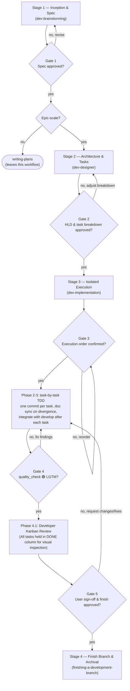

# Development Lifecycle

The orchestrator for epic-scale work. It owns **sequence and gates only** — each stage's *how*
stays in that stage's own skill. If you need to know how to run a stage, open its skill; if you
need to know what runs next or what must be true before it does, stay here.

**Announce at start:** "I'm using the dev-lifecycle skill to orchestrate the `<epic_slug>` epic."

**Every stage is entered by invoking its skill.** This file names what runs next; it does not
replace it. Reading a stage's description here and then doing that stage's work yourself skips the
gate the stage owns.

## When NOT to use this

- Single-component feature, bugfix, or anything one implementation plan covers → `dev-brainstorming`
  then `writing-plans`. Do not open an epic for it.
- You are already mid-stage and know exactly which stage → go straight to that stage's skill.

## The Sequence



<HARD-GATE>
Do NOT create `implementation_plan.md` or any Antigravity planning-mode artifact.
The d3nexus workflow replaces the native planning mode entirely.
Specs go to `docs/superpowers/specs/` (Stage 1) or `.devtool/epic/<epic_dir>/` (Stage 2+).
Plans go through `writing-plans` skill (non-epic) or `dev-designer` task files (epic).
If you find yourself about to write `implementation_plan.md`, STOP — you are bypassing a gate.
</HARD-GATE>

## Document Contract

Every durable design document produced by this lifecycle MUST be emitted as a synchronized English
`.en.md` and Vietnamese `.vi.md` pair. English is canonical; Vietnamese matches its structure and
facts. Every variant MUST contain a linked table of contents covering every `##` section, regardless
of document length. This applies to specs, HLD/overview documents, BDD scenario documents, and
non-epic implementation plans. `task_*.md` files are the only exception and remain English-only.

### Markdown Formatting & Lint Standards

Every markdown document produced by this lifecycle MUST pass markdown lint standards:
- **Heading Hierarchy**: Exactly one top-level `# Title` (H1) at the start of the file. Heading levels MUST increment by one (no skipping levels from `#` to `###`). Space after `#` (`# Title`, not `#Title`). No trailing punctuation in headings (`.`, `:`, `,`, `;`).
- **Fenced Code Blocks**: Fenced code blocks MUST specify a language tag (e.g. ````bash`, ````markdown`, ````python`, ````mermaid`, ````dot`, ````json`). Bare fences without a language are prohibited.
- **Lists**: Consistent list markers (`-` for unordered lists), 2-space or 4-space nested indentation, and blank lines separating list blocks from surrounding paragraphs.
- **Links & Anchors**: Relative file links must resolve on disk; heading anchor fragments (`#anchor`) must match existing headings.
- **Formatting Hygiene**: No trailing whitespace at line ends, no hard tabs (use spaces), maximum 1 consecutive blank line, and ensure the file ends with a trailing newline.

### Diagram Standards & Lint Rules (Mermaid & Graphviz DOT)

All diagrams included in any durable document (spec, HLD, BDD scenarios, implementation plan, or doc sync) MUST adhere strictly to the latest modern linting rules:

1. **Mermaid Standards & Lint Rules**:
   - **`flowchart` over `graph`**: ALWAYS use `flowchart` syntax (e.g. `flowchart TD`, `flowchart LR`). NEVER use legacy `graph` syntax (e.g. `graph TD`, `graph LR`). `graph` is legacy Mermaid syntax; `flowchart` is the current keyword and enables per-subgraph `direction` control (e.g. `direction LR` inside a subgraph), richer node shapes, better rendering engines, and styling.
   - **Quote Node Labels**: Enclose any node label containing special characters, parentheses `()`, brackets `[]`, braces `{}`, colons `:`, slashes `/`, ampersands `&`, or punctuation in double quotes (e.g. `node1["Component (Core Logic)"]`, `gate1{"Gate 1: Spec Approved?"}`, `db[("Storage (PostgreSQL)")]`). Unquoted parentheses or colons break parser AST and trigger linter warnings.
   - **Alphanumeric Node IDs**: Use clean alphanumeric IDs with underscores (e.g. `AUTH_SVC`), never spaces, dashes, or dots in the ID itself. Avoid reserved keywords (`end`, `subgraph`, `graph`, `flowchart`).
   - **Edge Syntax & Quotes**: Use standard edges (`-->`, `-.->`, `==>`). Quote edge labels containing parentheses or punctuation (`A -->|"yes (verified)"| B`). Do not append trailing semicolons `;` on flowchart lines.
   - **Subgraphs**: Always specify explicit closing `end`, unique alphanumeric subgraph ID, and a quoted label: `subgraph ID ["Label"]` ... `end`.
   - **Sequence Diagrams**: Use modern `sequenceDiagram` with explicit participants (`actor U as User`, `participant S as Service`), valid arrows (`->>`, `-->>`, `-)`, `--))`), closed blocks (`alt`, `opt`, `loop`, `par`), and optional `autonumber`.
   - **State Diagrams**: Use `stateDiagram-v2` instead of legacy `stateDiagram`.

2. **Graphviz (DOT) Standards & Lint Rules**:
   - Follow semantic node shapes (see `writing-skills/graphviz-conventions.dot`):
     - `[shape=diamond]` for decisions (questions ending in `?`).
     - `[shape=box]` for actions (imperative verbs: "Write test", "Commit changes").
     - `[shape=plaintext]` for shell commands or literal code (`git status`, `npm test`).
     - `[shape=ellipse]` for states or situations ("Test failing", "Build complete").
     - `[shape=octagon, style=filled, fillcolor=red, fontcolor=white]` for critical warnings (`STOP: ...`).
     - `[shape=doublecircle]` for entry/exit points (`Process starts`, `Process complete`).
   - **Statement Semicolons**: Every statement inside DOT must terminate with a semicolon `;`.
   - **Quotes**: Double-quote all multi-word or punctuation-containing node IDs and labels (`"Process starts"`, `label="Is test passing?"`).
   - **Edges**: In `digraph`, edge operator MUST be `->` (NEVER `--`). Label branches explicitly (`[label="yes"]`, `[label="no"]`).
   - **Clusters**: Subgraphs intended to have a visual border MUST begin with `cluster_` (e.g. `subgraph cluster_phase1 { label="Phase 1"; ... }`).

## The Five Gates

Every gate is a **human approval** except Gate 4, which is a machine verdict. Never cross one
on your own judgement.

| Gate | Name | Approver | Enforced in | Handoff artefact |
|------|------|----------|-------------|------------------|
| **1** | Spec Approved | User | end of `dev-brainstorming` | `YYYY-MM-DD-<topic>-design.en.md` + `.vi.md` |
| **2** | HLD & Task Breakdown | User | `dev-designer` task-breakdown checkpoint | `<epic_dir>.en.md` + `.vi.md` + `bdd_scenarios.en.md` + `.vi.md` + `task_*.md` |
| **3** | Execution Order | User | `dev-implementation` Phase 1 checkpoint | confirmed order + bootstrapped worktree |
| **4** | Quality LGTM & Check 2 | `quality_check` | `dev-implementation` Phase 4 | 🟢 report + coverage matrix + merge-ready branch |
| **5** | Developer Kanban Sign-Off | User | `dev-implementation` Phase 4.1 checkpoint | User confirmation to proceed with branch finishing and archival |

## Stages

### Stage 1 — Inception & Spec → `dev-brainstorming`

**Invoke `d3nexus:dev-brainstorming`.** Do not write the spec yourself: Gate 1 is *its* user-approval
step, and a spec that never passed through it has not cleared the gate.

**Entry:** a raw idea or requirement.
**Exit (Gate 1):** the user has approved a written spec that passed self-review.

**Routing decision, made here and nowhere else.** Once the spec is approved, choose:

- **Epic-scale code** → `dev-designer`, which is Stage 2 of this lifecycle — multiple independent
  components/services, needs Kanban breakdown plus architecture/use-case/sequence diagrams, or the
  user called it an epic or large feature.
  → relocate both spec variants from `docs/superpowers/specs/` into
  `.devtool/epic/<epic_dir>/` (create the directory if needed), fix relative links inside both
  moved files, then go to Stage 2 passing the canonical `.en.md` path.
- **Everything else** → `writing-plans`. This leaves the epic lifecycle; the remaining gates do
  not apply. `writing-plans` still emits the required `.en.md`/`.vi.md` plan pair with complete
  tables of contents.

When in doubt, ask the user rather than guessing.

If dev-brainstorming decomposed the request into several sub-project specs, **route each one
independently**. Each spec keeps its own spec → design → implementation lineage and gets its own
epic directory. Never merge multiple specs into one epic.

### Stage 2 — Architecture & Tasks → `dev-designer`

**Entry:** a Gate 1 spec, already sitting in `.devtool/epic/<epic_dir>/`.
**Exit (Gate 2):** the user has confirmed the proposed task list and granularity.

Treat the approved spec as the source of truth for scope and decisions already made — formalize
it, do not re-litigate it. Gate 2 is a lightweight confirmation of the *task split* only; the
architecture was already approved at Gate 1.

### Stage 3 — Isolated Execution → `dev-implementation`

**Entry:** Gate 2 passed; HLD and `task_*.md` files exist.
**Exit (Gate 5):** `quality_check` reports 🟢 LGTM (Gate 4) AND the user explicitly reviews the completed tasks on the Kanban dashboard and approves finishing the branch (Gate 5).

Gate 3 sits inside this stage, at the end of Phase 1: present the computed execution order and
get confirmation **before** creating any worktree or dispatching any subagent.

Then one worktree, one task at a time, one commit per task, docs kept truthful. On divergence
from the HLD, sync the epic docs before starting the next task. After every task, integrate the
branch with `develop` — rebase, then re-verify by tier — before the next one starts.

**Gate 4 Machine Acceptance Criteria:**
Gate 4 grants `🟢 LGTM` only when all 4 conditions are satisfied:
1. **3-Tier Test Suite Passes 100%**: Unit, component/widget, and integration tests pass without failure.
2. **4 Semantic Audits Report Zero Blockers**: Security, Architecture, UI, and Code Health audits pass cleanly.
3. **Reverse Verification Coverage Satisfied**:
   - **Security Audit**: High-risk files (crypto, keychain, tokens, biometrics) have **100% line coverage**.
   - **Architecture Audit**: Pure domain logic (UseCases, Repositories, Entities) has **$\ge 85\%$ line coverage**.
   - **UI Audit**: State hoisting, BLoCs, and ViewModels have **$\ge 80\%$ line coverage**.
   - **Code Health Audit**: Refactored methods (< 20 lines) have **$\ge 75\%$ line coverage**.
4. **Check 2 (Shift-Right Bookend) Clean**: Pre-merge cumulative diff analysis (`check_code_impact.py`) against `<base_ref>` reports zero divergence, zero unprotected modified files, and synchronized native bridge interfaces.

If any condition fails, Gate 4 routes back to Stage 3 Phase 2 (`dev-implementation`) with an actionable gap report.

A 🟢 verdict belongs to the SHA it ran on. If `develop` moves after Gate 4, Stage 4 rebases the
branch and re-verifies it by tier before landing.

**Gate 5 Developer Kanban Review & Sign-Off:**
Once Gate 4 passes, all completed tasks MUST remain in `.devtool/features/done/`. The agent MUST STOP calling tools and present the final executive report to the user. The user visually reviews the Kanban board and approves proceeding to Stage 4. If the user requests adjustments or fixes, execution routes back to Stage 3 Phase 2.

### Stage 4 — Finish Branch → `finishing-a-development-branch`

**Entry:** Gate 5 passed (user confirmed).
**Exit:** epic branch rebased onto `develop`, re-verified by tier, landed with a `--no-ff` merge, and done tasks archived into `.devtool/epic/<epic_dir>/`.

## When a Gate Fails

| Gate | On failure, return to |
|------|----------------------|
| 1 | Stage 1 — revise the spec, re-run its self-review |
| 2 | Stage 2 — adjust the breakdown; only revisit Stage 1 if scope itself was wrong |
| 3 | Stage 3 Phase 1 — reorder by hand; prose notes in task files outrank the calculator |
| 4 | Stage 3 Phase 2 — fix findings in the worktree, then re-run `quality_check` in full |
| 5 | Stage 3 Phase 2 — implement user-requested changes or fixes |

Never advance on a partial pass, and never re-run only the previously failing check at Gate 4 —
the 🟢 verdict must come from a complete run.

## Red Flags

- Writing to `implementation_plan.md` or any Antigravity native planning artifact.
- Skipping `dev-brainstorming` because "the scope is already clear".
- Routing an approved spec straight to an implementation skill, skipping Stage 2 for epic-scale work.
- Merging several sub-project specs into one epic directory.
- Creating a worktree or dispatching a subagent before Gate 3.
- Merging to `develop` without a 🟢 from Gate 4.
- Merging to `develop` by hand instead of through `integrate_branch.py land`.
- Starting a task while the previous task's integration with `develop` is red.
- Invoking `finishing-a-development-branch` without passing Gate 5 (explicit user sign-off after Kanban review).
- Archiving tasks from `.devtool/features/done/` prematurely before Gate 5 user review.
- Leaving a spec split across `docs/superpowers/specs/` and `.devtool/epic/<epic_dir>/`.
- Producing a durable design document without both language variants or without a complete table
  of contents.
- Using legacy Mermaid syntax (e.g. `graph TD`, `graph LR` instead of `flowchart TD`, `flowchart LR`), unquoted special characters/parentheses in node labels, or malformed Graphviz (DOT) diagrams.
- Translating `task_*.md`; task files remain English-only.
- Leaving completed `task_*.md` files in `.devtool/features/done/` or draft specs in `docs/superpowers/` after branch integration.

## Rationalizations — STOP and Re-read This Skill

| Excuse | Reality |
|--------|---------|
| "I already have enough context to skip brainstorming" | Context ≠ spec. Gate 1 requires a written, approved spec. |
| "This is too simple for the full lifecycle" | Simple work uses `dev-brainstorming` → `writing-plans`. You still start at Stage 1. |
| "I'll just write the implementation plan directly" | `implementation_plan.md` is an Antigravity artifact. d3nexus uses `docs/superpowers/specs/` and `.devtool/`. |
| "The user confirmed the scope, that's basically Gate 1" | Gate 1 is spec approval through `dev-brainstorming`, not a scope question. |
| "I can combine research + spec into one step" | Stage 1 is `dev-brainstorming`'s job. Invoke the skill. |

## Stage Skills

| Stage | Skill | Gate it enforces |
|-------|-------|------------------|
| 1 | `dev-brainstorming` | 1 |
| 2 | `dev-designer` | 2 |
| 3 | `dev-implementation` | 3, triggers 4, and enforces 5 |
| 3 (verification) | `quality_check` | 4 |
| 4 | `finishing-a-development-branch` | — |
