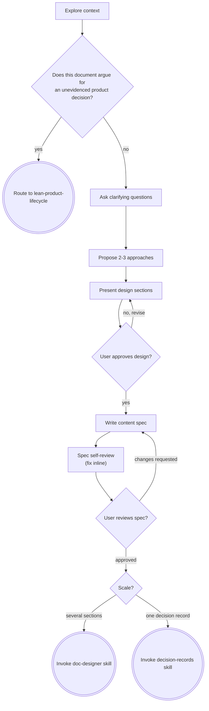

# Brainstorming Ideas Into Documents

Help turn an idea, or a request for a document, into a content spec through natural collaborative
dialogue. The sibling skill for code deliverables is `dev-brainstorming`; the router that picks
between them is `brainstorming`.

<HARD-GATE>
Do NOT write the document, draft sections, create an outline, or invoke any downstream skill until
you have presented a design and the user has approved it. This applies to EVERY document regardless
of perceived simplicity.
</HARD-GATE>

## Anti-Pattern: "This Is Too Simple To Need A Design"

Every document goes through this process. A one-page onboarding note, a three-step runbook, a short
FAQ — all of them. "Obvious" documents are where unexamined assumptions about the reader cause the
most wasted writing. **The design can be short — a few sentences for a genuinely simple document —
but you MUST present it and get approval.**

This is what makes `doc-lifecycle` Stage 0 mandatory without making it expensive. The stage is
required in its *existence*; its *depth* scales with the work.

## What this skill owns, and what it does not

| | Owns |
|---|---|
| **This skill** | Whether the document should exist, and what it must say. The claim, the substance, the scope, and what it deliberately leaves out. |
| **`doc-designer`** | Who exactly reads it, in what Diátaxis type, in what outline, broken into which sections. |

The split is the kit's usual problem-space / solution-space discipline. `doc-designer` Step 1 asks
who reads this, what they are trying to do, and what they already know. **Do not ask those three
questions here.** Asking them twice makes the user answer twice, and people stop using whichever
skill asked second.

## Checklist

You MUST create a task for each of these items and complete them in order:

1. **Explore context** — existing docs, related files, what already covers this ground
2. **Check the claim is evidenced** — if this document argues for a product decision that nothing
   supports, stop here and route to `lean-product-lifecycle` (see Upstream Escape below)
3. **Ask clarifying questions** — one at a time, understand purpose, scope and what "done" means
4. **Propose 2-3 approaches** — with trade-offs and your recommendation
5. **Present design** — in sections scaled to their complexity, get user approval after each
6. **Write content spec** — save to `docs/superpowers/specs/YYYY-MM-DD-<topic>-design.md` and commit
7. **Spec self-review** — quick inline check for placeholders, contradictions, ambiguity, scope
8. **User reviews written spec** — ask the user to review the spec file before proceeding
9. **Route to the next skill** — one of two routine exits, see Routing After Approval below

## Process Flow

**The terminal state is invoking exactly one of three skills: `doc-designer`, `decision-records`, or
`lean-product-lifecycle` — never two, and never any other skill.**

## Upstream Escape — when the document argues for something unevidenced

A document that makes a *product* argument inherits that argument's evidence problem. Writing it up
persuasively does not make it true; it makes it harder to challenge.

**Fire it at step 2, before the clarifying questions.**

Stop and recommend `lean-product-lifecycle` when **both** are true:

- The document **is** a product argument — a strategy document, a proposal, a business case, a
  pitch, a recommendation to build or stop building something.
- The idea it argues for is asserted rather than evidenced — no interviews, no data, no ranking of
  importance against satisfaction.

**This trigger examines what the document claims, not who reads it.** A runbook, a handbook, an
onboarding guide, a reference page or a post-mortem never fires it, however little is known about
their readers. Pushing those toward market discovery is the kind of friction that teaches people to
route around a gate.

Say plainly what it costs and what it saves. Then hand over whatever context this session gathered.

If the user decides to proceed anyway, that is their call — record the unvalidated assumption in the
spec's risks section and continue.

## Correction — when this is the wrong variant

The `brainstorming` router decides which variant a session enters. This section covers the other
case: the branch was chosen, and chosen wrongly.

If you discover mid-session that **the work will change a file that ships in the build**, stop and
hand over to `dev-brainstorming`. Restart inception there; do not carry a half-written content spec
across as though it were approved.

The deliverable decides, not the amount of prose involved. A skill file, a schema, a config that
ships, a README compiled into a site build — all code, however much writing they contain.

This fires on a discovery, not on a decision. It is deliberately not an edge in the process flow
above.

## Routing After Approval

Once the spec is approved (and has passed self-review):

- **Invoke `doc-designer`** when the document has enough sections that a reviewer could accept some
  and reject others. This enters the Document Lifecycle at Stage 1.
- **Invoke `decision-records`** when the deliverable is a single Architecture Decision Record. That
  is below the lifecycle threshold entirely.

If brainstorming decomposed the request into several documents, route **each spec independently**.

### Complete End-to-End Document Lifecycle

Routing to `doc-designer` enters the governed Document Lifecycle. The stage sequence, the approval
gates, and the handoff artefact each stage owes the next are defined in one place — the
**[`doc-lifecycle`](../doc-lifecycle/SKILL.md)** skill. Do not restate them here; this skill owns
Stage 0 and Gate 1 only.

---

## The Brainstorming Mindset

- **No Early Judgment:** Never immediately reject an idea as unwritable or off-topic. Postpone
  judgment, accept it, and analyse its trade-offs constructively.
- **The "Yes, and..." Principle:** Build on the user's suggestions rather than replacing them.
- **Encourage Wild Ideas:** When proposing approaches, include at least one unconventional framing —
  a different genre, a different starting point, a document that argues the opposite.
- **Reverse Brainstorming:** Ask "how could this document mislead someone?", "what would make a
  reader act on it wrongly?", "what does it imply that we cannot support?". Use the answers to
  harden the spec.

## The Process

**Understanding what is wanted:**

- Check what already exists first. A document that duplicates one already in the repository is worse
  than no document, because now two of them can disagree.
- If the request covers several independent documents — a handbook *and* a runbook *and* a set of
  reference pages — flag that immediately and help group them before refining any one of them. Each
  document gets its own spec → brief → draft cycle.
- Ask questions one at a time. Multiple choice where possible.
- Shape clarifying questions around what the document must carry:
  - **Why:** What goes wrong today because this does not exist?
  - **What:** What claim or content must it carry? What must it deliberately *not* cover?
  - **When:** What event makes it out of date? What keeps it true?
  - **How:** How will we know it worked — what can a reader do afterwards that they could not before?

**Exploring approaches:**

- Propose 2-3 different framings with trade-offs. Lead with your recommendation and explain why.
- Framings differ in what they claim and what they leave out, not in formatting.

**Presenting the design:**

- Scale each section to its complexity: a few sentences if straightforward, up to 200-300 words if
  nuanced.
- Ask after each section whether it looks right so far.
- Cover: the claim, the scope, the explicit non-goals, and one acceptance criterion the reader can
  act on.
- **Dependency Mapping:** List assumptions, risks, and anything this document depends on staying
  true — a process that might change, an API that might move, a decision not yet made.

## After the Design

**Documentation:**

- Write the validated content spec to `docs/superpowers/specs/YYYY-MM-DD-<topic>-design.md`
  (user preferences for spec location override this default).
- Commit it (if `auto_commit` is enabled):
  - Read `.agents/config.json` — check `auto_commit`
  - If `auto_commit: true` (default when absent): `git add <path> && git commit -m "[<TOPIC>] Add content spec"` —
    see [Commit Message Format](../../rules/CRITICAL_RULES.md#commit-message-format); no
    `Co-Authored-By` or other trailer
  - If `auto_commit: false`: skip commit and staging entirely. Print: "Skipping commit (auto_commit:
    false in .agents/config.json). File is ready for manual commit."

**Spec Self-Review:**

After writing the spec, look at it with fresh eyes:

1. **Placeholder scan:** Any "TBD", "TODO", incomplete sections, or vague claims? Fix them.
2. **Internal consistency:** Do any sections contradict each other? Does the stated scope match what
   the claim actually requires?
3. **Scope check:** Is this one document, or several pretending to be one?
4. **Ambiguity check:** Could any statement be read two ways? Pick one and make it explicit.
5. **Evidence check:** Does anything here assert a fact the document cannot support? Either source
   it or soften it now — a fabricated detail is far cheaper to remove at spec stage than after a
   reader has acted on it.

Fix any issues inline. No need to re-review — just fix and move on.

**User Review Gate:**

After the self-review passes, ask the user to review the written spec before proceeding:

> "Content spec written and committed to `<path>`. Please review it and let me know if you want to
> make any changes before we start on the brief and outline."

Wait for the user's response. If they request changes, make them and re-run the self-review. Only
proceed once the user approves.

## Key Principles

- **One question at a time** — don't overwhelm with multiple questions
- **Multiple choice preferred** — easier to answer than open-ended when possible
- **YAGNI ruthlessly** — a section nobody will read is a section that will go stale and mislead
- **Explore alternatives** — always propose 2-3 framings before settling
- **Incremental validation** — present design, get approval before moving on
- **Non-goals are content** — what a document refuses to cover is as load-bearing as what it covers
