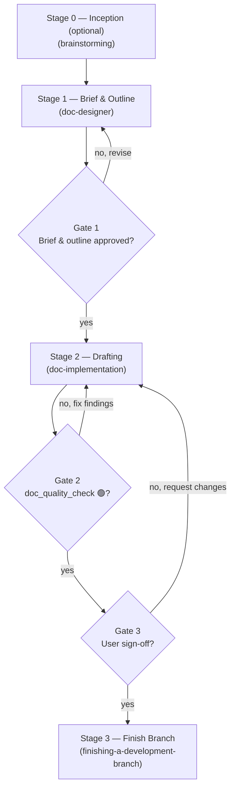

# Document Lifecycle

The orchestrator for work that ends in a document. It owns **sequence and gates only** — each
stage's *how* stays in that stage's own skill. If you need to know how to run a stage, open its
skill; if you need to know what runs next or what must be true before it does, stay here.

The development-side sibling is `dev-lifecycle`. The two mirror each other section for section on
purpose: independently maintained orchestrators drift, and a readable diff between these two files
is what makes drift visible.

**Announce at start:** "I'm using the doc-lifecycle skill to orchestrate the `<doc_slug>` document."

## When NOT to use this

The threshold is real. Opening gates around a small edit costs more than having no lifecycle at
all, because people route around a gate that wastes their time. Edit directly, with no brief, no
outline and no gate, when the work is:

- A typo, a broken link, or a one-line correction.
- A single Architecture Decision Record → use `decision-records` directly.
- Any change a reviewer would not meaningfully gate — if you cannot imagine rejecting it, do not
  gate it.
- Code work. If the deliverable changes a file that ships in the build, it belongs in
  `dev-lifecycle` no matter how much prose it involves.

Reach for this skill when a document has enough sections that a reviewer could accept some and
reject others.

## The Sequence

## The Three Gates

Gates 1 and 3 are **human approvals**; Gate 2 is a machine verdict. Never cross one on your own
judgement.

Three, not five. Code and prose differ in ways that change what verification can mean: the unit of
work is a section rather than an independently testable deliverable, verification is mechanical
checks plus human judgement rather than a machine running tests, the governing constraint is the
**audience** rather than the architecture, and the cost of being wrong is low. Because the cost of
being wrong is low, the gate count is low.

| Gate | Name | Approver | Enforced in | Handoff artefact |
|------|------|----------|-------------|------------------|
| **1** | Brief & Outline | User | `doc-designer` breakdown checkpoint | `<doc_dir>.en.md` + `.vi.md` + `task_*.md` |
| **2** | Draft Verified | `doc_quality_check` | `doc-implementation` final phase | 🟢 document quality report |
| **3** | Sign-Off | User | `doc-implementation` review checkpoint | User confirmation to finish the branch |

## Stages

### Stage 0 — Inception → `brainstorming` *(optional)*

**Entry:** a request whose *content* is still unknown — a strategy document, a proposal, an argument
whose conclusion has not been reached.
**Exit:** an approved spec.

Skip this stage whenever the content is known and only its shape is open. "Write a runbook for X"
needs a brief, not a design exploration, and `doc-designer` produces the brief.

### Stage 1 — Brief & Outline → `doc-designer`

**Entry:** a document request, with or without a Stage 0 spec.
**Exit (Gate 1):** the user has confirmed the outline and the section breakdown.

Produces the audience, exactly one Diátaxis mode, the outline, and one task per section. The
overview's Meta Data carries `Kind: document`, which records what the work item is for the board
and the archive.

### Stage 2 — Drafting → `doc-implementation`

**Entry:** Gate 1 passed; outline and `task_*.md` files exist.
**Exit (Gate 3):** `doc_quality_check` reports 🟢 (Gate 2) **and** the user signs off on the draft.

One worktree, one section at a time, one commit per section. No test suite runs — there is nothing
to run. Each section is re-read against its own purpose line in the outline, and on divergence the
outline is synced before the next section starts.

**Gate 2 acceptance criteria.** `doc_quality_check` grants 🟢 only when all four of its checks
pass:

1. **Mechanical** — no placeholder text, every internal link resolves, ToC anchors match headings,
   mermaid parses, fenced samples are syntactically valid.
2. **Diátaxis conformance** — the document stays inside its declared mode.
3. **Content audit** — no unsupported claims, and the `Acceptance` criterion is actually met.
4. **Not code work** — the diff touches no file that ships in the build.

### Stage 3 — Finish Branch → `finishing-a-development-branch`

**Entry:** Gate 3 passed (user confirmed).
**Exit:** the branch is integrated and completed tasks are archived into the document's directory.

The finished document lands where it belongs — `docs/`, a README, a skill's `references/`. A
deliverable left inside `.devtool/` has not shipped; that directory is a workspace, not a
publication target.

## When a Gate Fails

| Gate | On failure, return to |
|------|----------------------|
| 1 | Stage 1 — revise the brief or the outline; re-confirm the breakdown |
| 2 | Stage 2 — fix the findings, then re-run `doc_quality_check` **in full** |
| 3 | Stage 2 — apply the requested changes |

Never advance on a partial pass, and never re-run only the previously failing check at Gate 2 — the
🟢 verdict must come from a complete run.

## Red Flags

- Opening a gate around a typo or a single ADR. Read **When NOT to use this** again.
- Declaring two Diátaxis modes on one document instead of splitting it.
- An `Acceptance` criterion that is a length, a section count, or "explains X" rather than something
  the reader can do.
- Running the 3-tier test suite on a document, or skipping the gate because "it is only prose".
- Taking the document path for a diff that touches shipped files.
- Finishing the branch without the user's Gate 3 sign-off.
- Leaving the finished document inside `.devtool/`.

## Stage Skills

| Stage | Skill | Gate it enforces |
|-------|-------|------------------|
| 0 | `brainstorming` | — (optional) |
| 1 | `doc-designer` | 1 |
| 2 | `doc-implementation` | triggers 2, enforces 3 |
| 2 (verification) | `doc_quality_check` | 2 |
| 3 | `finishing-a-development-branch` | — |
