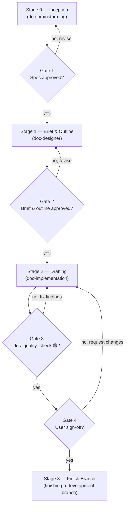

# Document Lifecycle

The orchestrator for work that ends in a document. It owns **sequence and gates only** — each
stage's *how* stays in that stage's own skill. If you need to know how to run a stage, open its
skill; if you need to know what runs next or what must be true before it does, stay here.

The development-side sibling is `dev-lifecycle`. The two mirror each other section for section on
purpose: independently maintained orchestrators drift, and a readable diff between these two files
is what makes drift visible.

**Announce at start:** "I'm using the doc-lifecycle skill to orchestrate the `<doc_slug>` document."

**Every stage is entered by invoking its skill.** This file names what runs next; it does not
replace it. Reading a stage's description here and then doing that stage's work yourself skips the
gate the stage owns.

## When NOT to use this

The threshold is real. Opening gates around a small edit costs more than having no lifecycle at
all, because people route around a gate that wastes their time. Edit directly, with no brief, no
outline and no gate, when the work is:

- A typo, a broken link, or a one-line correction.
- A single Architecture Decision Record → use `decision-records` directly.
- Any change a reviewer would not meaningfully gate — if you cannot imagine rejecting it, do not
  gate it.
- Code work. If the deliverable changes a file that ships in the build, it belongs in
  `dev-lifecycle` no matter how much prose it involves.

Reach for this skill when a document has enough sections that a reviewer could accept some and
reject others.

## The Sequence

## The Four Gates

Gates 1, 2 and 4 are **human approvals**; Gate 3 is a machine verdict. Never cross one on your own
judgement.

## Document Contract

Every durable document produced by this lifecycle MUST be emitted as a synchronized English
`.en.md` and Vietnamese `.vi.md` pair. English is canonical; Vietnamese matches its structure and
facts. Every variant MUST contain a linked table of contents covering every `##` section, regardless
of document length. The only exception is Kanban `task_*.md`, which remains English-only.

Four, not five. Code and prose differ in ways that change what verification can mean: the unit of
work is a section rather than an independently testable deliverable, verification is mechanical
checks plus human judgement rather than a machine running tests, the governing constraint is the
**audience** rather than the architecture, and the cost of being wrong is low. Because the cost of
being wrong is low, the gate count stays below the development side's five.

| Gate | Name | Approver | Enforced in | Handoff artefact |
|------|------|----------|-------------|------------------|
| **1** | Spec Approved | User | `doc-brainstorming` user review gate | `<date>-<topic>-design.en.md` + `.vi.md` |
| **2** | Brief & Outline | User | `doc-designer` breakdown checkpoint | `<doc_dir>.en.md` + `.vi.md` + `task_*.md` |
| **3** | Draft Verified | `doc_quality_check` | `doc-implementation` final phase | 🟢 document quality report |
| **4** | Sign-Off | User | `doc-implementation` review checkpoint | User confirmation to finish the branch |

## Stages

### Stage 0 — Inception → `doc-brainstorming`

**Invoke `d3nexus:doc-brainstorming`.** Do not decide the content yourself: Gate 1 is *its* user
review gate, and a spec that never passed through it has not cleared the gate.

**Entry:** any document request that reaches this lifecycle.
**Exit (Gate 1):** the user has approved the content spec.

**This stage is not optional.** It was, and its skip condition asked whether the content was already
known — a question an agent answers yes to essentially always, having just read the request and
believed it understood it. The stage is mandatory in its *existence* and elastic in its *depth*:
"write a runbook for X" still passes through, and its spec may be three sentences. The gate question
is not "is the content known?" but "was a spec presented and approved?", which can actually be
answered.

### Stage 1 — Brief & Outline → `doc-designer`

**Invoke `d3nexus:doc-designer`.** Do not write the outline yourself: Gate 2 is *its* breakdown
checkpoint, and an outline that never passed through it has not cleared the gate.

**Entry:** an approved Stage 0 spec.
**Exit (Gate 2):** the user has confirmed the outline and the section breakdown.

Produces the audience, exactly one Diátaxis mode, the outline, and one task per section. The
overview's Meta Data carries `Kind: document`, which records what the work item is for the board
and the archive.

### Stage 2 — Drafting → `doc-implementation`

**Entry:** Gate 2 passed; outline and `task_*.md` files exist.
**Exit (Gate 4):** `doc_quality_check` reports 🟢 (Gate 3) **and** the user signs off on the draft.

One worktree, one section at a time, one commit per section. Each section commit updates the English
canonical document and its Vietnamese translation together. No test suite runs — there is nothing
to run. Each section is re-read against its own purpose line in the outline, and on divergence the
outline pair is synced before the next section starts.

**Gate 3 acceptance criteria.** `doc_quality_check` grants 🟢 only when all four of its checks
pass:

1. **Mechanical** — both `.en.md` and `.vi.md` variants exist; no placeholder text; every internal
   link resolves; mermaid parses; fenced samples are syntactically valid; and each variant carries
   a complete table of contents linking every `##` section, regardless of document length.
2. **Diátaxis conformance** — the document stays inside its declared mode.
3. **Content audit** — no unsupported claims, and the `Acceptance` criterion is actually met.
4. **Not code work** — the diff touches no file that ships in the build.

### Stage 3 — Finish Branch → `finishing-a-development-branch`

**Entry:** Gate 4 passed (user confirmed).
**Exit:** the branch is integrated and completed tasks are archived into the document's directory.

The finished document lands where it belongs — `docs/`, a README, a skill's `references/`. A
deliverable left inside `.devtool/` has not shipped; that directory is a workspace, not a
publication target.

## When a Gate Fails

| Gate | On failure, return to |
|------|----------------------|
| 1 | Stage 0 — revise the content spec; re-confirm with the user |
| 2 | Stage 1 — revise the brief or the outline; re-confirm the breakdown |
| 3 | Stage 2 — fix the findings, then re-run `doc_quality_check` **in full** |
| 4 | Stage 2 — apply the requested changes |

Never advance on a partial pass, and never re-run only the previously failing check at Gate 3 — the
🟢 verdict must come from a complete run.

## Red Flags

- Opening a gate around a typo or a single ADR. Read **When NOT to use this** again.
- Declaring two Diátaxis modes on one document instead of splitting it.
- An `Acceptance` criterion that is a length, a section count, or "explains X" rather than something
  the reader can do.
- Running the 3-tier test suite on a document, or skipping the gate because "it is only prose".
- Taking the document path for a diff that touches shipped files.
- Finishing the branch without the user's Gate 4 sign-off.
- Leaving the finished document inside `.devtool/`.
- Producing a durable document without both language variants or without a complete table of
  contents.
- Translating `task_*.md`; task files remain English-only.

## Stage Skills

| Stage | Skill | Gate it enforces |
|-------|-------|------------------|
| 0 | `doc-brainstorming` | 1 |
| 1 | `doc-designer` | 2 |
| 2 | `doc-implementation` | triggers 3, enforces 4 |
| 2 (verification) | `doc_quality_check` | 3 |
| 3 | `finishing-a-development-branch` | — |
