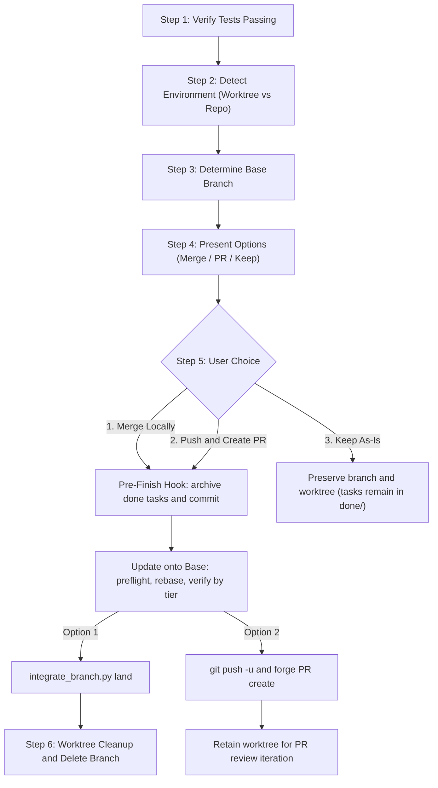

# Finishing a Development Branch

## Overview

**Core principle:** Verify tests → Detect environment → Present options → Update onto base → Execute choice → Clean up.

**Integration rule:** conflicts are resolved on the branch, inside its worktree, never on the base
branch. The base only ever receives a `--no-ff` merge whose tree is exactly the tree that passed
verification. `integrate_branch.py` enforces this; do not integrate by hand.

**Announce at start:** "I'm using the finishing-a-development-branch skill to complete this work."

Resolve the paths this skill uses. `SKILL_DIR` is the directory this `SKILL.md` was loaded from —
vendored under `.agents/skills/` in some projects, inside a plugin install in others, so never
hardcode it:

```bash
SKILL_DIR=<absolute path of the directory containing this SKILL.md>
INTEGRATE="$SKILL_DIR/resources/scripts/integrate_branch.py"
```

Shell variables do not survive between separate tool calls: set both in the same command that uses
them, or write the absolute paths out.




## Step 1: Verify Tests

Run the project's full test suite (`npm test` / `cargo test` / `pytest` / `go test ./...`).

**If tests fail**, report the failures and stop — the menu comes after a green suite:

```
Tests failing (<N> failures). Must fix before completing:

[Show failures]
```

**If tests pass:** continue to Step 2.

## Step 2: Detect Environment

```bash
GIT_DIR=$(cd "$(git rev-parse --git-dir)" 2>/dev/null && pwd -P)
GIT_COMMON=$(cd "$(git rev-parse --git-common-dir)" 2>/dev/null && pwd -P)
# Capture now, while still inside the workspace — Step 5 changes directory
# before cleanup (Step 6) needs this value
WORKTREE_PATH=$(git rev-parse --show-toplevel)
```

This determines which menu to show and how cleanup works:

| State | Menu | Cleanup |
|-------|------|---------|
| `GIT_DIR == GIT_COMMON` (normal repo) | Standard 3 options | No worktree to clean up |
| `GIT_DIR != GIT_COMMON`, named branch | Standard 3 options | Provenance-based (see Step 6) |
| `GIT_DIR != GIT_COMMON`, detached HEAD | Reduced 2 options (no merge) | Externally managed — leave in place |

## Step 3: Determine Base Branch

The base branch is whatever this work forked from — usually named in the
plan, the conversation, or the branch's upstream. If it is not already
known, ask: "This branch split from <your best guess> - is that correct?"
Confirm before merging: merging into the wrong base is expensive to undo.

## Step 4: Present Options

**Normal repo and named-branch worktree — present exactly these 3 options:**

```
Implementation complete. What would you like to do?

1. Merge back to <base-branch> locally
2. Push and create a Pull Request
3. Keep the branch as-is (I'll handle it later)

Which option?
```

**Detached HEAD — present exactly these 2 options:**

```
Implementation complete. You're on a detached HEAD (externally managed workspace).

1. Push as new branch and create a Pull Request
2. Keep as-is (I'll handle it later)

Which option?
```

Present the menu exactly as written — concise, with every option coming
from the list above. Discarding the work happens only in response to your
human partner explicitly asking for it (see "If your human partner asks to
discard the work" below). Wait for their answer; the integration decision
is theirs.

## Step 5: Execute Choice

### Pre-Finish Hook: Epic Archival & Kanban Clean-up

Before executing **Option 1 (Merge)** or **Option 2 (Push & PR)**, if the workspace contains completed tasks in `.devtool/features/done/`, archive them into their respective epic directory:

```bash
SYNC_SCRIPT="$SKILL_DIR/../dev-implementation/resources/scripts/sync_task_status.py"
if ls .devtool/features/done/task_*.md 1>/dev/null 2>&1; then
  if [ ! -f "$SYNC_SCRIPT" ]; then
    echo "STOP: done tasks exist but $SYNC_SCRIPT is missing" >&2
  else
    python3 "$SYNC_SCRIPT" archive-done
    git add .devtool/ docs/ 2>/dev/null || true
    git commit -m "[EPIC] Complete epic and archive done tasks" -m "- archive done tasks into .devtool/epic/<epic_dir>
- update epic status to Done across English and Vietnamese HLDs
- clean up .devtool/features/done and docs/superpowers" 2>/dev/null || true
  fi
fi
```

If it prints `STOP`, report it to your human partner and do not continue: integrating without the
archival leaves completed tasks stranded in `done/`.

This guarantees:
- Tasks remain visible in the **DONE** column on the Kanban dashboard throughout development and review.
- Archival, link rewriting, and status transition to `Done` occur cleanly and are committed to the branch before it is merged or pushed to a PR.
- If the user selects **Option 3 (Keep As-Is)**, tasks remain untouched in `.devtool/features/done/` so the developer can continue tracking them on the Kanban board.

### Update onto Base (Options 1 and 2)

Runs after the archival commit, from the branch's worktree (or the repository, for a normal repo).
It brings in everything that landed on the base since this branch split off, resolves conflicts here
on the branch, and re-verifies the result. Nothing touches the base branch during this section.

Skip this section on a detached HEAD. When preflight warns that the branch `has already been
pushed`, skip steps 2 and 3 and tell your human partner why: rebasing a pushed branch needs a
force-push. Step 4 still runs and gives the candidate sha.

1. **Preflight** — read-only:

   ```bash
   python3 "$INTEGRATE" preflight --base <base-branch>
   ```

   Show your human partner the upstream commits, the upstream epics and the predicted tier. If the
   warnings say the base has diverged from its upstream, stop and ask. If a rebase is already in
   progress (`predicted tier: rebase-in-progress`), continue or abort it; never start another. If the fetch failed, ask before landing.

2. **Rebase:**

   ```bash
   python3 "$INTEGRATE" rebase --base <base-branch>
   ```

   On exit 2, resolve the listed conflicts with the
   [conflict playbook](references/conflict-playbook.md), then run
   `python3 "$INTEGRATE" rebase --continue --base <base-branch>` and repeat until it exits 0. Your
   human partner may ask for `rebase --abort` at any point; it restores the branch to
   `backup/<feature-branch>`. Any other non-zero exit — stop and report the output.

3. **Re-bootstrap** the worktree when preflight reported `bootstrap required: True` (for d3nexus
   mobile projects, the platform bootstrap in `dev-implementation` Phase 1 step 5), and regenerate
   any `regenerate` files as the playbook describes.

4. **Measure and verify:**

   ```bash
   python3 "$INTEGRATE" verify-tier --base <base-branch>
   ```

   | Tier | Verification before integrating |
   |------|---------------------------------|
   | `noop` | Keep the existing verdict only if it ran on this sha, or on its parent when the only newer commit is the archival commit; otherwise run the `clean` row's verification |
   | `clean` | Full test suite (the 3-tier suite for d3nexus mobile projects), `impact-analysis` Check 2, and a check that the run included the integration tests of every epic on the regression checklist |
   | `conflicts` | The invoking lifecycle's full gate: `quality_check` for code, `doc_quality_check` for documents, the full test suite outside a lifecycle |

   If verification is red, stop. The branch and worktree stay; fix in the worktree, commit, and
   rerun `verify-tier` and its verification. Note the `candidate sha` of the green run.

### Option 1: Merge Locally

From the branch's worktree, land the verified commit:

```bash
python3 "$INTEGRATE" land --base <base-branch> --verified <candidate-sha> \
  --title "[<SCOPE>] Merge <feature-branch>"
```

| Exit | Meaning | Next |
|------|---------|------|
| `0` | Landed | Clean up |
| `1` | A git command failed, for example a commit-msg hook rejected the merge; the merge was aborted and the base is unchanged | Stop and report |
| `3`, dirty files collide with the merge | The base checkout holds uncommitted copies of files the merge changes | If every colliding file is under `.devtool/` or `docs/superpowers/` (copies the archival script writes into every checkout), restore the tracked ones with `git -C <checkout> restore --source=HEAD --staged --worktree -- <files>`, delete the untracked ones, and land again. Any other colliding file: stop and ask |
| `3`, the base has moved | Something landed while you verified | Back to Update onto Base step 1. If the rebase was skipped because the branch was already pushed, stop and ask instead |
| `4` | Postcondition failed; the base was rolled back | Stop and report |

The title follows the [Commit Message Format](../../rules/CRITICAL_RULES.md#commit-message-format);
the script writes the body and never adds a trailer.

Once landed: move out of the worktree, clean it up (Step 6), then delete the branch and its backup:

```bash
MAIN_ROOT=$(git -C "$(git rev-parse --git-common-dir)/.." rev-parse --show-toplevel)
cd "$MAIN_ROOT"
# Run Step 6 (worktree cleanup) here: a branch still checked out in a worktree cannot be deleted.
# Normal repo only: git checkout <base-branch>
git branch -d <feature-branch>
git branch -D backup/<feature-branch> 2>/dev/null || true
```

### Option 2: Push and Create PR

After Update onto Base is green (for an already-pushed branch only step 4 runs), or was skipped for a detached HEAD:

```bash
git push -u origin <feature-branch>
# From a detached HEAD, name the new branch on the remote:
# git push origin HEAD:refs/heads/<new-branch>
```

Then create the pull/merge request against <base-branch> with the forge's
tooling — its CLI if one is available, or the creation URL most forges
print when you push — following the repo's PR template and conventions if
present, and report the URL to your human partner.

Keep the worktree — your human partner iterates on PR feedback there.

### Option 3: Keep As-Is

Report: "Keeping branch <name>. Worktree preserved at <path>."

### If your human partner asks to discard the work

This path exists only as a response to an explicit request to throw the
work away. Confirm first:

```
This will permanently delete:
- Branch <name>
- All commits: <commit-list>
- Worktree at <path>

Type 'discard' to confirm.
```

Wait for that exact confirmation. When it arrives:

```bash
MAIN_ROOT=$(git -C "$(git rev-parse --git-common-dir)/.." rev-parse --show-toplevel)
cd "$MAIN_ROOT"
```

Then clean up the worktree (Step 6) and force-delete the branch and any backup:

```bash
git branch -D <feature-branch>
git branch -D backup/<feature-branch> 2>/dev/null || true
```

## Step 6: Cleanup Workspace

**Runs for Option 1 and confirmed discards.** Options 2 and 3 always
preserve the worktree. Both callers have already changed directory to the
main repo root — worktree removal must run from outside the worktree —
and use the `GIT_DIR`/`GIT_COMMON`/`WORKTREE_PATH` values captured in
Step 2, from before that directory change.

**If `GIT_DIR == GIT_COMMON`:** Normal repo, no worktree to clean up. Done.

**If `WORKTREE_PATH` is under `.worktrees/` or `worktrees/`:** Superpowers
created this worktree — we own cleanup:

```bash
git worktree remove "$WORKTREE_PATH"
git worktree prune  # Self-healing: clean up any stale registrations
```

**If removal is refused** (`contains modified or untracked files`): the
worktree holds files that exist nowhere else — uncommitted plans, notes,
or scratch work. Never `--force` on your own initiative. Show your human
partner what is at stake and ask:

```bash
git -C "$WORKTREE_PATH" status --porcelain -uall
```

```
Worktree removal refused — these files were never committed:

<file list>

1. Commit them to <branch> before cleanup
2. Move them into <main repo root>
3. Delete them (unrecoverable)

Which?
```

Carry out the choice, then remove the worktree.

**Otherwise:** The host environment owns this workspace — leave it in
place. If your platform provides a workspace-exit tool, use it.

## Quick Reference

| Option | Rebase onto base | Land | Push | Keep Worktree | Cleanup Branch |
|--------|------------------|------|------|---------------|----------------|
| 1. Merge locally | yes | yes | - | - | yes |
| 2. Create PR | yes, unless already pushed | - | yes | yes | - |
| 3. Keep as-is | - | - | - | yes | - |
| Discard (explicit request only) | - | - | - | - | yes (force) |

## Common Rationalizations

| Excuse | Reality |
|--------|---------|
| "Tests passed earlier this session" | Run the suite on the tree you are about to integrate. A green run only proves the tree it ran on. |
| "They obviously want it merged" | Integration is your human partner's decision. Present the menu and wait. |
| "They seem done with this feature — I'll offer to discard it" | The menu is complete as written. Discard happens only when your human partner asks for it in so many words. |
| "'Yeah, get rid of it' counts as confirmation" | Only the typed word `discard` authorizes deletion. |
| "The PR is up, so the worktree is clutter now" | PR feedback gets fixed in that worktree. It stays until the work lands. |
| "This other worktree looks stale — I'll clean it too" | Clean up only worktrees under `.worktrees/` or `worktrees/`. Everything else belongs to the host. |
| "Removal refused — `--force` is just finishing the cleanup" | The refusal means files exist only in that worktree. `--force` destroys them permanently. Show your human partner and ask. |
| "The red verification after the rebase is probably flaky" | A red result stops everything. The branch and worktree stay put, and the base stays untouched, while you investigate. |
| "The base branch is obviously main" | Confirm the fork point or ask. Merging into the wrong base is expensive to undo. |
| "The push was rejected — force-push will fix it" | A rejected push means the remote moved. Investigate; force-push only on your human partner's explicit request. |
| "The rebase was clean, so tests are unnecessary" | Semantic conflicts produce no textual conflict. Tier `clean` still runs the full suite. |
| "The base just moved; merge now and test later" | `land` refuses. Go back to preflight. |
| "A plain `git merge` on the base is quicker" | That resolves conflicts on the base and tests afterwards — the failure this flow exists to prevent. Use `land`. |
| "This conflict is only mechanical" | If it touches logic, it is semantic. Stop and ask. |
| "Take `--ours` to keep my change" | During a rebase `--ours` is the base. Read the playbook. |
