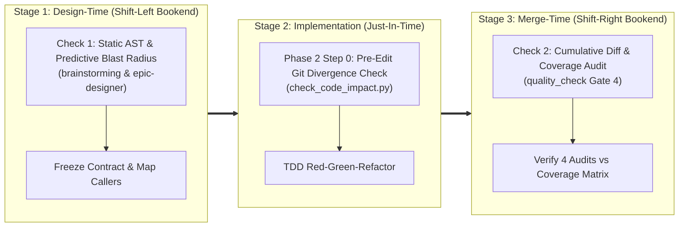
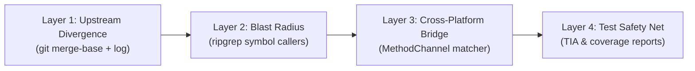

# Impact Analysis

## Overview

In multi-module mobile architectures (**Flutter**, **Android Native**, **iOS Native**), source code changes frequently cause unforeseen side effects:
1. **Upstream Git Merge Conflicts**: Modifying files that have diverged on `<base_ref>` causes merge collisions.
2. **Blast Radius & Downstream Breakage**: Changing shared models or repositories breaks downstream consumers (BLoCs, ViewModels, Route Providers) across package boundaries.
3. **Cross-Platform Bridge Drift**: Renaming or altering `MethodChannel` strings breaks native Android (Kotlin) or iOS (Swift) integrations at runtime.
4. **Unprotected Legacy Code**: Altering logic that lacks unit test coverage introduces silent regressions.

This skill provides the operational procedure and automated tooling (`check_code_impact.py`) to analyze and eliminate these risks through a **Double-Check (Bookend Verification)** mechanism.

**Core principle:** Check early to design safely (Shift-Left); check before editing to prevent conflicts; check finally before merge to verify real-world diffs (Shift-Right).

**Announce at start:** "I'm using the impact-analysis skill to evaluate code impact and blast radius."

---

## The Double-Check (Bookend Verification) Architecture

Single-point verification fails in autonomous agentic workflows:
- **Shift-Left Only (Design-Time)** predicts impact from initial requirements, but cannot foresee code drift, new upstream commits, or emergent implementation decisions.
- **Shift-Right Only (Merge-Time)** catches bugs only after the code is fully written, forcing expensive redesigns and rewrites at the final gate.

The **Double-Check Architecture** clamps the development lifecycle between two synchronized bookends:



| Dimension | Check 1 (Design-Time / Shift-Left) | Check 2 (Merge-Time / Shift-Right) |
| :--- | :--- | :--- |
| **Trigger Point** | `brainstorming` & `epic-designer` | `quality_check` (Gate 4) |
| **Inspection Target** | Architectural files & symbol definitions | Cumulative `git diff <base_ref>...HEAD` |
| **Primary Goal** | Expose blast radius, native bridges, and missing test files before writing tasks. | Verify real-world test coverage matches the 4-Audit Category thresholds. |
| **Decision Output** | Enriches Kanban tasks with `### Impact Analysis & Blast Radius`. | Grants `🟢 LGTM` or rejects PR with concrete line coverage gaps. |

---

## When to Use

- During **`brainstorming`** and **`epic-designer`** (Check 1) to inspect proposed architectural changes.
- At **Phase 2 Step 0** of **`epic-implementation`** immediately before editing any source file.
- During **`quality_check`** (Check 2) to evaluate the cumulative diff against the upstream `<base_ref>`.
- Whenever a developer asks to evaluate the blast radius of modifying a specific class or function.

**Don't use when:** running simple documentation formatting, fixing Markdown typos, or working on standalone tasks with no code dependencies.

---

## 4-Layer Inspection Pipeline

The CLI engine `check_code_impact.py` evaluates code health across 4 distinct layers:



### 1. Running the Impact Engine

Execute the analyzer tool from the skill directory or repository root:

```bash
python3 skills/impact-analysis/resources/scripts/check_code_impact.py \
  --files <path/to/target/file1> <path/to/target/file2> \
  --symbols <TargetClassName> <targetFunctionName> \
  --base-ref develop \
  --format markdown
```

For machine-readable JSON output (ideal for subagent automation):

```bash
python3 skills/impact-analysis/resources/scripts/check_code_impact.py \
  --files <path/to/target/file1> \
  --symbols <TargetClassName> \
  --format json
```

---

## Agent Decision Trees & Gate Actions

When `check_code_impact.py` produces output, the agent MUST follow these decision rules:

### 1. Handling `🔴 DIVERGENCE DETECTED` (Layer 1)
- **Symptom**: Upstream base ref (`develop` or `main`) contains unmerged commits that touched the target file.
- **Action**: **HALT IMMEDIATELY**. Do not edit the file.
- **Resolution**: Alert the engineer or run `git fetch && git rebase origin/<base_ref>`. Verify that the local branch contains upstream commits before proceeding.

### 2. Handling Downstream Callers (Layer 2)
- **Symptom**: Report identifies 1 or more consumer files referencing the target symbol.
- **Action**: Review caller files. Ensure that public signatures, nullability contracts, and default parameters do not break downstream compilation. Add regression tests covering callers.

### 3. Handling `⚠️ NATIVE BRIDGE DETECTED` (Layer 3)
- **Symptom**: Target file invokes `MethodChannel("channel_name")` with matching native Android Kotlin or iOS Swift implementations.
- **Action**: Open the native files. If altering method names or argument payload structures, update both Android and iOS platform implementations simultaneously in the same task.

### 4. Handling `⚠️ UNPROTECTED CODE (0% Coverage)` (Layer 4)
- **Symptom**: Target file has no paired unit test or has 0% line coverage in `lcov.info` / JaCoCo / `xccov`.
- **Action**: Before modifying business logic, write baseline **characterization tests** capturing existing behavior (RED -> GREEN). Only refactor after tests pass.

---

## Red Flags - STOP and Escalate
- Proceeding with source code edits while `check_code_impact.py` reports `🔴 DIVERGENCE DETECTED`.
- Modifying cross-platform `MethodChannel` strings in Dart without inspecting paired Kotlin/Swift files.
- Refactoring legacy methods with 0% coverage without first writing baseline characterization tests.
- Claiming an epic is complete without running Check 2 during `quality_check`.
