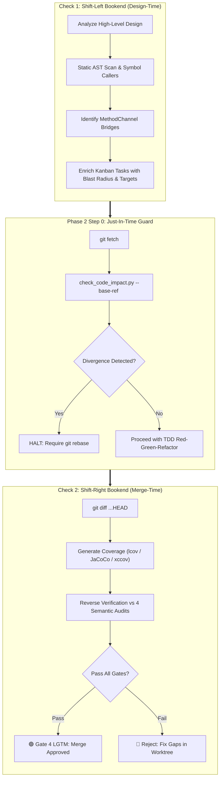
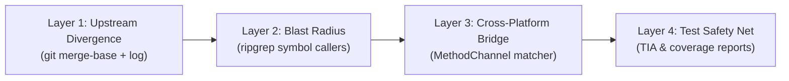

# Technical Reference: Impact Analysis & Double-Check Architecture

## 1. Introduction & Problem Statement

In enterprise mobile engineering (**Flutter**, **Android Native**, and **iOS Native**), software systems consist of layered packages, native platform bridges, asynchronous event streams, and strict modular boundaries. When developers or autonomous AI agents modify existing code, local changes frequently ripple across module boundaries, causing:

1. **Upstream Git Collisions**: Parallel feature branches modifying the same core contracts, resulting in severe merge conflicts when integrating into `develop` or `main`.
2. **Contract Drift**: Renaming methods or modifying argument types without updating all downstream callers, breaking compilation in feature packages.
3. **Cross-Platform Bridge Failures**: Altering Flutter `MethodChannel` invocations without updating native Android Kotlin (`MethodChannel`) and iOS Swift (`FlutterMethodChannel`), triggering runtime `MissingPluginException` crashes.
4. **Regression in Unprotected Code**: Editing legacy components with 0% test coverage or untested error-handling branches.

To eliminate these vulnerabilities, the **`impact-analysis`** skill establishes a deterministic, automated **Double-Check (Bookend Verification)** protocol backed by a **4-Layer Static & Dynamic Inspection Engine**.

---

## 2. The Double-Check (Bookend Verification) Architecture

### 2.1 Why Single-Point Checking Fails
In traditional software workflows, impact checking is typically performed either at the beginning (design phase) OR at the end (pull request review). Both single-point strategies exhibit critical failure modes:

- **Failure of Shift-Left Only (Design-Time)**:
  Predicting blast radius during design relies on static assumptions. During implementation, developers frequently discover edge cases, introduce helper classes, or diverge from original plans. Furthermore, while the developer is working, upstream base branches continue to receive new commits. Design-time analysis is completely blind to upstream changes that occur while work is in flight.

- **Failure of Shift-Right Only (Merge-Time / PR Review)**:
  Running static audits only when a PR is raised catches issues at the most expensive stage. If an architectural contract was violated, or if an unmerged upstream change requires a major rebase, developers must discard days of completed work and refactor entire modules.

### 2.2 The Bookend Verification Model
The Double-Check mechanism clamps the epic lifecycle between two synchronized bookends:



1. **Check 1 (Shift-Left Bookend)**:
   - Invoked during `brainstorming` and `epic-designer`.
   - Runs predictive AST and symbol scans on planned architectural touchpoints.
   - Enriches every generated Kanban task with `### Impact Analysis & Blast Radius` and sets explicit test coverage targets.
2. **Phase 2 Step 0 (Just-In-Time Guard)**:
   - Runs immediately before a developer or agent modifies source code for an individual task.
   - Evaluates `git merge-base` against the latest upstream `<base_ref>` to ensure zero unmerged upstream commits touch the target file.
3. **Check 2 (Shift-Right Bookend)**:
   - Invoked during `quality_check` (Gate 4) when all epic tasks are marked `done`.
   - Evaluates the cumulative `git diff` of the entire branch against `<base_ref>`.
   - Executes the **Reverse Verification Coverage Matrix**, guaranteeing that security files have 100% coverage and domain entities have $\ge 85\%$ coverage before merging.

---

## 3. The 4-Layer Impact Pipeline Deep Dive

The core engine `check_code_impact.py` operates as a sequential 4-layer diagnostic pipeline:



### Layer 1: Upstream Git Conflict Detection
- **Objective**: Prevent editing files that have evolved on the upstream base branch (`develop` or `main`).
- **Algorithm**:
  1. Dynamically resolve `<base_ref>` using `git rev-parse --verify` across `develop`, `origin/develop`, `main`, `origin/main`.
  2. Compute merge base: `git merge-base HEAD <base_ref>`.
  3. Query commit log: `git log --format="%H|%an|%ad|%s" <merge_base>..<base_ref> -- <file>`.
  4. Query local dirty status: `git status --porcelain -- <file>`.
  5. If unmerged upstream commits exist: Flag `🔴 DIVERGENCE DETECTED` and exit with status `1`.

### Layer 2: Blast Radius & Downstream Callers Identification
- **Objective**: Identify all consumer classes, ViewModels, and services that depend on the target symbol.
- **Algorithm**:
  1. Extract symbol identifiers (class name, function name, interface).
  2. Perform recursive regex walk across source directories (`.dart`, `.kt`, `.java`, `.swift`, `.ts`).
  3. Filter out build artifacts, caches, and the defining source file itself.
  4. Record exact matching line numbers and file paths for caller auditing.

### Layer 3: Cross-Platform Bridge Matcher
- **Objective**: Prevent breaking native platform channels between Flutter and Android/iOS.
- **Algorithm**:
  1. Scan Flutter Dart files for `MethodChannel\s*\(\s*['"]([^'"]+)['"]\s*\)`.
  2. For every discovered channel name:
     - Scan `android/**` for Kotlin/Java `MethodChannel(..., "<channel_name>")`.
     - Scan `ios/**` for Swift/Objective-C `FlutterMethodChannel(name: "<channel_name>", ...)`.
  3. Flag `⚠️ NATIVE BRIDGE DETECTED` and list all paired platform files that must be updated in tandem.

### Layer 4: Test Impact Analysis (TIA) & Safety Net
- **Objective**: Guarantee baseline test protection before code modifications begin.
- **Algorithm**:
  1. Pair source file with corresponding test file (`*_test.dart`, `*Test.kt`, `*Tests.swift`).
  2. If test coverage reports exist (`coverage/lcov.info`, JaCoCo XML, `xccov` JSON), extract exact line coverage percentage.
  3. If 0% coverage or no test file is found: Flag `⚠️ UNPROTECTED CODE (0% Coverage)`.
  4. Inspect source file for exception handlers (`catch`, `onError`, `failure`); if the paired test suite contains no error assertions, flag `⚠️ Missing Logic Alert: Unhandled catch/error scenario in test suite`.

---

## 4. Reverse Verification & Coverage-by-Audit Category Matrix

During Check 2 (`quality_check` Gate 4), test coverage is not evaluated as a generic, monolithic percentage. Instead, coverage is evaluated through **Reverse Verification against the 4 Semantic Audits**:

| Audit Dimension | Target Code Scope | Minimum Line Coverage | Rationale & Invariant |
| :--- | :--- | :--- | :--- |
| **Security Audit** | Auth tokens, Keychain, Biometrics, Crypto, Secure Storage | **100%** | Zero tolerance for untested authentication or cryptographic logic. |
| **Architecture Audit** | Pure Domain UseCases, Repositories, Domain Entities | **$\ge 85\%$** | Business logic must be fully decoupled and verified independent of frameworks. |
| **UI Audit** | BLoCs, ViewModels, State Hoisting, UI Reducers | **$\ge 80\%$** | State transitions and event flows must be verified by automated widget/unit tests. |
| **Code Health Audit** | General utility methods, Parsers, Helper extensions | **$\ge 75\%$** | Functions must be concise (< 20 lines) and covered by regression tests. |

---

## 5. Decision Trees & Escalation Protocols

```
Is check_code_impact.py reporting DIVERGENCE?
├── YES -> [HALT EXECUTION]
│          ├── Do not modify source code.
│          ├── Run git fetch origin <base_ref>.
│          ├── Run git rebase origin/<base_ref>.
│          └── Re-run check_code_impact.py.
└── NO  -> Check Blast Radius
           ├── Downstream Callers Found?
           │   ├── YES -> Verify public ABI/API signatures remain backward compatible.
           │   └── NO  -> Safe to proceed.
           ├── Native Bridge Detected?
           │   ├── YES -> Stage simultaneous edits to Android Kotlin and iOS Swift files.
           │   └── NO  -> Safe to proceed.
           └── Unprotected Code (0% Coverage)?
               ├── YES -> [TDD INVARIANT] Author baseline characterization tests first.
               └── NO  -> Proceed with TDD Red-Green-Refactor.
```
